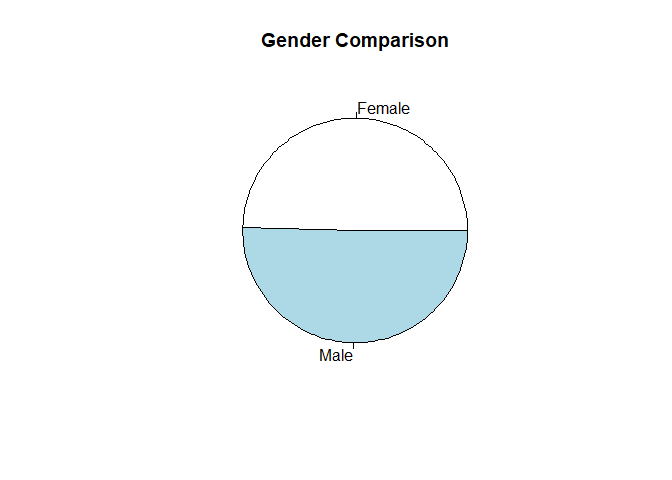
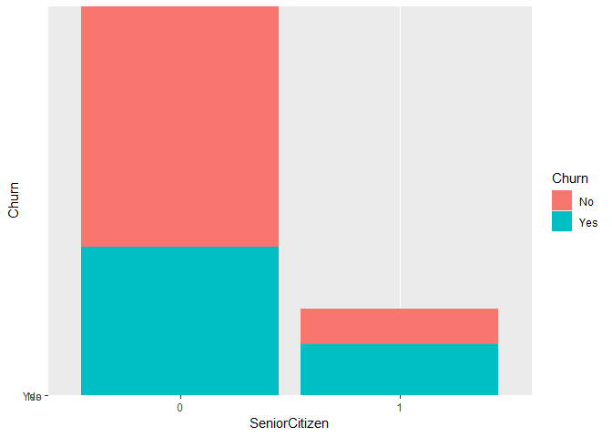

# SMU Machine Learning 1 DS7331  
## Lab 1
  
**Telco Churn Data Set**  
https://www.kaggle.com/blastchar/telco-customer-churn  
  

* Jeremy Otsap - jotsap@mail.smu.edu  
* Shawn Jung - shawnj@mail.smu.edu  
* Lance Dacy - ldacy@mail.smu.edu  
* Amber Burnett - aburnett@mail.smu.edu  


### Business Understanding  

We are looking at customer data from a north American Telco provider. The purpose being to retain existing customers. In telecommunications, the estimated cost of new customer acquisition is approximately 5x higher than retaining an existing customer. Furthermore, only a third of customers switch carriers due to lower prices; more and more factors such as dissatisfaction with quality of service, advancing technology and media features, competitors having better cellular coverage, and poorly implemented loyalty programs are all contributing to customer attrition.  
  
### Data Understanding  
  
**Data Dictionary**  
We are provided a CSV set of 21 features and 7043 anonymyzed customers.

* **customerID**: Unique alpha-numeric string to anonymously represent an individual customer
* **gender**: Categorical String value to represent customer's gender (Male or Female)
* **SeniorCitizen**: Boolean int value to show whether the customer is a senior citizen or not (1, 0)
* **Partner**: Boolean string value showing whether the customer has a partner or not (Yes, No)
* **Dependents**: Boolean string value showing whether the customer has dependents or not (Yes, No)
* **tenure**: Numeric value showing number of months the customer has stayed with the company
* **PhoneService**: Boolean string value showing whether the customer has a phone service or not (Yes, No)
* **MultipleLines**: Categorical string value that shows if the customer has multiple lines or not (Yes, No, No phone service)
* **InternetService**: Categorical string value that shows the customer’s internet service provider (DSL, Fiber optic, No)
* **OnlineSecurity**: Categorical string value showing whether the customer has online security or not (Yes, No, No internet service)
* **OnlineBackup**: Categorical string showing whether the customer has online backup or not (Yes, No, No internet service)
* **DeviceProtection**: Categorical string showing whether the customer has device protection or not (Yes, No, No internet service)
* **TechSupport**: Categorical string showing whether the customer has tech support or not (Yes, No, No internet service)
* **StreamingTV**: Categorical string showing whether the customer has streaming TV or not (Yes, No, No internet service)
* **StreamingMovies**: Categorical string showing whether the customer has streaming movies or not (Yes, No, No internet service)
* **Contract**: Categorical string that represents the contract term (Month-to-month, One year, Two year)
* **PaperlessBilling**: Boolean string showing whether the customer has paperless billing or not (Yes, No)
* **PaymentMethod**: Categorical string that shows the customer’s payment method (Electronic check, Mailed check, Bank transfer (automatic), Credit card (automatic))
* **MonthlyCharges**: Numeric value showing the amount charged to the customer each month
* **TotalCharges**: Numeric value showing the total amount charged to the customer
* **Churn**: Boolean string showing whether or not the customer 'churned' or terminated ser
vices (Yes or No)  


### Initial Data Examination

As we can see most of the predictor variables are categorical, as is the response "Churn." However there are a few numerical variables as well specifically relating to the customer's spend, as well as the length of their contract.


```r
# dataframe
churn.df <- read.csv('https://raw.githubusercontent.com/jotsap/DS7331/master/data/churn.csv')

str(churn.df)
```

```
## 'data.frame':	7043 obs. of  21 variables:
##  $ customerID      : Factor w/ 7043 levels "0002-ORFBO","0003-MKNFE",..: 5376 3963 2565 5536 6512 6552 1003 4771 5605 4535 ...
##  $ gender          : Factor w/ 2 levels "Female","Male": 1 2 2 2 1 1 2 1 1 2 ...
##  $ SeniorCitizen   : int  0 0 0 0 0 0 0 0 0 0 ...
##  $ Partner         : Factor w/ 2 levels "No","Yes": 2 1 1 1 1 1 1 1 2 1 ...
##  $ Dependents      : Factor w/ 2 levels "No","Yes": 1 1 1 1 1 1 2 1 1 2 ...
##  $ tenure          : int  1 34 2 45 2 8 22 10 28 62 ...
##  $ PhoneService    : Factor w/ 2 levels "No","Yes": 1 2 2 1 2 2 2 1 2 2 ...
##  $ MultipleLines   : Factor w/ 3 levels "No","No phone service",..: 2 1 1 2 1 3 3 2 3 1 ...
##  $ InternetService : Factor w/ 3 levels "DSL","Fiber optic",..: 1 1 1 1 2 2 2 1 2 1 ...
##  $ OnlineSecurity  : Factor w/ 3 levels "No","No internet service",..: 1 3 3 3 1 1 1 3 1 3 ...
##  $ OnlineBackup    : Factor w/ 3 levels "No","No internet service",..: 3 1 3 1 1 1 3 1 1 3 ...
##  $ DeviceProtection: Factor w/ 3 levels "No","No internet service",..: 1 3 1 3 1 3 1 1 3 1 ...
##  $ TechSupport     : Factor w/ 3 levels "No","No internet service",..: 1 1 1 3 1 1 1 1 3 1 ...
##  $ StreamingTV     : Factor w/ 3 levels "No","No internet service",..: 1 1 1 1 1 3 3 1 3 1 ...
##  $ StreamingMovies : Factor w/ 3 levels "No","No internet service",..: 1 1 1 1 1 3 1 1 3 1 ...
##  $ Contract        : Factor w/ 3 levels "Month-to-month",..: 1 2 1 2 1 1 1 1 1 2 ...
##  $ PaperlessBilling: Factor w/ 2 levels "No","Yes": 2 1 2 1 2 2 2 1 2 1 ...
##  $ PaymentMethod   : Factor w/ 4 levels "Bank transfer (automatic)",..: 3 4 4 1 3 3 2 4 3 1 ...
##  $ MonthlyCharges  : num  29.9 57 53.9 42.3 70.7 ...
##  $ TotalCharges    : num  29.9 1889.5 108.2 1840.8 151.7 ...
##  $ Churn           : Factor w/ 2 levels "No","Yes": 1 1 2 1 2 2 1 1 2 1 ...
```

```r
head(churn.df)
```

```
##   customerID gender SeniorCitizen Partner Dependents tenure PhoneService
## 1 7590-VHVEG Female             0     Yes         No      1           No
## 2 5575-GNVDE   Male             0      No         No     34          Yes
## 3 3668-QPYBK   Male             0      No         No      2          Yes
## 4 7795-CFOCW   Male             0      No         No     45           No
## 5 9237-HQITU Female             0      No         No      2          Yes
## 6 9305-CDSKC Female             0      No         No      8          Yes
##      MultipleLines InternetService OnlineSecurity OnlineBackup
## 1 No phone service             DSL             No          Yes
## 2               No             DSL            Yes           No
## 3               No             DSL            Yes          Yes
## 4 No phone service             DSL            Yes           No
## 5               No     Fiber optic             No           No
## 6              Yes     Fiber optic             No           No
##   DeviceProtection TechSupport StreamingTV StreamingMovies       Contract
## 1               No          No          No              No Month-to-month
## 2              Yes          No          No              No       One year
## 3               No          No          No              No Month-to-month
## 4              Yes         Yes          No              No       One year
## 5               No          No          No              No Month-to-month
## 6              Yes          No         Yes             Yes Month-to-month
##   PaperlessBilling             PaymentMethod MonthlyCharges TotalCharges
## 1              Yes          Electronic check          29.85        29.85
## 2               No              Mailed check          56.95      1889.50
## 3              Yes              Mailed check          53.85       108.15
## 4               No Bank transfer (automatic)          42.30      1840.75
## 5              Yes          Electronic check          70.70       151.65
## 6              Yes          Electronic check          99.65       820.50
##   Churn
## 1    No
## 2    No
## 3   Yes
## 4    No
## 5   Yes
## 6   Yes
```


CustomerID is simply a placeholder value to represent an anonomyzed customer and is not necessary for analysis. Thus we will remove it. Additionally R can convert a data type to factor, thus we will convert the numerical SeniorCitizen variable to a factor and store it as a separate column


```r
# CustomerID not necessary for analysis
churn.df %>% select(-customerID) -> churn.df
churn.df$customerID <- NULL

# make FACTOR flavor of SeniorCitizen column
churn.df <- churn.df %>% mutate(
  SeniorCitizen = factor(SeniorCitizen)
)

glimpse(churn.df)
```

```
## Observations: 7,043
## Variables: 20
## $ gender           <fct> Female, Male, Male, Male, Female, Female, Mal...
## $ SeniorCitizen    <fct> 0, 0, 0, 0, 0, 0, 0, 0, 0, 0, 0, 0, 0, 0, 0, ...
## $ Partner          <fct> Yes, No, No, No, No, No, No, No, Yes, No, Yes...
## $ Dependents       <fct> No, No, No, No, No, No, Yes, No, No, Yes, Yes...
## $ tenure           <int> 1, 34, 2, 45, 2, 8, 22, 10, 28, 62, 13, 16, 5...
## $ PhoneService     <fct> No, Yes, Yes, No, Yes, Yes, Yes, No, Yes, Yes...
## $ MultipleLines    <fct> No phone service, No, No, No phone service, N...
## $ InternetService  <fct> DSL, DSL, DSL, DSL, Fiber optic, Fiber optic,...
## $ OnlineSecurity   <fct> No, Yes, Yes, Yes, No, No, No, Yes, No, Yes, ...
## $ OnlineBackup     <fct> Yes, No, Yes, No, No, No, Yes, No, No, Yes, N...
## $ DeviceProtection <fct> No, Yes, No, Yes, No, Yes, No, No, Yes, No, N...
## $ TechSupport      <fct> No, No, No, Yes, No, No, No, No, Yes, No, No,...
## $ StreamingTV      <fct> No, No, No, No, No, Yes, Yes, No, Yes, No, No...
## $ StreamingMovies  <fct> No, No, No, No, No, Yes, No, No, Yes, No, No,...
## $ Contract         <fct> Month-to-month, One year, Month-to-month, One...
## $ PaperlessBilling <fct> Yes, No, Yes, No, Yes, Yes, Yes, No, Yes, No,...
## $ PaymentMethod    <fct> Electronic check, Mailed check, Mailed check,...
## $ MonthlyCharges   <dbl> 29.85, 56.95, 53.85, 42.30, 70.70, 99.65, 89....
## $ TotalCharges     <dbl> 29.85, 1889.50, 108.15, 1840.75, 151.65, 820....
## $ Churn            <fct> No, No, Yes, No, Yes, Yes, No, No, Yes, No, N...
```


Now lets get a better look at our data using the skim() command. We can see a breakdown of variables by their types, as well as the ratio of counts for categorical variables, or range of values for numeric. 

One thing we notice immediately is there are 11 missing values in the TotalCharges parameter. *Note: we will address this shortly; however being such a small number it should not significantly impact our initial exploration*

A few things become immediately apparent as well. Firstly this sample has roughly a one third attrition rate looking at the Churn column: 1869 Yes vs 5174 No.

The output for SeniorCitizen is more useful now as a factor rather than the numeric representation, and because we did this it allows us to see that there are almost 6 times as many non-senior adults as seniors: 5901 vs 1142. However, when we look at gender we see a fairly even representation: 3555 males vs 3488 females. 

So we are starting to get a sense of the customer sample being a fairly even collection of males and females, however most of them are likely *not* retired and still working professionally. However, to get better insight we will now create some visualizations of our data


```r
skim(churn.df)
```

```
## Skim summary statistics
##  n obs: 7043 
##  n variables: 20 
## 
## -- Variable type:factor ----------------------------------------------------------------------------
##          variable missing complete    n n_unique
##             Churn       0     7043 7043        2
##          Contract       0     7043 7043        3
##        Dependents       0     7043 7043        2
##  DeviceProtection       0     7043 7043        3
##            gender       0     7043 7043        2
##   InternetService       0     7043 7043        3
##     MultipleLines       0     7043 7043        3
##      OnlineBackup       0     7043 7043        3
##    OnlineSecurity       0     7043 7043        3
##  PaperlessBilling       0     7043 7043        2
##           Partner       0     7043 7043        2
##     PaymentMethod       0     7043 7043        4
##      PhoneService       0     7043 7043        2
##     SeniorCitizen       0     7043 7043        2
##   StreamingMovies       0     7043 7043        3
##       StreamingTV       0     7043 7043        3
##       TechSupport       0     7043 7043        3
##                                  top_counts ordered
##                  No: 5174, Yes: 1869, NA: 0   FALSE
##      Mon: 3875, Two: 1695, One: 1473, NA: 0   FALSE
##                  No: 4933, Yes: 2110, NA: 0   FALSE
##       No: 3095, Yes: 2422, No : 1526, NA: 0   FALSE
##                 Mal: 3555, Fem: 3488, NA: 0   FALSE
##       Fib: 3096, DSL: 2421, No: 1526, NA: 0   FALSE
##        No: 3390, Yes: 2971, No : 682, NA: 0   FALSE
##       No: 3088, Yes: 2429, No : 1526, NA: 0   FALSE
##       No: 3498, Yes: 2019, No : 1526, NA: 0   FALSE
##                  Yes: 4171, No: 2872, NA: 0   FALSE
##                  No: 3641, Yes: 3402, NA: 0   FALSE
##  Ele: 2365, Mai: 1612, Ban: 1544, Cre: 1522   FALSE
##                   Yes: 6361, No: 682, NA: 0   FALSE
##                     0: 5901, 1: 1142, NA: 0   FALSE
##       No: 2785, Yes: 2732, No : 1526, NA: 0   FALSE
##       No: 2810, Yes: 2707, No : 1526, NA: 0   FALSE
##       No: 3473, Yes: 2044, No : 1526, NA: 0   FALSE
## 
## -- Variable type:integer ---------------------------------------------------------------------------
##  variable missing complete    n  mean    sd p0 p25 p50 p75 p100     hist
##    tenure       0     7043 7043 32.37 24.56  0   9  29  55   72 <U+2587><U+2583><U+2583><U+2582><U+2582><U+2583><U+2583><U+2585>
## 
## -- Variable type:numeric ---------------------------------------------------------------------------
##        variable missing complete    n    mean      sd    p0    p25     p50
##  MonthlyCharges       0     7043 7043   64.76   30.09 18.25  35.5    70.35
##    TotalCharges      11     7032 7043 2283.3  2266.77 18.8  401.45 1397.47
##      p75    p100     hist
##    89.85  118.75 <U+2587><U+2581><U+2583><U+2582><U+2586><U+2585><U+2585><U+2582>
##  3794.74 8684.8  <U+2587><U+2583><U+2582><U+2582><U+2581><U+2581><U+2581><U+2581>
```

```r
# Churn ratio
table(churn.df$Churn) %>% pie(., main = "Churn Comparison")
```

<!-- -->

```r
# Gender ratio
table(churn.df$gender) %>% pie(., main = "Gender Comparison")
```

<!-- -->

```r
# Senior ratio
table(churn.df$SeniorCitizen) %>% pie(., , main = "SeniorCitizen")
```

<!-- -->


To do more advanced visualization we will split the data into 2 separate dataframes: numeric and categorical. However both will contain the response variable Churn. This will allow us to more easily make appropriate visualizations based on the type of variables we are considering

First lets look at boxplot of the different numerical variables for each sample of customers: those that terminated services vs those that stayed


```r
# split dataframes: numeric
churnNum.df <- churn.df %>% select(tenure, MonthlyCharges, TotalCharges, Churn)

# create a vector of numNames
churnNumNames <- names(churnNum.df)
#remove Churn response
churnNumNames[-4] -> churnNumNames

### BOXPLOT OF NUMERICAL VALUES VS CHURN
boxplot_vs_response <- function(x) {
  ggplot(data = churnNum.df, aes_string(y=x, x="Churn", fill="Churn")) + geom_boxplot() + coord_flip() 
}

lapply(churnNumNames, boxplot_vs_response)
```

```
## [[1]]
```

<!-- -->

```
## 
## [[2]]
```

<!-- -->

```
## 
## [[3]]
```

```
## Warning: Removed 11 rows containing non-finite values (stat_boxplot).
```

<!-- -->


Next lets look at a barplots for the categoric variales to get a sense of the different ratio of customers who terminated service for each categorical column's level.


```r
# split dataframes: categorical
churnCat.df <- churn.df %>% select(-tenure, -MonthlyCharges, -TotalCharges)

# create a vector of numNames and catNames
churnCatNames <- names(churnCat.df)
#remove Churn response
churnCatNames[-17] -> churnCatNames


### BARPLOT OF CATEGORICAL VALUES VS CHURN
ggplot(data = churnCat.df, aes_string(x="OnlineSecurity", y="Churn", fill="Churn")) + geom_col() 
```

<!-- -->

```r
barplot_vs_response <- function(x) {
  ggplot(data = churnCat.df, aes_string(x = x, y="Churn", fill = "Churn")) + geom_col() 
}

lapply(churnCatNames, barplot_vs_response)
```

```
## [[1]]
```

<!-- -->

```
## 
## [[2]]
```

<!-- -->

```
## 
## [[3]]
```

<!-- -->

```
## 
## [[4]]
```

<!-- -->

```
## 
## [[5]]
```

<!-- -->

```
## 
## [[6]]
```

<!-- -->

```
## 
## [[7]]
```

<!-- -->

```
## 
## [[8]]
```

<!-- -->

```
## 
## [[9]]
```

<!-- -->

```
## 
## [[10]]
```

<!-- -->

```
## 
## [[11]]
```

<!-- -->

```
## 
## [[12]]
```

<!-- -->

```
## 
## [[13]]
```

<!-- -->

```
## 
## [[14]]
```

<!-- -->

```
## 
## [[15]]
```

<!-- -->

```
## 
## [[16]]
```

<!-- -->


