# SMU Machine Learning 1 DS7331  
## Lab 2
  
**Telco Churn Data Set**  
https://www.kaggle.com/blastchar/telco-customer-churn  
  

* Jeremy Otsap - jotsap@mail.smu.edu  
* Shawn Jung - shawnj@mail.smu.edu  
* Lance Dacy - ldacy@mail.smu.edu  
* Amber Burnett - aburnett@mail.smu.edu  


### Business Understanding  

We are looking at customer data from a north American Telco provider. The purpose being to retain existing customers. In telecommunications, the estimated cost of new customer acquisition is approximately 5x higher than retaining an existing customer. Furthermore, only a third of customers switch carriers due to lower prices; more and more factors such as dissatisfaction with quality of service, advancing technology and media features, competitors having better cellular coverage, and poorly implemented loyalty programs are all contributing to customer attrition.  
  
### Data Understanding  
  
**Data Dictionary**  
We are provided a CSV set of 21 features and 7043 anonymyzed customers.

* **customerID**: Unique alpha-numeric string to anonymously represent an individual customer
* **gender**: Categorical String value to represent customer's gender (Male or Female)
* **SeniorCitizen**: Boolean int value to show whether the customer is a senior citizen or not (1, 0)
* **Partner**: Boolean string value showing whether the customer has a partner or not (Yes, No)
* **Dependents**: Boolean string value showing whether the customer has dependents or not (Yes, No)
* **tenure**: Numeric value showing number of months the customer has stayed with the company
* **PhoneService**: Boolean string value showing whether the customer has a phone service or not (Yes, No)
* **MultipleLines**: Categorical string value that shows if the customer has multiple lines or not (Yes, No, No phone service)
* **InternetService**: Categorical string value that shows the customer’s internet service provider (DSL, Fiber optic, No)
* **OnlineSecurity**: Categorical string value showing whether the customer has online security or not (Yes, No, No internet service)
* **OnlineBackup**: Categorical string showing whether the customer has online backup or not (Yes, No, No internet service)
* **DeviceProtection**: Categorical string showing whether the customer has device protection or not (Yes, No, No internet service)
* **TechSupport**: Categorical string showing whether the customer has tech support or not (Yes, No, No internet service)
* **StreamingTV**: Categorical string showing whether the customer has streaming TV or not (Yes, No, No internet service)
* **StreamingMovies**: Categorical string showing whether the customer has streaming movies or not (Yes, No, No internet service)
* **Contract**: Categorical string that represents the contract term (Month-to-month, One year, Two year)
* **PaperlessBilling**: Boolean string showing whether the customer has paperless billing or not (Yes, No)
* **PaymentMethod**: Categorical string that shows the customer’s payment method (Electronic check, Mailed check, Bank transfer (automatic), Credit card (automatic))
* **MonthlyCharges**: Numeric value showing the amount charged to the customer each month
* **TotalCharges**: Numeric value showing the total amount charged to the customer
* **Churn**: Boolean string showing whether or not the customer 'churned' or terminated ser
vices (Yes or No)  


### Initial Data Examination

As we can see most of the predictor variables are categorical, as is the response "Churn." However there are a few numerical variables as well specifically relating to the customer's spend, as well as the length of their contract.


```r
# dataframe
churn.df <- read.csv('https://raw.githubusercontent.com/jotsap/DS7331/master/data/churn.csv')

str(churn.df)
```

```
## 'data.frame':	7043 obs. of  21 variables:
##  $ customerID      : Factor w/ 7043 levels "0002-ORFBO","0003-MKNFE",..: 5376 3963 2565 5536 6512 6552 1003 4771 5605 4535 ...
##  $ gender          : Factor w/ 2 levels "Female","Male": 1 2 2 2 1 1 2 1 1 2 ...
##  $ SeniorCitizen   : int  0 0 0 0 0 0 0 0 0 0 ...
##  $ Partner         : Factor w/ 2 levels "No","Yes": 2 1 1 1 1 1 1 1 2 1 ...
##  $ Dependents      : Factor w/ 2 levels "No","Yes": 1 1 1 1 1 1 2 1 1 2 ...
##  $ tenure          : int  1 34 2 45 2 8 22 10 28 62 ...
##  $ PhoneService    : Factor w/ 2 levels "No","Yes": 1 2 2 1 2 2 2 1 2 2 ...
##  $ MultipleLines   : Factor w/ 3 levels "No","No phone service",..: 2 1 1 2 1 3 3 2 3 1 ...
##  $ InternetService : Factor w/ 3 levels "DSL","Fiber optic",..: 1 1 1 1 2 2 2 1 2 1 ...
##  $ OnlineSecurity  : Factor w/ 3 levels "No","No internet service",..: 1 3 3 3 1 1 1 3 1 3 ...
##  $ OnlineBackup    : Factor w/ 3 levels "No","No internet service",..: 3 1 3 1 1 1 3 1 1 3 ...
##  $ DeviceProtection: Factor w/ 3 levels "No","No internet service",..: 1 3 1 3 1 3 1 1 3 1 ...
##  $ TechSupport     : Factor w/ 3 levels "No","No internet service",..: 1 1 1 3 1 1 1 1 3 1 ...
##  $ StreamingTV     : Factor w/ 3 levels "No","No internet service",..: 1 1 1 1 1 3 3 1 3 1 ...
##  $ StreamingMovies : Factor w/ 3 levels "No","No internet service",..: 1 1 1 1 1 3 1 1 3 1 ...
##  $ Contract        : Factor w/ 3 levels "Month-to-month",..: 1 2 1 2 1 1 1 1 1 2 ...
##  $ PaperlessBilling: Factor w/ 2 levels "No","Yes": 2 1 2 1 2 2 2 1 2 1 ...
##  $ PaymentMethod   : Factor w/ 4 levels "Bank transfer (automatic)",..: 3 4 4 1 3 3 2 4 3 1 ...
##  $ MonthlyCharges  : num  29.9 57 53.9 42.3 70.7 ...
##  $ TotalCharges    : num  29.9 1889.5 108.2 1840.8 151.7 ...
##  $ Churn           : Factor w/ 2 levels "No","Yes": 1 1 2 1 2 2 1 1 2 1 ...
```

```r
head(churn.df)
```

```
##   customerID gender SeniorCitizen Partner Dependents tenure PhoneService
## 1 7590-VHVEG Female             0     Yes         No      1           No
## 2 5575-GNVDE   Male             0      No         No     34          Yes
## 3 3668-QPYBK   Male             0      No         No      2          Yes
## 4 7795-CFOCW   Male             0      No         No     45           No
## 5 9237-HQITU Female             0      No         No      2          Yes
## 6 9305-CDSKC Female             0      No         No      8          Yes
##      MultipleLines InternetService OnlineSecurity OnlineBackup
## 1 No phone service             DSL             No          Yes
## 2               No             DSL            Yes           No
## 3               No             DSL            Yes          Yes
## 4 No phone service             DSL            Yes           No
## 5               No     Fiber optic             No           No
## 6              Yes     Fiber optic             No           No
##   DeviceProtection TechSupport StreamingTV StreamingMovies       Contract
## 1               No          No          No              No Month-to-month
## 2              Yes          No          No              No       One year
## 3               No          No          No              No Month-to-month
## 4              Yes         Yes          No              No       One year
## 5               No          No          No              No Month-to-month
## 6              Yes          No         Yes             Yes Month-to-month
##   PaperlessBilling             PaymentMethod MonthlyCharges TotalCharges
## 1              Yes          Electronic check          29.85        29.85
## 2               No              Mailed check          56.95      1889.50
## 3              Yes              Mailed check          53.85       108.15
## 4               No Bank transfer (automatic)          42.30      1840.75
## 5              Yes          Electronic check          70.70       151.65
## 6              Yes          Electronic check          99.65       820.50
##   Churn
## 1    No
## 2    No
## 3   Yes
## 4    No
## 5   Yes
## 6   Yes
```


CustomerID is simply a placeholder value to represent an anonomyzed customer and is not necessary for analysis. Thus we will remove it. Additionally R can convert a data type to factor, thus we will convert the numerical SeniorCitizen variable to a factor and store it as a separate column


```r
# CustomerID not necessary for analysis
churn.df %>% dplyr::select(-customerID)  -> churn.df
# alternate code: churn.df$customerID <- NULL


# make FACTOR flavor of SeniorCitizen column
# recode 1 as "Yes" and 0 as "No"
dplyr::recode_factor(
  churn.df$SeniorCitizen, 
  `1` = "Yes", `0` = "No"
  ) -> churn.df$SeniorCitizen
# alternate code: churn.df <- churn.df %>% mutate(SeniorCitizen = factor(SeniorCitizen))

glimpse(churn.df)
```

```
## Observations: 7,043
## Variables: 20
## $ gender           <fct> Female, Male, Male, Male, Female, Female, Mal...
## $ SeniorCitizen    <fct> No, No, No, No, No, No, No, No, No, No, No, N...
## $ Partner          <fct> Yes, No, No, No, No, No, No, No, Yes, No, Yes...
## $ Dependents       <fct> No, No, No, No, No, No, Yes, No, No, Yes, Yes...
## $ tenure           <int> 1, 34, 2, 45, 2, 8, 22, 10, 28, 62, 13, 16, 5...
## $ PhoneService     <fct> No, Yes, Yes, No, Yes, Yes, Yes, No, Yes, Yes...
## $ MultipleLines    <fct> No phone service, No, No, No phone service, N...
## $ InternetService  <fct> DSL, DSL, DSL, DSL, Fiber optic, Fiber optic,...
## $ OnlineSecurity   <fct> No, Yes, Yes, Yes, No, No, No, Yes, No, Yes, ...
## $ OnlineBackup     <fct> Yes, No, Yes, No, No, No, Yes, No, No, Yes, N...
## $ DeviceProtection <fct> No, Yes, No, Yes, No, Yes, No, No, Yes, No, N...
## $ TechSupport      <fct> No, No, No, Yes, No, No, No, No, Yes, No, No,...
## $ StreamingTV      <fct> No, No, No, No, No, Yes, Yes, No, Yes, No, No...
## $ StreamingMovies  <fct> No, No, No, No, No, Yes, No, No, Yes, No, No,...
## $ Contract         <fct> Month-to-month, One year, Month-to-month, One...
## $ PaperlessBilling <fct> Yes, No, Yes, No, Yes, Yes, Yes, No, Yes, No,...
## $ PaymentMethod    <fct> Electronic check, Mailed check, Mailed check,...
## $ MonthlyCharges   <dbl> 29.85, 56.95, 53.85, 42.30, 70.70, 99.65, 89....
## $ TotalCharges     <dbl> 29.85, 1889.50, 108.15, 1840.75, 151.65, 820....
## $ Churn            <fct> No, No, Yes, No, Yes, Yes, No, No, Yes, No, N...
```


Now lets get a better look at our data using the skim() command. We can see a breakdown of variables by their types, as well as the ratio of counts for categorical variables, or range of values for numeric. 

One thing we notice immediately is there are 11 missing values in the TotalCharges parameter. *Note: we will address this shortly; however being such a small number it should not significantly impact our initial exploration*

A few things become immediately apparent as well. Firstly this sample has roughly a one third attrition rate looking at the Churn column: 1869 Yes vs 5174 No.

The output for SeniorCitizen is more useful now as a factor rather than the numeric representation, and because we did this it allows us to see that there are almost 6 times as many non-senior adults as seniors: 5901 vs 1142. However, when we look at gender we see a fairly even representation: 3555 males vs 3488 females. 

So we are starting to get a sense of the customer sample being a fairly even collection of males and females, however most of them are likely *not* retired and still working professionally. However, to get better insight we will now create some visualizations of our data


```r
skim(churn.df)
```

```
## Skim summary statistics
##  n obs: 7043 
##  n variables: 20 
## 
## -- Variable type:factor ------------------------------------------------------------------------
##          variable missing complete    n n_unique
##             Churn       0     7043 7043        2
##          Contract       0     7043 7043        3
##        Dependents       0     7043 7043        2
##  DeviceProtection       0     7043 7043        3
##            gender       0     7043 7043        2
##   InternetService       0     7043 7043        3
##     MultipleLines       0     7043 7043        3
##      OnlineBackup       0     7043 7043        3
##    OnlineSecurity       0     7043 7043        3
##  PaperlessBilling       0     7043 7043        2
##           Partner       0     7043 7043        2
##     PaymentMethod       0     7043 7043        4
##      PhoneService       0     7043 7043        2
##     SeniorCitizen       0     7043 7043        2
##   StreamingMovies       0     7043 7043        3
##       StreamingTV       0     7043 7043        3
##       TechSupport       0     7043 7043        3
##                                  top_counts ordered
##                  No: 5174, Yes: 1869, NA: 0   FALSE
##      Mon: 3875, Two: 1695, One: 1473, NA: 0   FALSE
##                  No: 4933, Yes: 2110, NA: 0   FALSE
##       No: 3095, Yes: 2422, No : 1526, NA: 0   FALSE
##                 Mal: 3555, Fem: 3488, NA: 0   FALSE
##       Fib: 3096, DSL: 2421, No: 1526, NA: 0   FALSE
##        No: 3390, Yes: 2971, No : 682, NA: 0   FALSE
##       No: 3088, Yes: 2429, No : 1526, NA: 0   FALSE
##       No: 3498, Yes: 2019, No : 1526, NA: 0   FALSE
##                  Yes: 4171, No: 2872, NA: 0   FALSE
##                  No: 3641, Yes: 3402, NA: 0   FALSE
##  Ele: 2365, Mai: 1612, Ban: 1544, Cre: 1522   FALSE
##                   Yes: 6361, No: 682, NA: 0   FALSE
##                  No: 5901, Yes: 1142, NA: 0   FALSE
##       No: 2785, Yes: 2732, No : 1526, NA: 0   FALSE
##       No: 2810, Yes: 2707, No : 1526, NA: 0   FALSE
##       No: 3473, Yes: 2044, No : 1526, NA: 0   FALSE
## 
## -- Variable type:integer -----------------------------------------------------------------------
##  variable missing complete    n  mean    sd p0 p25 p50 p75 p100     hist
##    tenure       0     7043 7043 32.37 24.56  0   9  29  55   72 <U+2587><U+2583><U+2583><U+2582><U+2582><U+2583><U+2583><U+2585>
## 
## -- Variable type:numeric -----------------------------------------------------------------------
##        variable missing complete    n    mean      sd    p0    p25     p50
##  MonthlyCharges       0     7043 7043   64.76   30.09 18.25  35.5    70.35
##    TotalCharges      11     7032 7043 2283.3  2266.77 18.8  401.45 1397.47
##      p75    p100     hist
##    89.85  118.75 <U+2587><U+2581><U+2583><U+2582><U+2586><U+2585><U+2585><U+2582>
##  3794.74 8684.8  <U+2587><U+2583><U+2582><U+2582><U+2581><U+2581><U+2581><U+2581>
```

```r
# Churn ratio
table(churn.df$Churn) %>% pie(., main = "Churn Comparison")
```

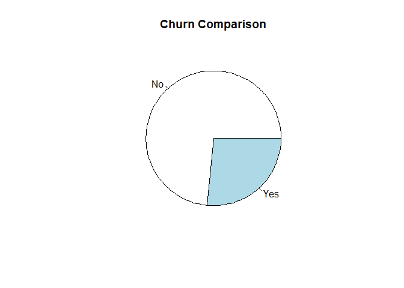<!-- -->

```r
# Gender ratio
table(churn.df$gender) %>% pie(., main = "Gender Comparison")
```

<!-- -->

```r
# Senior ratio
table(churn.df$SeniorCitizen) %>% pie(., , main = "SeniorCitizen")
```

<!-- -->


## Missing Values

As we investigate the data set we need to check for missing values. We validate there are 11 missing values in the TotalCharges column


```r
# from VIM package
aggr(churn.df, 
     prop = FALSE, 
     combined = TRUE, 
     numbers = TRUE, 
     sortVars = TRUE, 
     sortCombs = TRUE)
```

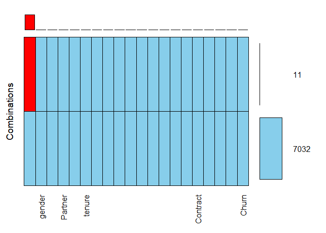<!-- -->

```
## 
##  Variables sorted by number of missings: 
##          Variable Count
##      TotalCharges    11
##            gender     0
##     SeniorCitizen     0
##           Partner     0
##        Dependents     0
##            tenure     0
##      PhoneService     0
##     MultipleLines     0
##   InternetService     0
##    OnlineSecurity     0
##      OnlineBackup     0
##  DeviceProtection     0
##       TechSupport     0
##       StreamingTV     0
##   StreamingMovies     0
##          Contract     0
##  PaperlessBilling     0
##     PaymentMethod     0
##    MonthlyCharges     0
##             Churn     0
```

```r
# we can see that 'TotalCharges' has 11 missing values

# VALIDATE COUNT OF NA VALUES FOR ABOVE ROWS
print("Total number of missing values for TotalCharges: ")
```

```
## [1] "Total number of missing values for TotalCharges: "
```

```r
sum(is.na(churn.df$TotalCharges))
```

```
## [1] 11
```


Lets examine those specific rows that have missing values. We notice right away they all have a 0 for the tenure field. Lets validate we get the same 11 rows on the 2 following queries. 

NOTE: for readability we will only output the following 3 columns
* TotalCharges
* tenure
* MonthlyCharges

**All rows that have missing values in TotalCharges**


```r
# list rows with missing values
churn.df[is.na(churn.df$TotalCharges), c('TotalCharges','tenure','MonthlyCharges')]
```

```
##      TotalCharges tenure MonthlyCharges
## 489            NA      0          52.55
## 754            NA      0          20.25
## 937            NA      0          80.85
## 1083           NA      0          25.75
## 1341           NA      0          56.05
## 3332           NA      0          19.85
## 3827           NA      0          25.35
## 4381           NA      0          20.00
## 5219           NA      0          19.70
## 6671           NA      0          73.35
## 6755           NA      0          61.90
```


**All rows that have a 0 in tenure**


```r
# list rows with tenure of 0
churn.df[churn.df$tenure == 0, c('TotalCharges','tenure','MonthlyCharges')]
```

```
##      TotalCharges tenure MonthlyCharges
## 489            NA      0          52.55
## 754            NA      0          20.25
## 937            NA      0          80.85
## 1083           NA      0          25.75
## 1341           NA      0          56.05
## 3332           NA      0          19.85
## 3827           NA      0          25.35
## 4381           NA      0          20.00
## 5219           NA      0          19.70
## 6671           NA      0          73.35
## 6755           NA      0          61.90
```


We can see these are the **same** 11 rows. Thus these are likely new customers that just started their contract. Thus for this exercise it makes sense to use the value from **MonthlyCharges** as a placeholder for **TotalCharges**


```r
churn.df$TotalCharges[churn.df$tenure == 0] <- churn.df$MonthlyCharges[churn.df$tenure == 0]
```


Let's quickly verify no missing vlaues remain


```r
aggr(churn.df, 
     prop = FALSE, 
     combined = TRUE, 
     numbers = TRUE, 
     sortVars = TRUE, 
     sortCombs = TRUE)
```

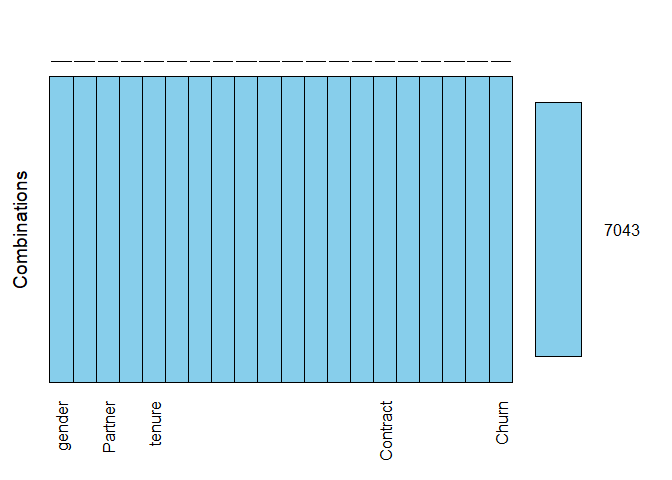<!-- -->

```
## 
##  Variables sorted by number of missings: 
##          Variable Count
##            gender     0
##     SeniorCitizen     0
##           Partner     0
##        Dependents     0
##            tenure     0
##      PhoneService     0
##     MultipleLines     0
##   InternetService     0
##    OnlineSecurity     0
##      OnlineBackup     0
##  DeviceProtection     0
##       TechSupport     0
##       StreamingTV     0
##   StreamingMovies     0
##          Contract     0
##  PaperlessBilling     0
##     PaymentMethod     0
##    MonthlyCharges     0
##      TotalCharges     0
##             Churn     0
```


# MODELING CHURN


## Logistic Regression: Full Model


First we need to split the data into a train and test set, with 80% of the data going into the train set. Note that createDataPartition() automatically accounts for the unbalanced levels of y [in this case 'Churn'] in an attempt to balance the class distributions within the splits


```r
# creating the 80 data partition 
churn_split <- createDataPartition(churn.df$Churn, p = 0.8, list = F)
# including 80 for training set
churn_train.df <- churn.df[churn_split,] 
# excluding 80 for testing set
churn_test.df <- churn.df[-churn_split,]

# validating
head(churn_test.df)
```

```
##    gender SeniorCitizen Partner Dependents tenure PhoneService
## 5  Female            No      No         No      2          Yes
## 6  Female            No      No         No      8          Yes
## 10   Male            No      No        Yes     62          Yes
## 13   Male            No     Yes         No     58          Yes
## 14   Male            No      No         No     49          Yes
## 15   Male            No      No         No     25          Yes
##    MultipleLines InternetService OnlineSecurity OnlineBackup
## 5             No     Fiber optic             No           No
## 6            Yes     Fiber optic             No           No
## 10            No             DSL            Yes          Yes
## 13           Yes     Fiber optic             No           No
## 14           Yes     Fiber optic             No          Yes
## 15            No     Fiber optic            Yes           No
##    DeviceProtection TechSupport StreamingTV StreamingMovies       Contract
## 5                No          No          No              No Month-to-month
## 6               Yes          No         Yes             Yes Month-to-month
## 10               No          No          No              No       One year
## 13              Yes          No         Yes             Yes       One year
## 14              Yes          No         Yes             Yes Month-to-month
## 15              Yes         Yes         Yes             Yes Month-to-month
##    PaperlessBilling             PaymentMethod MonthlyCharges TotalCharges
## 5               Yes          Electronic check          70.70       151.65
## 6               Yes          Electronic check          99.65       820.50
## 10               No Bank transfer (automatic)          56.15      3487.95
## 13               No   Credit card (automatic)         100.35      5681.10
## 14              Yes Bank transfer (automatic)         103.70      5036.30
## 15              Yes          Electronic check         105.50      2686.05
##    Churn
## 5    Yes
## 6    Yes
## 10    No
## 13    No
## 14   Yes
## 15    No
```

```r
head(churn_train.df)
```

```
##   gender SeniorCitizen Partner Dependents tenure PhoneService
## 1 Female            No     Yes         No      1           No
## 2   Male            No      No         No     34          Yes
## 3   Male            No      No         No      2          Yes
## 4   Male            No      No         No     45           No
## 7   Male            No      No        Yes     22          Yes
## 8 Female            No      No         No     10           No
##      MultipleLines InternetService OnlineSecurity OnlineBackup
## 1 No phone service             DSL             No          Yes
## 2               No             DSL            Yes           No
## 3               No             DSL            Yes          Yes
## 4 No phone service             DSL            Yes           No
## 7              Yes     Fiber optic             No          Yes
## 8 No phone service             DSL            Yes           No
##   DeviceProtection TechSupport StreamingTV StreamingMovies       Contract
## 1               No          No          No              No Month-to-month
## 2              Yes          No          No              No       One year
## 3               No          No          No              No Month-to-month
## 4              Yes         Yes          No              No       One year
## 7               No          No         Yes              No Month-to-month
## 8               No          No          No              No Month-to-month
##   PaperlessBilling             PaymentMethod MonthlyCharges TotalCharges
## 1              Yes          Electronic check          29.85        29.85
## 2               No              Mailed check          56.95      1889.50
## 3              Yes              Mailed check          53.85       108.15
## 4               No Bank transfer (automatic)          42.30      1840.75
## 7              Yes   Credit card (automatic)          89.10      1949.40
## 8               No              Mailed check          29.75       301.90
##   Churn
## 1    No
## 2    No
## 3   Yes
## 4    No
## 7    No
## 8    No
```


Lets create our initial Logistic Regression model using all the values. The AIC on the model is 4691.3. 

Note that R automatically processes the 1-bit encoding on factor variables. However our model has some issues due to the fact that there is a high amount of correlation. For example if a customer has no Internet service, they will always have no for ancillary services like Online Security or Online Backup. 

Despite this we see some parameters appear to be more *significant* to the model looking at the p-values for the following:

* SeniorCitizen
* tenure
* MultipleLines
* InternetService
* Contract
* PaperlessBilling
* PaymentMethod
* TotalCharges


```r
# create logistic regression model on train data
# R will automatically create dummy variables on factors
churn_train.logit <- glm(Churn ~ ., data = churn_train.df, family = binomial("logit") )
summary(churn_train.logit)
```

```
## 
## Call:
## glm(formula = Churn ~ ., family = binomial("logit"), data = churn_train.df)
## 
## Deviance Residuals: 
##     Min       1Q   Median       3Q      Max  
## -1.8776  -0.6809  -0.3024   0.7353   3.3405  
## 
## Coefficients: (7 not defined because of singularities)
##                                        Estimate Std. Error z value
## (Intercept)                           1.075e+00  9.090e-01   1.183
## genderMale                           -5.759e-02  7.212e-02  -0.799
## SeniorCitizenNo                      -1.663e-01  9.383e-02  -1.772
## PartnerYes                            2.478e-02  8.619e-02   0.288
## DependentsYes                        -1.535e-01  9.942e-02  -1.544
## tenure                               -5.450e-02  6.667e-03  -8.174
## PhoneServiceYes                       1.990e-02  7.182e-01   0.028
## MultipleLinesNo phone service                NA         NA      NA
## MultipleLinesYes                      4.059e-01  1.957e-01   2.074
## InternetServiceFiber optic            1.597e+00  8.834e-01   1.807
## InternetServiceNo                    -1.513e+00  8.947e-01  -1.691
## OnlineSecurityNo internet service            NA         NA      NA
## OnlineSecurityYes                    -2.294e-01  1.987e-01  -1.155
## OnlineBackupNo internet service              NA         NA      NA
## OnlineBackupYes                       4.522e-02  1.938e-01   0.233
## DeviceProtectionNo internet service          NA         NA      NA
## DeviceProtectionYes                   1.424e-01  1.943e-01   0.733
## TechSupportNo internet service               NA         NA      NA
## TechSupportYes                       -2.328e-01  1.996e-01  -1.166
## StreamingTVNo internet service               NA         NA      NA
## StreamingTVYes                        4.781e-01  3.603e-01   1.327
## StreamingMoviesNo internet service           NA         NA      NA
## StreamingMoviesYes                    5.755e-01  3.626e-01   1.587
## ContractOne year                     -6.677e-01  1.192e-01  -5.600
## ContractTwo year                     -1.317e+00  1.885e-01  -6.985
## PaperlessBillingYes                   2.977e-01  8.272e-02   3.598
## PaymentMethodCredit card (automatic) -1.524e-01  1.269e-01  -1.201
## PaymentMethodElectronic check         2.754e-01  1.048e-01   2.627
## PaymentMethodMailed check            -7.713e-02  1.279e-01  -0.603
## MonthlyCharges                       -3.181e-02  3.517e-02  -0.905
## TotalCharges                          2.644e-04  7.595e-05   3.482
##                                      Pr(>|z|)    
## (Intercept)                          0.236855    
## genderMale                           0.424541    
## SeniorCitizenNo                      0.076363 .  
## PartnerYes                           0.773720    
## DependentsYes                        0.122574    
## tenure                               2.97e-16 ***
## PhoneServiceYes                      0.977890    
## MultipleLinesNo phone service              NA    
## MultipleLinesYes                     0.038095 *  
## InternetServiceFiber optic           0.070727 .  
## InternetServiceNo                    0.090909 .  
## OnlineSecurityNo internet service          NA    
## OnlineSecurityYes                    0.248240    
## OnlineBackupNo internet service            NA    
## OnlineBackupYes                      0.815446    
## DeviceProtectionNo internet service        NA    
## DeviceProtectionYes                  0.463834    
## TechSupportNo internet service             NA    
## TechSupportYes                       0.243533    
## StreamingTVNo internet service             NA    
## StreamingTVYes                       0.184508    
## StreamingMoviesNo internet service         NA    
## StreamingMoviesYes                   0.112475    
## ContractOne year                     2.14e-08 ***
## ContractTwo year                     2.84e-12 ***
## PaperlessBillingYes                  0.000320 ***
## PaymentMethodCredit card (automatic) 0.229618    
## PaymentMethodElectronic check        0.008612 ** 
## PaymentMethodMailed check            0.546614    
## MonthlyCharges                       0.365712    
## TotalCharges                         0.000498 ***
## ---
## Signif. codes:  0 '***' 0.001 '**' 0.01 '*' 0.05 '.' 0.1 ' ' 1
## 
## (Dispersion parameter for binomial family taken to be 1)
## 
##     Null deviance: 6522.7  on 5635  degrees of freedom
## Residual deviance: 4717.0  on 5612  degrees of freedom
## AIC: 4765
## 
## Number of Fisher Scoring iterations: 6
```


### Visualize the coefficients of the Full Logistic Model

Visualizing the coefficients, we can see the most *influential* factors are the type of Internet Service and the type of contract, which were included in significant factors above


```r
# visualize coefficients
as.data.frame(churn_train.logit$coefficients) %>% ggplot(aes(y = .[,1], x = rownames(.)) ) + geom_col() + theme( axis.text = element_text(angle = 90, size = rel(0.7)) )
```

```
## Warning: Removed 7 rows containing missing values (position_stack).
```

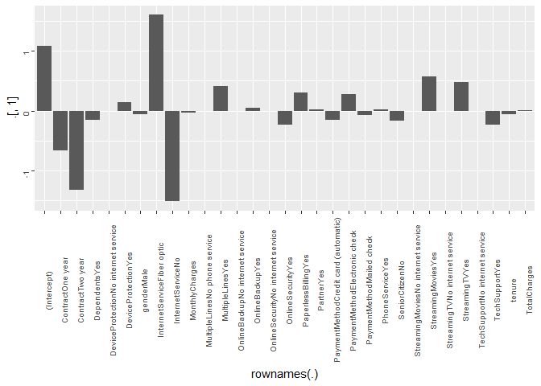<!-- -->

```r
# standard graphics alternative
# barplot( churn_train.logit$coefficients, names.arg = F, col = rainbow(31), legend.text = names(churn_train.logit$coefficient) )
```


### ROC Curve for Full Logistic Model

So now lets validate the accuracy of our model on the test data set. First lets take a look at a ROC curve for the model. The AUC is 83.79 


```r
# create predictions
predict(
  churn_train.logit, 
  newdata = churn_test.df,
  type = "response"
  ) -> churn_test.pred
```

```
## Warning in predict.lm(object, newdata, se.fit, scale = 1, type =
## ifelse(type == : prediction from a rank-deficient fit may be misleading
```

```r
#prediction(churn_test.pred, churn_test.df$Churn)

performance(
  prediction(churn_test.pred, churn_test.df$Churn),
  measure = "tpr",
  x.measure = "fpr"
) -> churn_logit.perf 

plot(churn_logit.perf)
```

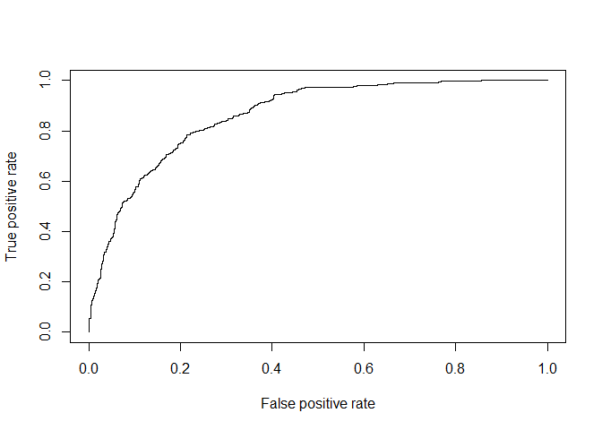<!-- -->

```r
# AUC value
print("AUC Value for this model is ")
```

```
## [1] "AUC Value for this model is "
```

```r
performance(
  prediction(churn_test.pred, churn_test.df$Churn),
  measure = "auc"
)@y.values[[1]]
```

```
## [1] 0.8626226
```

Looking at Accuracy, we can see we have an accurancy of approximately 79.25%

Essentially this means that when comparing the number of times the model predicts an accurate result, either "Yes" or "No" in comparison to the actual values, it is just under 80% accurate


```r
# split into "Yes" and "No" based on 0.5 threadshold
as.numeric(churn_test.pred > 0.5 ) -> churn_test.pred

dplyr::recode_factor(
  churn_test.pred, 
  `1` = "Yes", `0` = "No"
  ) -> churn_test.pred


mean(churn_test.pred == churn_test.df$Churn )
```

```
## [1] 0.8095238
```


### Confusion Matrix: Full Logistic Model

Lets setup a confusion matrix to also see the sensitivity and specificity of the model. 

Our specificity, essentially predicting negative outcomes, is fairly good at 88.3%.

However the sensitivity, predicting positive outcomes, is actually quite low at just under 54.16%

What this means is our **Full Logistic Model** is better at determining loyal customers, or when a customer **won't** leave.


```r
caret::confusionMatrix(
  data = relevel(churn_test.pred, ref = "Yes"),
  reference = relevel(churn_test.df$Churn, ref = "Yes")
)
```

```
## Confusion Matrix and Statistics
## 
##           Reference
## Prediction Yes  No
##        Yes 208 103
##        No  165 931
##                                          
##                Accuracy : 0.8095         
##                  95% CI : (0.788, 0.8297)
##     No Information Rate : 0.7349         
##     P-Value [Acc > NIR] : 3.313e-11      
##                                          
##                   Kappa : 0.4837         
##  Mcnemar's Test P-Value : 0.0001944      
##                                          
##             Sensitivity : 0.5576         
##             Specificity : 0.9004         
##          Pos Pred Value : 0.6688         
##          Neg Pred Value : 0.8495         
##              Prevalence : 0.2651         
##          Detection Rate : 0.1478         
##    Detection Prevalence : 0.2210         
##       Balanced Accuracy : 0.7290         
##                                          
##        'Positive' Class : Yes            
## 
```


### Adjusting Model

Tweaking the split away from 50% [or 0.5], we can try other values that more accurately reflect the disproritionate sample of customer churn, and then see if this will improve the model sensitivity.

We can see how uneven the samples between "No" vs "Yes" customers is, thus we skew our prediciton boundary to account for this


```r
# compare "yes" vs "no"
table(churn.df$Churn)
```

```
## 
##   No  Yes 
## 5174 1869
```

```r
plot(churn.df$Churn)
```

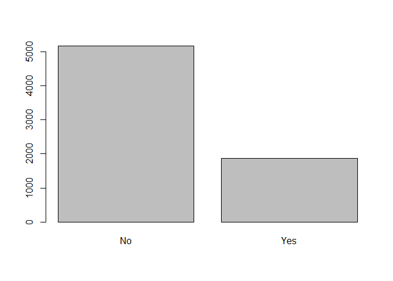<!-- -->

**Model using a 30% threshold instead of 50%**

Accuracy goes down a little to 74.41%


```r
# create predictions
predict(
  churn_train.logit, 
  newdata = churn_test.df,
  type = "response"
  ) -> churn_test.pred
```

```
## Warning in predict.lm(object, newdata, se.fit, scale = 1, type =
## ifelse(type == : prediction from a rank-deficient fit may be misleading
```

```r
# split into "Yes" and "No" based on 0.3 threshold
as.numeric(churn_test.pred > 0.3 ) -> churn_test.pred

dplyr::recode_factor(
  churn_test.pred, 
  `1` = "Yes", `0` = "No"
  ) -> churn_test.pred

mean(churn_test.pred == churn_test.df$Churn )
```

```
## [1] 0.7782516
```


**Confusion Matrix for 30% Prediction Boundary**

Our specificity has gone down to 73.21%, however the sensitivity is almost at 77.75%, giving a more balanced model.

**Why is this important?**
Using Cancer as an example, the value of a False Postitive is *not* the same as a False Negative. To clarify: mistakenly telling someone they have Cancer when they are in fact Healthy is bad, but the reverse, telling someone they are Healthy when they in fact have Cancer is much more severe.

Thus **Sensitivity** addresses this: how often to you identify Cancer or customer's Churning, when they ACTUALLY are Cancer or Churning


```r
caret::confusionMatrix(
  data = relevel(churn_test.pred, ref = "Yes"),
  reference = relevel(churn_test.df$Churn, ref = "Yes")
)
```

```
## Confusion Matrix and Statistics
## 
##           Reference
## Prediction Yes  No
##        Yes 297 236
##        No   76 798
##                                           
##                Accuracy : 0.7783          
##                  95% CI : (0.7556, 0.7997)
##     No Information Rate : 0.7349          
##     P-Value [Acc > NIR] : 0.0001002       
##                                           
##                   Kappa : 0.4995          
##  Mcnemar's Test P-Value : < 2.2e-16       
##                                           
##             Sensitivity : 0.7962          
##             Specificity : 0.7718          
##          Pos Pred Value : 0.5572          
##          Neg Pred Value : 0.9130          
##              Prevalence : 0.2651          
##          Detection Rate : 0.2111          
##    Detection Prevalence : 0.3788          
##       Balanced Accuracy : 0.7840          
##                                           
##        'Positive' Class : Yes             
## 
```

```r
# TO LOOP THROUGH CONFUSION MATRIX OBJECT
# SENSITIVITY = test.churn.conf$byClass[1]
# ACCURACY = test.churn.conf$overall[1]
# SPECIFICITY = test.churn.conf$byClass[2]
# F1 [Recall vs Precision} test.churn.conf$byClass[7]
```


## Model Challenges: Variable Correlation and Overfitting

As mentioned earlier we have some issues with this model. Due to the fact that we are predominantly dealing with categorical predictors, it's not as obvious to identify potential correlation between them; as compared to continuous variables that allow us to simply calculate the Variance Inflation Factor [VIF].

The message *Coefficients: (7 not defined because of singularities)* alludes to model features whose effect on the output is not discernable from other features due to inter-dependencies. As per above, any customer with "no" for the InternetService predictor is also going to have "no" for ancillary services like OnlineSecurity and OnlineBackup, as well as StreamingTV or StreamingMovies.

The **alias()** command [output omitted due to size] validates this.

Additionally with 20+ predictors we run the risk of overfitting, where our model performs well on the training data set used to construct the model, but then performs poorly on new customers we wish to accurately predict their attrition likelihood.

For this there are a variety of techniques to simplify the model, leaving only the most influential predictors. We will explore these further

* Feature Selection
* Regularized or Shrinkage
* Manually Adjusted


## Feature Selection: Stepwise Regression

Now let's employ **Feature Selection**, where R iteratively goes through the model adding / removing a predictors based on the calculated significance to the model's overall performance. There are different metrics which can be used to evaluate this performance; here we find optimal coefficients by using the respective AIC score. 

So far this is the lowest AIC score at 4683.7, compared to the **Full** model's AIC of 4691.3. However we still have some interdependencies among the predictors.

Let's investigate further


### Visualizing Coefficients on Stepwise Model

The list of significant factors that the AIC-based Stepwise Regression recommends are:

* SeniorCitizen
* tenure
* MultipleLines
* InternetService
* OnlineSecurity
* TechSupport
* StreamingMovies
* Contract
* PaperlessBilling
* TotalCharges


```r
stepAIC(
  churn_train.logit,
  trace = F,
  direction = "both"
) -> churn_step.logit


# view results
summary(churn_step.logit)
```

```
## 
## Call:
## glm(formula = Churn ~ SeniorCitizen + Dependents + tenure + MultipleLines + 
##     InternetService + OnlineSecurity + TechSupport + StreamingTV + 
##     StreamingMovies + Contract + PaperlessBilling + PaymentMethod + 
##     TotalCharges, family = binomial("logit"), data = churn_train.df)
## 
## Deviance Residuals: 
##     Min       1Q   Median       3Q      Max  
## -1.8860  -0.6830  -0.3026   0.7318   3.3281  
## 
## Coefficients: (4 not defined because of singularities)
##                                        Estimate Std. Error z value
## (Intercept)                          -3.931e-01  1.683e-01  -2.336
## SeniorCitizenNo                      -1.684e-01  9.320e-02  -1.807
## DependentsYes                        -1.430e-01  9.012e-02  -1.587
## tenure                               -5.347e-02  6.586e-03  -8.120
## MultipleLinesNo phone service         6.070e-01  1.480e-01   4.101
## MultipleLinesYes                      2.494e-01  8.817e-02   2.828
## InternetServiceFiber optic            8.151e-01  1.095e-01   7.446
## InternetServiceNo                    -6.861e-01  1.514e-01  -4.532
## OnlineSecurityNo internet service            NA         NA      NA
## OnlineSecurityYes                    -3.850e-01  9.444e-02  -4.077
## TechSupportNo internet service               NA         NA      NA
## TechSupportYes                       -3.886e-01  9.606e-02  -4.045
## StreamingTVNo internet service               NA         NA      NA
## StreamingTVYes                        1.657e-01  9.043e-02   1.832
## StreamingMoviesNo internet service           NA         NA      NA
## StreamingMoviesYes                    2.630e-01  9.033e-02   2.911
## ContractOne year                     -6.726e-01  1.188e-01  -5.659
## ContractTwo year                     -1.318e+00  1.880e-01  -7.011
## PaperlessBillingYes                   2.979e-01  8.263e-02   3.605
## PaymentMethodCredit card (automatic) -1.560e-01  1.268e-01  -1.230
## PaymentMethodElectronic check         2.748e-01  1.047e-01   2.624
## PaymentMethodMailed check            -7.954e-02  1.278e-01  -0.623
## TotalCharges                          2.419e-04  7.382e-05   3.277
##                                      Pr(>|z|)    
## (Intercept)                          0.019511 *  
## SeniorCitizenNo                      0.070781 .  
## DependentsYes                        0.112567    
## tenure                               4.67e-16 ***
## MultipleLinesNo phone service        4.11e-05 ***
## MultipleLinesYes                     0.004680 ** 
## InternetServiceFiber optic           9.66e-14 ***
## InternetServiceNo                    5.86e-06 ***
## OnlineSecurityNo internet service          NA    
## OnlineSecurityYes                    4.56e-05 ***
## TechSupportNo internet service             NA    
## TechSupportYes                       5.23e-05 ***
## StreamingTVNo internet service             NA    
## StreamingTVYes                       0.066988 .  
## StreamingMoviesNo internet service         NA    
## StreamingMoviesYes                   0.003599 ** 
## ContractOne year                     1.52e-08 ***
## ContractTwo year                     2.36e-12 ***
## PaperlessBillingYes                  0.000312 ***
## PaymentMethodCredit card (automatic) 0.218532    
## PaymentMethodElectronic check        0.008683 ** 
## PaymentMethodMailed check            0.533563    
## TotalCharges                         0.001049 ** 
## ---
## Signif. codes:  0 '***' 0.001 '**' 0.01 '*' 0.05 '.' 0.1 ' ' 1
## 
## (Dispersion parameter for binomial family taken to be 1)
## 
##     Null deviance: 6522.7  on 5635  degrees of freedom
## Residual deviance: 4720.2  on 5617  degrees of freedom
## AIC: 4758.2
## 
## Number of Fisher Scoring iterations: 6
```

As far as the strongest coefficients, the AIC Step Model found the following to be the most influential:

* Contract
* InternetService
* MultipleLines


```r
# visualize coefficients
as.data.frame(churn_step.logit$coefficients) %>% ggplot(aes(y = .[,1], x = rownames(.)) ) + geom_col() + theme( axis.text = element_text(angle = 90, size = rel(0.7)) )
```

```
## Warning: Removed 4 rows containing missing values (position_stack).
```

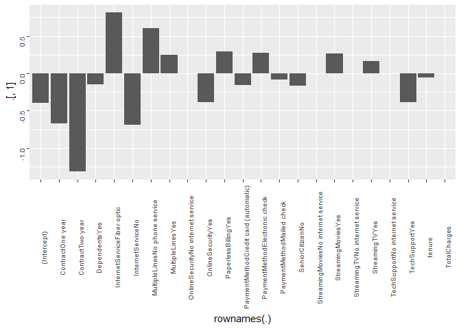<!-- -->


### ROC Curve on AIC-based Stepwise

Evaluating the accuracy of our model on the test data set by visualizing through a ROC curve of the model's performance. Looks fairly close to the ROC of the Full Logistic Model. The AUC is 83.63% compared to the Full's 83.79%


```r
# create predictions
predict(
  churn_step.logit, 
  newdata = churn_test.df,
  type = "response"
  ) -> churn_step.pred
```

```
## Warning in predict.lm(object, newdata, se.fit, scale = 1, type =
## ifelse(type == : prediction from a rank-deficient fit may be misleading
```

```r
#prediction(churn_step.pred, churn_test.df$Churn)

performance(
  prediction(churn_step.pred, churn_test.df$Churn),
  measure = "tpr",
  x.measure = "fpr"
) -> churn_step.perf 

plot(churn_step.perf)
```

<!-- -->

```r
# AUC value
print("AUC Value for this model is ")
```

```
## [1] "AUC Value for this model is "
```

```r
performance(
  prediction(churn_step.pred, churn_test.df$Churn),
  measure = "auc"
)@y.values[[1]]
```

```
## [1] 0.8617592
```

**Accuracy doing a 50 / 50 Prediction Boundary**

Essentially comparing the number of times the model predicts an accurate result, either "Yes" or "No" in comparison to the actual values

We have an accurancy of 78.96%


```r
# split into "Yes" and "No" based on 0.5 threadshold
as.numeric(churn_step.pred > 0.5 ) -> churn_step.pred

dplyr::recode_factor(
  churn_step.pred, 
  `1` = "Yes", `0` = "No"
  ) -> churn_step.pred


mean(churn_step.pred == churn_test.df$Churn )
```

```
## [1] 0.8066809
```


Lets setup a confusion matrix to also see the sensitivity and specificity of the model. 

Our specificity, essentially predicting negative outcomes, is around 88%. And the sensitivity, predicting positive outcomes, is slightly lower now at 53.6%

Thus our model is *still* better at determining loyal customers, or when a customer **won't** leave.


```r
caret::confusionMatrix(
  data = relevel(churn_step.pred, ref = "Yes"),
  reference = relevel(churn_test.df$Churn, ref = "Yes")
)
```

```
## Confusion Matrix and Statistics
## 
##           Reference
## Prediction Yes  No
##        Yes 210 109
##        No  163 925
##                                          
##                Accuracy : 0.8067         
##                  95% CI : (0.7851, 0.827)
##     No Information Rate : 0.7349         
##     P-Value [Acc > NIR] : 1.815e-10      
##                                          
##                   Kappa : 0.4798         
##  Mcnemar's Test P-Value : 0.001311       
##                                          
##             Sensitivity : 0.5630         
##             Specificity : 0.8946         
##          Pos Pred Value : 0.6583         
##          Neg Pred Value : 0.8502         
##              Prevalence : 0.2651         
##          Detection Rate : 0.1493         
##    Detection Prevalence : 0.2267         
##       Balanced Accuracy : 0.7288         
##                                          
##        'Positive' Class : Yes            
## 
```


**Accuracy doing a 70 / 30 Prediction Boundary**

Again accounting for the unbalanced levels of "Yes" vs "No" churn we can adjust the prediction boundary to more accurately reflect this

We now have a lower accurancy of 74.2%


```r
# create predictions
predict(
  churn_step.logit, 
  newdata = churn_test.df,
  type = "response"
  ) -> churn_step.pred
```

```
## Warning in predict.lm(object, newdata, se.fit, scale = 1, type =
## ifelse(type == : prediction from a rank-deficient fit may be misleading
```

```r
# split into "Yes" and "No" based on 0.3 threadshold
as.numeric(churn_step.pred > 0.3 ) -> churn_step.pred

dplyr::recode_factor(
  churn_step.pred, 
  `1` = "Yes", `0` = "No"
  ) -> churn_step.pred

mean(churn_step.pred == churn_test.df$Churn )
```

```
## [1] 0.7746979
```


Lets setup a confusion matrix to also see the sensitivity and specificity of the model. 

Our specificity, essentially predicting negative outcomes, is now around 73.1%. And the sensitivity, predicting positive outcomes, is improved dramatically to 77.21%


```r
caret::confusionMatrix(
  data = relevel(churn_step.pred, ref = "Yes"),
  reference = relevel(churn_test.df$Churn, ref = "Yes")
)
```

```
## Confusion Matrix and Statistics
## 
##           Reference
## Prediction Yes  No
##        Yes 294 238
##        No   79 796
##                                          
##                Accuracy : 0.7747         
##                  95% CI : (0.752, 0.7963)
##     No Information Rate : 0.7349         
##     P-Value [Acc > NIR] : 0.0003308      
##                                          
##                   Kappa : 0.4911         
##  Mcnemar's Test P-Value : < 2.2e-16      
##                                          
##             Sensitivity : 0.7882         
##             Specificity : 0.7698         
##          Pos Pred Value : 0.5526         
##          Neg Pred Value : 0.9097         
##              Prevalence : 0.2651         
##          Detection Rate : 0.2090         
##    Detection Prevalence : 0.3781         
##       Balanced Accuracy : 0.7790         
##                                          
##        'Positive' Class : Yes            
## 
```


## Regularization: Lasso & Ridge Penalized Regression

Unlike Feature Selection in the prior section, which adds / removes predictors, now we are looking at **Regularization** techniques. Rather than removing predictors they instead introduce a constraint in the training process that shrinks the estimated coefficients. We will be exploring 2 such methods

**Ridge Regression** introduces bias in order to reduce the model's variance, and tries to minimize the sum of the Residual Sum-of-Squares [RSS]. It shrinks variables to be *approximately* zero.

**Lasso Regression** is similar to Ridge, however it instad involves the minimizing the sum of the absolute values of the coefficients, pushing the least significant ones closer to zero. Unlike Ridge, the Lasso Penalty will actually push them all the way to zero.

Both of these rely on a constant **lambda** which acts as a tuning parameter which effects the size of the penalty, thus shrinking the coefficients's closer to zero. For the purposes of this exercise we rely on the **cv.glmnet()** function to iteratively find the optimal value for each model


```r
# NOTE: requires data as matrix

# create dummy variables
model.matrix(Churn ~ ., data = churn_train.df) -> churn_train.mtx
# remove intercept
churn_train.mtx[, -1] -> churn_train.mtx
```


First we need to prepare the data as a separate matrix of predictors, and the response as a vector, in order to leverage the cv.glmnet() function. Note that the glmnet() function can do either Lasso *or* Ridge Regularized Regression, simply by specifying **alpha = 1** or **alpha = 0** respectively

In both cases we first run the **cv.glmnet()** function to find the optimal value of lambda, then output as an S3 object which we plug that value into the actual Regularized Regression model. 


**Lasso Regression**


```r
# Find optimal value of lambda
cv.glmnet(
  churn_train.mtx, churn_train.df$Churn,
  family = "binomial",
  alpha = 1
) -> lambda.lasso

# glm model: LASSO
glmnet(
  churn_train.mtx, churn_train.df$Churn, 
  family="binomial", 
  alpha = 1,
  lambda = lambda.lasso$lambda.min
  ) -> churn_train.lasso

# output coefficients
coef(lambda.lasso, lambda.lasso$lambda.min)
```

```
## 31 x 1 sparse Matrix of class "dgCMatrix"
##                                                  1
## (Intercept)                           1.608043e-01
## genderMale                           -5.091244e-02
## SeniorCitizenNo                      -1.647759e-01
## PartnerYes                            8.769662e-03
## DependentsYes                        -1.440522e-01
## tenure                               -4.802513e-02
## PhoneServiceYes                      -5.635299e-01
## MultipleLinesNo phone service         .           
## MultipleLinesYes                      2.485751e-01
## InternetServiceFiber optic            8.370860e-01
## InternetServiceNo                    -5.721707e-01
## OnlineSecurityNo internet service    -6.053525e-14
## OnlineSecurityYes                    -3.715715e-01
## OnlineBackupNo internet service      -7.328977e-02
## OnlineBackupYes                      -8.953137e-02
## DeviceProtectionNo internet service  -1.599566e-02
## DeviceProtectionYes                   .           
## TechSupportNo internet service       -1.665598e-16
## TechSupportYes                       -3.719120e-01
## StreamingTVNo internet service       -4.976533e-02
## StreamingTVYes                        1.727720e-01
## StreamingMoviesNo internet service   -8.579185e-05
## StreamingMoviesYes                    2.684026e-01
## ContractOne year                     -6.600046e-01
## ContractTwo year                     -1.283091e+00
## PaperlessBillingYes                   2.948639e-01
## PaymentMethodCredit card (automatic) -1.340701e-01
## PaymentMethodElectronic check         2.902129e-01
## PaymentMethodMailed check            -5.100014e-02
## MonthlyCharges                        .           
## TotalCharges                          1.882901e-04
```

```r
# NOTE: lambda.lasso$lambda.1se outputs simplest model
```


### Plot of Lasso Model Lambda

CV Mean Squared Error [MSE] for Lasso model. The first dotted line represents lambda with the smallest MSE and the second represents with an MSE within 1 standard-error of the minimum MSE [which typically outputs a *simpler* model. ]


```r
plot(lambda.lasso)
```

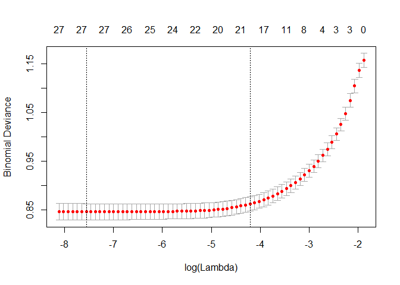<!-- -->


**Ridge Regression**


```r
# Find optimal value of lambda
cv.glmnet(
  churn_train.mtx, churn_train.df$Churn,
  family = "binomial",
  alpha = 0
) -> lambda.ridge

# glm model: RIDGE
glmnet(
  churn_train.mtx, churn_train.df$Churn, 
  family="binomial", 
  alpha = 0,
  lambda = lambda.ridge$lambda.min
  ) -> churn_train.ridge

# output coefficients of lowest lambda
coef(
  lambda.ridge,
  lambda.ridge$lambda.min
)
```

```
## 31 x 1 sparse Matrix of class "dgCMatrix"
##                                                  1
## (Intercept)                          -4.845065e-01
## genderMale                           -5.475793e-02
## SeniorCitizenNo                      -1.760554e-01
## PartnerYes                           -3.081024e-02
## DependentsYes                        -1.665253e-01
## tenure                               -2.336010e-02
## PhoneServiceYes                      -2.098322e-01
## MultipleLinesNo phone service         2.052741e-01
## MultipleLinesYes                      2.064169e-01
## InternetServiceFiber optic            7.109367e-01
## InternetServiceNo                    -1.103632e-01
## OnlineSecurityNo internet service    -1.100221e-01
## OnlineSecurityYes                    -3.876078e-01
## OnlineBackupNo internet service      -1.108155e-01
## OnlineBackupYes                      -1.159730e-01
## DeviceProtectionNo internet service  -1.118738e-01
## DeviceProtectionYes                  -3.354788e-02
## TechSupportNo internet service       -1.127394e-01
## TechSupportYes                       -3.764919e-01
## StreamingTVNo internet service       -1.136914e-01
## StreamingTVYes                        1.603585e-01
## StreamingMoviesNo internet service   -1.148324e-01
## StreamingMoviesYes                    2.330494e-01
## ContractOne year                     -6.002785e-01
## ContractTwo year                     -9.901186e-01
## PaperlessBillingYes                   2.832203e-01
## PaymentMethodCredit card (automatic) -1.564384e-01
## PaymentMethodElectronic check         3.158316e-01
## PaymentMethodMailed check            -1.661616e-02
## MonthlyCharges                        4.950242e-03
## TotalCharges                         -6.229724e-05
```

```r
# NOTE: lambda.ridge$lambda.1se outputs simplest model
```


### Plot of Ridge Model Lambda

CV Mean Squared Error [MSE] for Ridge model. The first dotted line represents lambda with the smallest MSE and the second represents with an MSE within 1 standard-error of the minimum MSE [again the 1 SE outputs the *simpler* model.]


```r
plot(lambda.ridge)
```

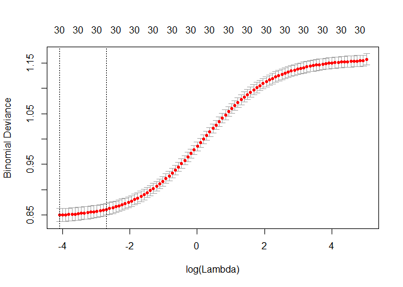<!-- -->


### Lasso model with optimized Lambda

**ROC curve**

Evaluating the accuracy of the Lasso Penalized Logistic model on the test data set by visualizing through a ROC curve of the model's performance. The AUC is 83.79%

Looks fairly close to the ROC of the Full Logistic Model.


```r
# make test data into matrix
# create dummy variables
model.matrix(Churn ~ ., data = churn_test.df) -> churn_test.mtx
# remove intercept
churn_test.mtx[, -1] -> churn_test.mtx

# validate prediction accuracy on test data set

predict(
  churn_train.lasso,
  s = lambda.lasso$lambda.min,
  newx = churn_test.mtx,
  type = "response"
) -> churn_test_lasso.pred


# validate range is between 0 and 1
range(churn_test_lasso.pred)
```

```
## [1] 0.002580414 0.831503110
```

```r
performance(
  prediction(churn_test_lasso.pred, churn_test.df$Churn),
  measure = "tpr",
  x.measure = "fpr"
) -> churn_lasso.perf 

plot(churn_lasso.perf)
```

<!-- -->

```r
# AUC value
print("AUC Value for this model is ")
```

```
## [1] "AUC Value for this model is "
```

```r
performance(
  prediction(churn_test_lasso.pred, churn_test.df$Churn),
  measure = "auc"
)@y.values[[1]]
```

```
## [1] 0.8617566
```


### Confusion Matrix for Lasso Model

Essentially comparing the number of times the model predicts an accurate result, either "Yes" or "No" in comparison to the actual values

We can see we have a slightly lower accurancy of approximately 78.96%


```r
# preparing data for confusion matrix

as.numeric(churn_test_lasso.pred > 0.5) -> churn_test_lasso.pred

dplyr::recode_factor(
  churn_test_lasso.pred, 
  `1` = "Yes", `0` = "No"
) -> churn_test_lasso.pred

# Accuracy
mean(churn_test_lasso.pred == churn_test.df$Churn)
```

```
## [1] 0.8081023
```


**Confusion Matrix**

Our specificity, essentially predicting negative outcomes, is 88%. And the sensitivity, predicting positive outcomes, is at 53.6%

What this means is our model is better at determining loyal customers, or when a customer **won't** leave.


```r
# confusion matrix
caret::confusionMatrix(
  data = relevel(churn_test_lasso.pred, ref = "Yes"),
  reference = relevel(churn_test.df$Churn, ref = "Yes")
)
```

```
## Confusion Matrix and Statistics
## 
##           Reference
## Prediction Yes  No
##        Yes 207 104
##        No  166 930
##                                           
##                Accuracy : 0.8081          
##                  95% CI : (0.7865, 0.8284)
##     No Information Rate : 0.7349          
##     P-Value [Acc > NIR] : 7.824e-11       
##                                           
##                   Kappa : 0.4799          
##  Mcnemar's Test P-Value : 0.0002054       
##                                           
##             Sensitivity : 0.5550          
##             Specificity : 0.8994          
##          Pos Pred Value : 0.6656          
##          Neg Pred Value : 0.8485          
##              Prevalence : 0.2651          
##          Detection Rate : 0.1471          
##    Detection Prevalence : 0.2210          
##       Balanced Accuracy : 0.7272          
##                                           
##        'Positive' Class : Yes             
## 
```


## Logistic Regression: Manually Optimized Model

Lookinga cross the results of all our models, the categories that were found to be significant across all of them are:

* tenure
* Contract
* PaperlessBilling
* TotalCharges
* SeniorCitizen
* MultipleLines
* InternetService


We will now create a model just using these predictors in an attempt to avoid a model that overfits our data. 

The AIC score on the manual model is 4765.9 vs the full model 4643.3, and using the Stepwise method for feature engineering of 4683.7.

Here, EVERY parameter is show to be statistically significant, given by their p-values.


```r
# logistic regression model on manually specified variables
churn_manual.logit <- glm(
  Churn ~ tenure + Contract + PaperlessBilling + TotalCharges + SeniorCitizen + MultipleLines + InternetService, 
  data = churn_train.df, 
  family = binomial("logit") 
  )

# view results
summary(churn_manual.logit)
```

```
## 
## Call:
## glm(formula = Churn ~ tenure + Contract + PaperlessBilling + 
##     TotalCharges + SeniorCitizen + MultipleLines + InternetService, 
##     family = binomial("logit"), data = churn_train.df)
## 
## Deviance Residuals: 
##     Min       1Q   Median       3Q      Max  
## -1.7401  -0.6936  -0.3166   0.8004   3.4552  
## 
## Coefficients:
##                                 Estimate Std. Error z value Pr(>|z|)    
## (Intercept)                   -4.235e-01  1.339e-01  -3.163 0.001561 ** 
## tenure                        -5.777e-02  6.304e-03  -9.164  < 2e-16 ***
## ContractOne year              -7.761e-01  1.158e-01  -6.703 2.05e-11 ***
## ContractTwo year              -1.566e+00  1.843e-01  -8.493  < 2e-16 ***
## PaperlessBillingYes            3.743e-01  8.082e-02   4.631 3.64e-06 ***
## TotalCharges                   2.718e-04  6.785e-05   4.006 6.18e-05 ***
## SeniorCitizenNo               -2.713e-01  9.039e-02  -3.001 0.002692 ** 
## MultipleLinesNo phone service  7.375e-01  1.440e-01   5.121 3.04e-07 ***
## MultipleLinesYes               2.940e-01  8.688e-02   3.384 0.000714 ***
## InternetServiceFiber optic     1.059e+00  1.044e-01  10.138  < 2e-16 ***
## InternetServiceNo             -5.969e-01  1.419e-01  -4.206 2.60e-05 ***
## ---
## Signif. codes:  0 '***' 0.001 '**' 0.01 '*' 0.05 '.' 0.1 ' ' 1
## 
## (Dispersion parameter for binomial family taken to be 1)
## 
##     Null deviance: 6522.7  on 5635  degrees of freedom
## Residual deviance: 4807.6  on 5625  degrees of freedom
## AIC: 4829.6
## 
## Number of Fisher Scoring iterations: 6
```


### Visualizing Coefficients on Manual Model

From this model it estimates the most influential feature to predicting customer churn would be those with a 2-year contract, followed by the type of Internet Service.


```r
# visualize coefficients
as.data.frame(churn_manual.logit$coefficients) %>% ggplot(aes(y = .[,1], x = rownames(.)) ) + geom_col() + theme( axis.text = element_text(angle = 90, size = rel(0.9)) )
```

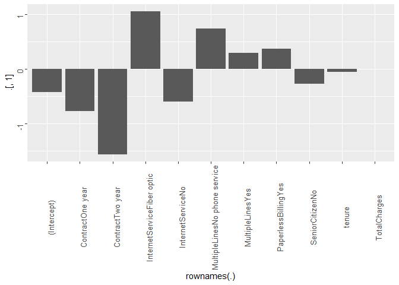<!-- -->


### ROC Curve on Manual Model

So now lets validate the AUC of our model on the test data set and take a look at a ROC curve.

The AUC for the *Manual* model is 83.9% which is slightly better than the *Full* model's score of 83.79%


```r
# create predictions
predict(
  churn_manual.logit, 
  newdata = churn_test.df,
  type = "response"
  ) -> churn_manual.pred

#prediction(churn_manual.pred, churn_test.df$Churn)

performance(
  prediction(churn_manual.pred, churn_test.df$Churn),
  measure = "tpr",
  x.measure = "fpr"
) -> churn_manual.perf 

plot(churn_manual.perf)
```

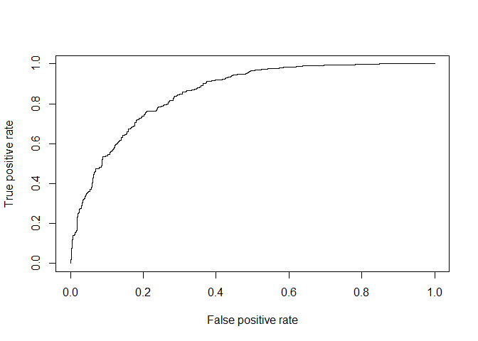<!-- -->

```r
# AUC value
print("AUC Value for this model is ")
```

```
## [1] "AUC Value for this model is "
```

```r
performance(
  prediction(churn_manual.pred, churn_test.df$Churn),
  measure = "auc"
)@y.values[[1]]
```

```
## [1] 0.8570545
```


We can see we have a an accurancy of approximately 79.74%


```r
# split into "Yes" and "No" based on 0.5 threadshold
as.numeric(churn_manual.pred > 0.5 ) -> churn_manual.pred

dplyr::recode_factor(
  churn_manual.pred, 
  `1` = "Yes", `0` = "No"
  ) -> churn_manual.pred


mean(churn_manual.pred == churn_test.df$Churn )
```

```
## [1] 0.8045487
```


Lets setup a confusion matrix to also see the sensitivity and specificity of the model. 

Our specificity, essentially predicting negative outcomes, is 87.9%. And the sensitivity, predicting positive outcomes, is at 57.1%

What this means is our model is better at determining loyal customers, or when a customer **won't** leave.


```r
caret::confusionMatrix(
  data = relevel(churn_manual.pred, ref = "Yes"),
  reference = relevel(churn_test.df$Churn, ref = "Yes")
)
```

```
## Confusion Matrix and Statistics
## 
##           Reference
## Prediction Yes  No
##        Yes 203 105
##        No  170 929
##                                          
##                Accuracy : 0.8045         
##                  95% CI : (0.7828, 0.825)
##     No Information Rate : 0.7349         
##     P-Value [Acc > NIR] : 6.199e-10      
##                                          
##                   Kappa : 0.4688         
##  Mcnemar's Test P-Value : 0.0001137      
##                                          
##             Sensitivity : 0.5442         
##             Specificity : 0.8985         
##          Pos Pred Value : 0.6591         
##          Neg Pred Value : 0.8453         
##              Prevalence : 0.2651         
##          Detection Rate : 0.1443         
##    Detection Prevalence : 0.2189         
##       Balanced Accuracy : 0.7213         
##                                          
##        'Positive' Class : Yes            
## 
```


**Model using a 30% threshold instead of 50%**

Accuracy goes down a little to 72.9%


```r
# create predictions
predict(
  churn_manual.logit, 
  newdata = churn_test.df,
  type = "response"
  ) -> churn_manual.pred

# split into "Yes" and "No" based on 0.3 threshold
as.numeric(churn_manual.pred > 0.3 ) -> churn_manual.pred

dplyr::recode_factor(
  churn_manual.pred, 
  `1` = "Yes", `0` = "No"
  ) -> churn_manual.pred

mean(churn_manual.pred == churn_test.df$Churn )
```

```
## [1] 0.7555082
```


**Confusion Matrix for 30% Prediction Boundary**

Our specificity has gone down to just under 71%, however the sensitivity is now over 78%, giving model that can more accurantely predict customer churn.

Thus the **Manual** Logistic model gives us the best sensitivity score so far at 78%. Compared to the **Full** Logistic model's sensitivity of 77.75% and the **AIC-Stepwise** Logistic model's sensitivity 77.21%


```r
caret::confusionMatrix(
  data = relevel(churn_manual.pred, ref = "Yes"),
  reference = relevel(churn_test.df$Churn, ref = "Yes")
)
```

```
## Confusion Matrix and Statistics
## 
##           Reference
## Prediction Yes  No
##        Yes 296 267
##        No   77 767
##                                           
##                Accuracy : 0.7555          
##                  95% CI : (0.7322, 0.7778)
##     No Information Rate : 0.7349          
##     P-Value [Acc > NIR] : 0.04171         
##                                           
##                   Kappa : 0.4604          
##  Mcnemar's Test P-Value : < 2e-16         
##                                           
##             Sensitivity : 0.7936          
##             Specificity : 0.7418          
##          Pos Pred Value : 0.5258          
##          Neg Pred Value : 0.9088          
##              Prevalence : 0.2651          
##          Detection Rate : 0.2104          
##    Detection Prevalence : 0.4001          
##       Balanced Accuracy : 0.7677          
##                                           
##        'Positive' Class : Yes             
## 
```


## Random Forest


Now we'll try a different type of modeling based on ensemble models of decision trees called Random Forest, combined with 10-fold cross validation.

The Random Forest means multiple trees will be built, all split in a variety of different ways, and randomly including different predictors, and then based on the majority rules, the "best" tree will be picked.

The 10 fold cross-validation means we take the **training** data, split it up into 10 equal portions, *train* the Random Forest on 9 of the 10, and *validate* on the remaining 1 of 10. It will iterate through all 10 possible combinations, where each of the 10 sections is ommitted in a training iteration

The combinanation of these techniques is an "ensemble" or aggregate results of many models

Initially we'll run the Random Forest with mostly default settings. We can see the default created 500 trees and 2 variables considered as split points per tree

NOTE: as per the Logistic Regression, we anticipate challenges due to the UNBALANCED "Yes" vs "No" levels


```r
# training RF model

train(
  Churn ~ .,
  data = churn_train.df,
  method = "rf",
  trControl = trainControl("cv", number = 10),
  importance = T,
  metric = "Accuracy"
) -> churn_train.rf

# best tuning parameter
churn_train.rf$bestTune
```

```
##   mtry
## 1    2
```

```r
#final model
churn_train.rf$finalModel
```

```
## 
## Call:
##  randomForest(x = x, y = y, mtry = param$mtry, importance = ..1) 
##                Type of random forest: classification
##                      Number of trees: 500
## No. of variables tried at each split: 2
## 
##         OOB estimate of  error rate: 21.01%
## Confusion matrix:
##       No Yes class.error
## No  3936 204  0.04927536
## Yes  980 516  0.65508021
```


### Evaluating model with test predictions

The OB estimate of error rate of 20.87% is calculated using observations not in the "bag" with respect to bagging / boosting sample selection. I.e. the training set *not* used for building the decision tree. Thus this implies when this model is applied to NEW data, the answers will be in error around 21% of the time.


```r
# predictions

predict(
  churn_train.rf,
  newdata = churn_test.df,
  ) -> churn_forest.pred
```

**AUC and RMSE**

The initial model's AUC is pretty terrible at 65.46% and the RMSE is 45.3% This is likely due to a few factors, including lack of hyperparameter tuning, and especially the unbalanced "yes" vs "no" levels


```r
# AUC plot
# NOTE: must convert values to numeric to use function
performance(
  prediction( as.numeric(churn_forest.pred), as.numeric(churn_test.df$Churn) ),
  measure = "tpr",
  x.measure = "fpr"
) -> churn_forest.perf 

plot(churn_forest.perf)
```

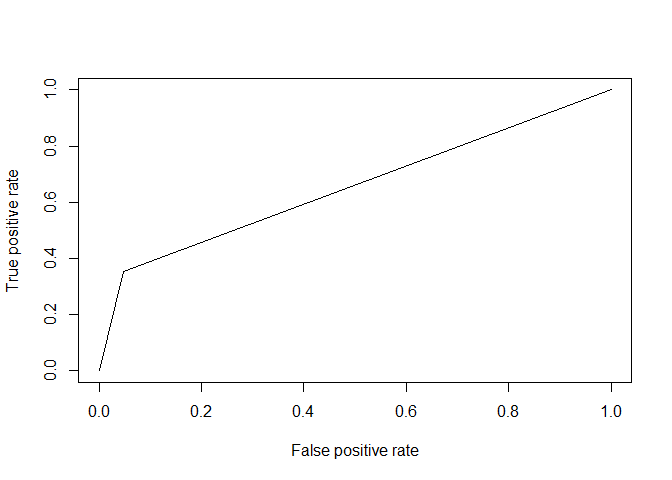<!-- -->

```r
# AUC value
print("AUC Value for this model is ")
```

```
## [1] "AUC Value for this model is "
```

```r
performance(
  prediction( as.numeric(churn_forest.pred), as.numeric(churn_test.df$Churn) ),
  measure = "auc",
  )@y.values[[1]] 
```

```
## [1] 0.6527658
```

```r
# RMSE
print("RMSE Value for this model is ")
```

```
## [1] "RMSE Value for this model is "
```

```r
RMSE( as.numeric(churn_forest.pred), as.numeric(churn_test.df$Churn) )
```

```
## [1] 0.454778
```

**Confusion Matrix**

As per the logistic regression, the Accuracy is just under 80%, and the Specificity is 95.26%, while Sensitivity performs fairly poorly at 35.66%


```r
# confusion matrix

caret::confusionMatrix(
  data = relevel(churn_forest.pred, ref = "Yes"),
  reference = relevel(churn_test.df$Churn, ref = "Yes")
)
```

```
## Confusion Matrix and Statistics
## 
##           Reference
## Prediction Yes  No
##        Yes 132  50
##        No  241 984
##                                           
##                Accuracy : 0.7932          
##                  95% CI : (0.7711, 0.8141)
##     No Information Rate : 0.7349          
##     P-Value [Acc > NIR] : 2.238e-07       
##                                           
##                   Kappa : 0.3653          
##  Mcnemar's Test P-Value : < 2.2e-16       
##                                           
##             Sensitivity : 0.35389         
##             Specificity : 0.95164         
##          Pos Pred Value : 0.72527         
##          Neg Pred Value : 0.80327         
##              Prevalence : 0.26510         
##          Detection Rate : 0.09382         
##    Detection Prevalence : 0.12935         
##       Balanced Accuracy : 0.65277         
##                                           
##        'Positive' Class : Yes             
## 
```


**Variable Importance & Impurity**

Looking at the variable-importance plot tells us how important that variable is in classifying the data. We can see that when looking at both mean decrease in accuracy, as well as node purity [i.e. Gini], tenure is the most important variable. Thus we will consider this later for our secondary analysis. 


Looking at both mean decrease in accuracy, as well as node impurity, we can see after tenure and TotalCharges there is a sharp drop before the next group of predictors. 

Essentially this shows that cost of service, as well as the length of time with their current provider, appear to contribute the homogeneity of the nodes and branches of the resulting random forest. Essentially implying that customers' behavior with regard to churn is most similar based on these attributes

Based on the Gini score, these are the top contributors of node purity:

* tenure
* TotalCharges
* MonthlyCharges
* InternetService
* PaymentMethod
* Contract
* TechSupport

Note that 2 of the top 5 parameters are moderately correlated: MonthlyCharges and TotalCharges.


```r
# Mean Decrease In Accuracy
varImpPlot(churn_train.rf$finalModel, type = 1, main = "Mean Decrease In Accuracy")
```

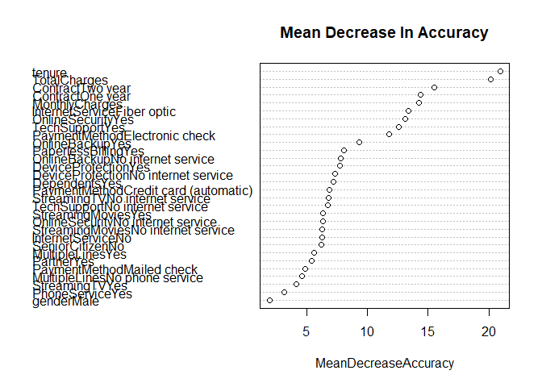<!-- -->

```r
# Mean Decrease In Gini / Node Impurity
varImpPlot(churn_train.rf$finalModel, type = 2, main = "Mean Decrease In Gini")
```

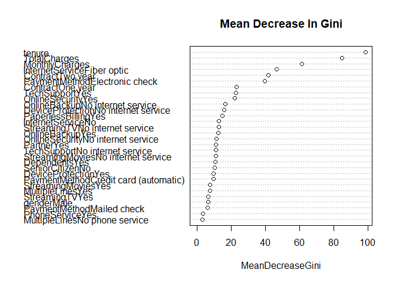<!-- -->

```r
# list importance
importance(churn_train.rf$finalModel)
```

```
##                                               No        Yes
## genderMale                             0.8117367  1.8978654
## SeniorCitizenNo                       -0.5468585  6.0565760
## PartnerYes                             2.0619164  3.1436134
## DependentsYes                         -2.3343513  6.9494684
## tenure                                14.4887000 17.6867728
## PhoneServiceYes                       -0.7957052  4.0894740
## MultipleLinesNo phone service          1.1690684  4.0296216
## MultipleLinesYes                       3.0492245  3.6676133
## InternetServiceFiber optic             1.6468815 17.0637707
## InternetServiceNo                      3.6070678  6.7688089
## OnlineSecurityNo internet service      3.8002068  6.4361139
## OnlineSecurityYes                      2.2183684 12.9592780
## OnlineBackupNo internet service        3.6648514  7.5053299
## OnlineBackupYes                        5.3294118  6.0088398
## DeviceProtectionNo internet service    4.3520386  6.8607492
## DeviceProtectionYes                    6.7216991 -0.1934984
## TechSupportNo internet service         3.3387237  6.6066981
## TechSupportYes                         0.7213994 13.6107159
## StreamingTVNo internet service         3.0702505  7.1104046
## StreamingTVYes                         2.2524180  1.4597183
## StreamingMoviesNo internet service     3.6087080  5.9637742
## StreamingMoviesYes                     4.7646133  0.8601009
## ContractOne year                      -4.5069692 14.9992653
## ContractTwo year                      -7.0246228 15.7631493
## PaperlessBillingYes                   -4.4265569  8.8466658
## PaymentMethodCredit card (automatic)  -5.0217112  9.0984812
## PaymentMethodElectronic check        -10.4903670 13.0583822
## PaymentMethodMailed check              0.1089065  4.7757001
## MonthlyCharges                         7.7625369 11.0155978
## TotalCharges                          16.0947897 13.1573564
##                                      MeanDecreaseAccuracy MeanDecreaseGini
## genderMale                                       1.950162         6.613245
## SeniorCitizenNo                                  6.241046        10.534854
## PartnerYes                                       5.408911        11.124311
## DependentsYes                                    7.180851        10.879449
## tenure                                          20.926735        98.392772
## PhoneServiceYes                                  3.136074         3.405326
## MultipleLinesNo phone service                    4.637407         3.058524
## MultipleLinesYes                                 5.631948         7.479519
## InternetServiceFiber optic                      13.369005        46.523799
## InternetServiceNo                                6.247036        12.842804
## OnlineSecurityNo internet service                6.319911        11.416522
## OnlineSecurityYes                               13.084046        22.200256
## OnlineBackupNo internet service                  7.810017        16.506610
## OnlineBackupYes                                  9.352961        12.282460
## DeviceProtectionNo internet service              7.334117        15.932773
## DeviceProtectionYes                              7.737620         9.735463
## TechSupportNo internet service                   6.722827        10.965690
## TechSupportYes                                  12.601437        22.827569
## StreamingTVNo internet service                   6.804946        12.763371
## StreamingTVYes                                   4.173811         6.752314
## StreamingMoviesNo internet service               6.266113        10.906537
## StreamingMoviesYes                               6.320046         7.695169
## ContractOne year                                14.383298        23.140085
## ContractTwo year                                15.515277        41.690581
## PaperlessBillingYes                              8.097793        14.738996
## PaymentMethodCredit card (automatic)             6.890738         9.652338
## PaymentMethodElectronic check                   11.782929        39.639330
## PaymentMethodMailed check                        4.906328         6.296646
## MonthlyCharges                                  14.219383        61.454034
## TotalCharges                                    20.144678        84.756432
```


## Random Forest: Manual Parameter Selection

Based on the above we can focus the tree selection to the specific variables that are found to be more important:

* tenure
* TotalCharges
* MonthlyCharges
* InternetService
* PaymentMethod
* Contract
* TechSupport


```r
# training RF model

train(
  Churn ~ tenure + TotalCharges + MonthlyCharges + Contract + InternetService + PaymentMethod + TechSupport,
  data = churn_train.df,
  method = "rf",
  trControl = trainControl("cv", number = 10),
  importance = T,
  metric = "Accuracy"
) -> churn_forest_manual.rf

# best tuning parameter
churn_forest_manual.rf$bestTune
```

```
##   mtry
## 1    2
```

```r
#final model
churn_forest_manual.rf$finalModel
```

```
## 
## Call:
##  randomForest(x = x, y = y, mtry = param$mtry, importance = ..1) 
##                Type of random forest: classification
##                      Number of trees: 500
## No. of variables tried at each split: 2
## 
##         OOB estimate of  error rate: 20.74%
## Confusion matrix:
##       No Yes class.error
## No  3776 364  0.08792271
## Yes  805 691  0.53810160
```


### Evaluating model with test predictions

The OB estimate of error rate of 20.79% is slightly lower than the original 20.87% 


```r
# predictions

predict(
  churn_forest_manual.rf,
  newdata = churn_test.df,
  ) -> churn_forest_manual.pred
```

**AUC and RMSE**

The initial model's AUC is increased slightly to 69.9%, slightly better than the prior 65.46% and the RMSE is barely moved up to 45.39% 


```r
# AUC plot
# NOTE: must convert values to numeric to use function
performance(
  prediction( as.numeric(churn_forest_manual.pred), as.numeric(churn_test.df$Churn) ),
  measure = "tpr",
  x.measure = "fpr"
) -> churn_forest_manual.perf 

plot(churn_forest_manual.perf)
```

<!-- -->

```r
# AUC value
print("AUC Value for this model is ")
```

```
## [1] "AUC Value for this model is "
```

```r
performance(
  prediction( as.numeric(churn_forest_manual.pred), as.numeric(churn_test.df$Churn) ),
  measure = "auc",
  )@y.values[[1]] 
```

```
## [1] 0.6970626
```

```r
# RMSE
print("RMSE Value for this model is ")
```

```
## [1] "RMSE Value for this model is "
```

```r
RMSE( as.numeric(churn_forest_manual.pred), as.numeric(churn_test.df$Churn) )
```

```
## [1] 0.4524277
```


**Confusion Matrix**

As per the logistic regression, the Accuracy is still just under 80%, and the Specificity actually went down to 90.14% from 95.26%, while Sensitivity has had a significant boost to 49.6%, up from 35.66%

Thus the simpler model with the more "important" variables is better at predicting churn with customers who actually churn. However, overall at 49.6% there is still room for improvement


```r
# confusion matrix

caret::confusionMatrix(
  data = relevel(churn_forest_manual.pred, ref = "Yes"),
  reference = relevel(churn_test.df$Churn, ref = "Yes")
)
```

```
## Confusion Matrix and Statistics
## 
##           Reference
## Prediction Yes  No
##        Yes 182  97
##        No  191 937
##                                           
##                Accuracy : 0.7953          
##                  95% CI : (0.7733, 0.8161)
##     No Information Rate : 0.7349          
##     P-Value [Acc > NIR] : 8.066e-08       
##                                           
##                   Kappa : 0.4287          
##  Mcnemar's Test P-Value : 4.251e-08       
##                                           
##             Sensitivity : 0.4879          
##             Specificity : 0.9062          
##          Pos Pred Value : 0.6523          
##          Neg Pred Value : 0.8307          
##              Prevalence : 0.2651          
##          Detection Rate : 0.1294          
##    Detection Prevalence : 0.1983          
##       Balanced Accuracy : 0.6971          
##                                           
##        'Positive' Class : Yes             
## 
```


## Random Forest: Hyperparameter Tuning

There are a number of hyperparameters that can be optimized to improve model performance: 

* How many trees should be generated? **ntree** parameter
* How many random variables should be included in each tree? **mtry** parameter
* What is minimum depth of each tree before a split can occur? **nodesize** parameter


From the initial model we can see that the forest contained 500 trees [default value] and the number of randomly selected predictors was 2 [default is the square root of total number of predictors], with a default minimum nodesize of 1 for classification trees. [*The default for regression trees is 5*]

https://www.rdocumentation.org/packages/randomForest/versions/4.6-14/topics/randomForest


```r
#final model
churn_train.rf$finalModel
```

```
## 
## Call:
##  randomForest(x = x, y = y, mtry = param$mtry, importance = ..1) 
##                Type of random forest: classification
##                      Number of trees: 500
## No. of variables tried at each split: 2
## 
##         OOB estimate of  error rate: 21.01%
## Confusion matrix:
##       No Yes class.error
## No  3936 204  0.04927536
## Yes  980 516  0.65508021
```


###Hyperparameter Tuning: **Nodesize**

Setting up a loop we can test out a few different nodesizes. Generally speaking you do not want these to be too large as you may have a subobtimal split. On the other hand over splitting can also create an overfit model. Here we loop through values of 1, 2, 3, and 5

Additionally for optimizing tuning parameters, we can use random selection vs the default grid searching. The scope of this is beyond this exercise, but essentially with a large number of hyperparameters, random may be a better option. More info can be read on the Caret package here:

https://topepo.github.io/caret/random-hyperparameter-search.html


We essentially loop through each iteration and output to a list, then compare the **Accuracy** of each one.

Note that we are using the limited set of predictors from the prior step

We can see a node size of 3 has the best median accuracy of 79.93%


```r
# create empty list to store all models
churn_forests <- list()

# iterate through different nodesizes

for (nodesize in c(1,2,3,5) ) {
train(
  Churn ~ tenure + TotalCharges + MonthlyCharges + Contract + InternetService + PaymentMethod + TechSupport,
  data = churn_train.df,
  method = "rf",
  trControl = trainControl("cv", number = 10, search = "random"),
  importance = T,
  nodesize = nodesize
) -> churn_forest_tuned.rf
toString(nodesize) -> model.name
churn_forests[[model.name]] <- churn_forest_tuned.rf
  
}


# Compare Median and Mean Accuracy
resamples(churn_forests) %>% summary(metric = "Accuracy")
```

```
## 
## Call:
## summary.resamples(object = ., metric = "Accuracy")
## 
## Models: 1, 2, 3, 5 
## Number of resamples: 10 
## 
## Accuracy 
##        Min.   1st Qu.    Median      Mean   3rd Qu.      Max. NA's
## 1 0.7531083 0.7689595 0.7730496 0.7737743 0.7828597 0.7890071    0
## 2 0.7641844 0.7708333 0.7845745 0.7824742 0.7900582 0.8046181    0
## 3 0.7388988 0.7686170 0.7790601 0.7744841 0.7840336 0.7921847    0
## 5 0.7673179 0.7811764 0.7985794 0.7948840 0.8070935 0.8156028    0
```


###Hyperparameter Tuning: **mtry**

Lets do the same thing now for the randomly selected predictors, using our previously optimized **nodesize** value of 3. Here however the functionality of looping through the **mtry** values and selecting the best one is built in to the model tuning


```r
# create empty list to store all models
churn_forests <- list()

# iterate through different mtry

train(
  Churn ~ tenure + TotalCharges + MonthlyCharges + Contract + InternetService + PaymentMethod + TechSupport,
  data = churn_train.df,
  method = "rf",
  trControl = trainControl("cv", number = 10, search = "random"),
  importance = T,
  nodesize = 3,
  tuneGrid = expand.grid(mtry = c(1,2,3,4))
) -> churn_forest_tuned.rf


# Final Model
churn_forest_tuned.rf$finalModel
```

```
## 
## Call:
##  randomForest(x = x, y = y, mtry = param$mtry, nodesize = 3, importance = ..1) 
##                Type of random forest: classification
##                      Number of trees: 500
## No. of variables tried at each split: 2
## 
##         OOB estimate of  error rate: 20.71%
## Confusion matrix:
##       No Yes class.error
## No  3798 342   0.0826087
## Yes  825 671   0.5514706
```


### Evaluating model with test predictions

The OB estimate of error rate of 20.4% *slightly* improved over the prior 20.87%


```r
# predictions

predict(
  churn_forest_tuned.rf,
  newdata = churn_test.df,
  ) -> churn_forest_tuned.pred
```

**AUC and RMSE**

The initial model's AUC has further improved to 70.97% over the prior 65.46% and the RMSE is 45.56% very slightly improved. 


```r
# AUC plot
# NOTE: must convert values to numeric to use function
performance(
  prediction( as.numeric(churn_forest_tuned.pred), as.numeric(churn_test.df$Churn) ),
  measure = "tpr",
  x.measure = "fpr"
) -> churn_forest_tuned.perf 

plot(churn_forest_tuned.perf)
```

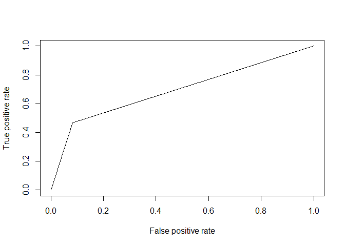<!-- -->

```r
# AUC value
print("AUC Value for this model is ")
```

```
## [1] "AUC Value for this model is "
```

```r
performance(
  prediction( as.numeric(churn_forest_tuned.pred), as.numeric(churn_test.df$Churn) ),
  measure = "auc",
  )@y.values[[1]] 
```

```
## [1] 0.6929984
```

```r
# RMSE
print("RMSE Value for this model is ")
```

```
## [1] "RMSE Value for this model is "
```

```r
RMSE( as.numeric(churn_forest_tuned.pred), as.numeric(churn_test.df$Churn) )
```

```
## [1] 0.4492749
```

**Confusion Matrix**

The Accuracy is still just under 80%, and the Specificity is 88.6%, while Sensitivity performs fairly poorly at 53.35%


```r
# confusion matrix

caret::confusionMatrix(
  data = relevel(churn_forest_tuned.pred, ref = "Yes"),
  reference = relevel(churn_test.df$Churn, ref = "Yes")
)
```

```
## Confusion Matrix and Statistics
## 
##           Reference
## Prediction Yes  No
##        Yes 175  86
##        No  198 948
##                                           
##                Accuracy : 0.7982          
##                  95% CI : (0.7762, 0.8188)
##     No Information Rate : 0.7349          
##     P-Value [Acc > NIR] : 1.949e-08       
##                                           
##                   Kappa : 0.427           
##  Mcnemar's Test P-Value : 4.499e-11       
##                                           
##             Sensitivity : 0.4692          
##             Specificity : 0.9168          
##          Pos Pred Value : 0.6705          
##          Neg Pred Value : 0.8272          
##              Prevalence : 0.2651          
##          Detection Rate : 0.1244          
##    Detection Prevalence : 0.1855          
##       Balanced Accuracy : 0.6930          
##                                           
##        'Positive' Class : Yes             
## 
```


### Unbalanced Levels: Downsampling


One of the challenges is we have very skewed samples with regard to the number of customers with "Yes" vs "No" in the Churn

We can modify the training to account for this by enabling **down-sampling** which takes this imbalance into account when selecting the folds for cross-validation


```r
train(
  Churn ~ tenure + TotalCharges + MonthlyCharges + Contract + InternetService + PaymentMethod + TechSupport,
  data = churn_train.df,
  method = "rf",
  metric = "Accuracy",
  preProcess = c("scale","center"),
  trControl = trainControl(
    method = "repeatedcv", 
    number = 10, 
#    repeats = 10,
    savePredictions = "final",
    allowParallel = T,
    verboseIter = F,
    search = "random",
    sampling = "down"
    ),
  importance = T,
  tuneGrid = expand.grid(mtry = 3),
  nodesize = 3
) -> churn_forest_sized.rf


#final model
churn_forest_sized.rf$finalModel
```

```
## 
## Call:
##  randomForest(x = x, y = y, mtry = param$mtry, nodesize = 3, importance = ..1) 
##                Type of random forest: classification
##                      Number of trees: 500
## No. of variables tried at each split: 3
## 
##         OOB estimate of  error rate: 24%
## Confusion matrix:
##       No  Yes class.error
## No  1081  415   0.2774064
## Yes  303 1193   0.2025401
```


The OB estimate of error rate of 23% is actually worse than the earlier 20.4%


```r
# predictions

predict(
  churn_forest_sized.rf,
  newdata = churn_test.df,
  ) -> churn_forest_sized.pred
```


Also the model's AUC has gone down sligthly from 77.8% to 75.37% while the RMSE is improved from 50% to 52.45%


```r
# AUC plot
# NOTE: must convert values to numeric to use function
performance(
  prediction( as.numeric(churn_forest_sized.pred), as.numeric(churn_test.df$Churn) ),
  measure = "tpr",
  x.measure = "fpr"
) -> churn_forest_sized.perf 

plot(churn_forest_sized.perf)
```

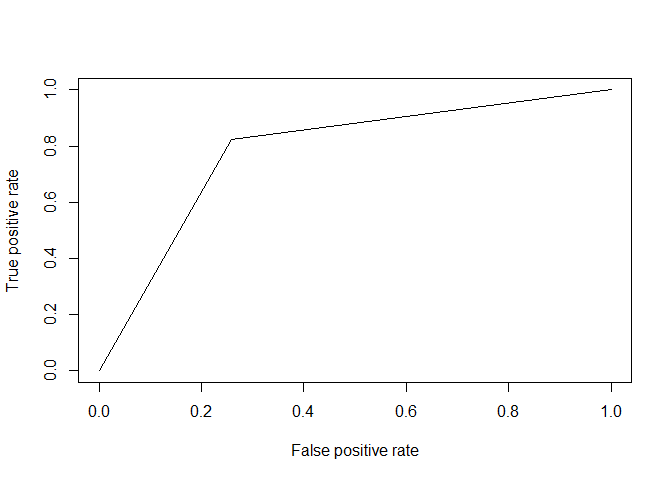<!-- -->

```r
# AUC value
print("AUC Value for this model is ")
```

```
## [1] "AUC Value for this model is "
```

```r
performance(
  prediction( as.numeric(churn_forest_sized.pred), as.numeric(churn_test.df$Churn) ),
  measure = "auc",
  )@y.values[[1]] 
```

```
## [1] 0.7824179
```

```r
# RMSE
print("RMSE Value for this model is ")
```

```
## [1] "RMSE Value for this model is "
```

```r
RMSE( as.numeric(churn_forest_sized.pred), as.numeric(churn_test.df$Churn) )
```

```
## [1] 0.4864913
```


However, looking at the confusion matrix we can see our Sensitivity is the highest yet at 81.5%. Accuracy is down to 72.5% and Specificity down significantly to just under 70%

In conclusion we have tuned the model to predicting the specific metric we want. In this case how accurately do we predict churn from the customers who actually churn


```r
# confusion matrix

caret::confusionMatrix(
  data = relevel(churn_forest_sized.pred, ref = "Yes"),
  reference = relevel(churn_test.df$Churn, ref = "Yes")
)
```

```
## Confusion Matrix and Statistics
## 
##           Reference
## Prediction Yes  No
##        Yes 307 267
##        No   66 767
##                                           
##                Accuracy : 0.7633          
##                  95% CI : (0.7402, 0.7853)
##     No Information Rate : 0.7349          
##     P-Value [Acc > NIR] : 0.007989        
##                                           
##                   Kappa : 0.4818          
##  Mcnemar's Test P-Value : < 2.2e-16       
##                                           
##             Sensitivity : 0.8231          
##             Specificity : 0.7418          
##          Pos Pred Value : 0.5348          
##          Neg Pred Value : 0.9208          
##              Prevalence : 0.2651          
##          Detection Rate : 0.2182          
##    Detection Prevalence : 0.4080          
##       Balanced Accuracy : 0.7824          
##                                           
##        'Positive' Class : Yes             
## 
```


