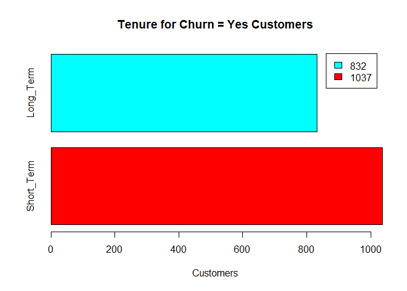
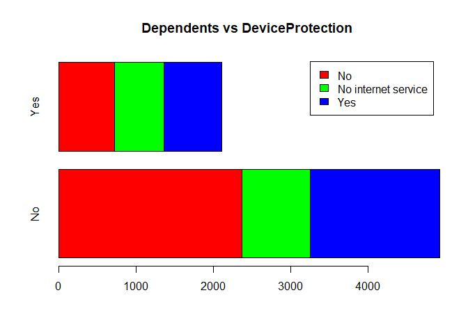

# SMU Machine Learning 1 DS7331  
## Lab 2 Part B - Tenure
  
**Telco Churn Data Set**  
https://www.kaggle.com/blastchar/telco-customer-churn  
  

* Jeremy Otsap - jotsap@mail.smu.edu  
* Shawn Jung - shawnj@mail.smu.edu  
* Lance Dacy - ldacy@mail.smu.edu  
* Amber Burnett - aburnett@mail.smu.edu  


### Business Understanding  

We are looking at customer data from a north American Telco provider. The purpose being to retain existing customers. In telecommunications, the estimated cost of new customer acquisition is approximately 5x higher than retaining an existing customer. Furthermore, only a third of customers switch carriers due to lower prices; more and more factors such as dissatisfaction with quality of service, advancing technology and media features, competitors having better cellular coverage, and poorly implemented loyalty programs are all contributing to customer attrition.  

From our prior Churn models we see that one of the most significant predictors **Tenure**

  
### Data Understanding  
  
**Data Dictionary**  
We are provided a CSV set of 21 features and 7043 anonymyzed customers.

* **customerID**: Unique alpha-numeric string to anonymously represent an individual customer
* **gender**: Categorical String value to represent customer's gender (Male or Female)
* **SeniorCitizen**: Boolean int value to show whether the customer is a senior citizen or not (1, 0)
* **Partner**: Boolean string value showing whether the customer has a partner or not (Yes, No)
* **Dependents**: Boolean string value showing whether the customer has dependents or not (Yes, No)
* **tenure**: Numeric value showing number of months the customer has stayed with the company
* **PhoneService**: Boolean string value showing whether the customer has a phone service or not (Yes, No)
* **MultipleLines**: Categorical string value that shows if the customer has multiple lines or not (Yes, No, No phone service)
* **InternetService**: Categorical string value that shows the customer’s internet service provider (DSL, Fiber optic, No)
* **OnlineSecurity**: Categorical string value showing whether the customer has online security or not (Yes, No, No internet service)
* **OnlineBackup**: Categorical string showing whether the customer has online backup or not (Yes, No, No internet service)
* **DeviceProtection**: Categorical string showing whether the customer has device protection or not (Yes, No, No internet service)
* **TechSupport**: Categorical string showing whether the customer has tech support or not (Yes, No, No internet service)
* **StreamingTV**: Categorical string showing whether the customer has streaming TV or not (Yes, No, No internet service)
* **StreamingMovies**: Categorical string showing whether the customer has streaming movies or not (Yes, No, No internet service)
* **Contract**: Categorical string that represents the contract term (Month-to-month, One year, Two year)
* **PaperlessBilling**: Boolean string showing whether the customer has paperless billing or not (Yes, No)
* **PaymentMethod**: Categorical string that shows the customer’s payment method (Electronic check, Mailed check, Bank transfer (automatic), Credit card (automatic))
* **MonthlyCharges**: Numeric value showing the amount charged to the customer each month
* **TotalCharges**: Numeric value showing the total amount charged to the customer
* **Churn**: Boolean string showing whether or not the customer 'churned' or terminated ser
vices (Yes or No)  


### Initial Data Examination

As we can see most of the predictor variables are categorical, as is the response "Churn." However there are a few numerical variables as well specifically relating to the customer's spend, as well as the length of their contract.


```r
# dataframe
tenure.df <- read.csv('https://raw.githubusercontent.com/jotsap/DS7331/master/data/churn.csv')

str(tenure.df)
```

```
## 'data.frame':	7043 obs. of  21 variables:
##  $ customerID      : Factor w/ 7043 levels "0002-ORFBO","0003-MKNFE",..: 5376 3963 2565 5536 6512 6552 1003 4771 5605 4535 ...
##  $ gender          : Factor w/ 2 levels "Female","Male": 1 2 2 2 1 1 2 1 1 2 ...
##  $ SeniorCitizen   : int  0 0 0 0 0 0 0 0 0 0 ...
##  $ Partner         : Factor w/ 2 levels "No","Yes": 2 1 1 1 1 1 1 1 2 1 ...
##  $ Dependents      : Factor w/ 2 levels "No","Yes": 1 1 1 1 1 1 2 1 1 2 ...
##  $ tenure          : int  1 34 2 45 2 8 22 10 28 62 ...
##  $ PhoneService    : Factor w/ 2 levels "No","Yes": 1 2 2 1 2 2 2 1 2 2 ...
##  $ MultipleLines   : Factor w/ 3 levels "No","No phone service",..: 2 1 1 2 1 3 3 2 3 1 ...
##  $ InternetService : Factor w/ 3 levels "DSL","Fiber optic",..: 1 1 1 1 2 2 2 1 2 1 ...
##  $ OnlineSecurity  : Factor w/ 3 levels "No","No internet service",..: 1 3 3 3 1 1 1 3 1 3 ...
##  $ OnlineBackup    : Factor w/ 3 levels "No","No internet service",..: 3 1 3 1 1 1 3 1 1 3 ...
##  $ DeviceProtection: Factor w/ 3 levels "No","No internet service",..: 1 3 1 3 1 3 1 1 3 1 ...
##  $ TechSupport     : Factor w/ 3 levels "No","No internet service",..: 1 1 1 3 1 1 1 1 3 1 ...
##  $ StreamingTV     : Factor w/ 3 levels "No","No internet service",..: 1 1 1 1 1 3 3 1 3 1 ...
##  $ StreamingMovies : Factor w/ 3 levels "No","No internet service",..: 1 1 1 1 1 3 1 1 3 1 ...
##  $ Contract        : Factor w/ 3 levels "Month-to-month",..: 1 2 1 2 1 1 1 1 1 2 ...
##  $ PaperlessBilling: Factor w/ 2 levels "No","Yes": 2 1 2 1 2 2 2 1 2 1 ...
##  $ PaymentMethod   : Factor w/ 4 levels "Bank transfer (automatic)",..: 3 4 4 1 3 3 2 4 3 1 ...
##  $ MonthlyCharges  : num  29.9 57 53.9 42.3 70.7 ...
##  $ TotalCharges    : num  29.9 1889.5 108.2 1840.8 151.7 ...
##  $ Churn           : Factor w/ 2 levels "No","Yes": 1 1 2 1 2 2 1 1 2 1 ...
```

```r
head(tenure.df)
```

```
##   customerID gender SeniorCitizen Partner Dependents tenure PhoneService
## 1 7590-VHVEG Female             0     Yes         No      1           No
## 2 5575-GNVDE   Male             0      No         No     34          Yes
## 3 3668-QPYBK   Male             0      No         No      2          Yes
## 4 7795-CFOCW   Male             0      No         No     45           No
## 5 9237-HQITU Female             0      No         No      2          Yes
## 6 9305-CDSKC Female             0      No         No      8          Yes
##      MultipleLines InternetService OnlineSecurity OnlineBackup
## 1 No phone service             DSL             No          Yes
## 2               No             DSL            Yes           No
## 3               No             DSL            Yes          Yes
## 4 No phone service             DSL            Yes           No
## 5               No     Fiber optic             No           No
## 6              Yes     Fiber optic             No           No
##   DeviceProtection TechSupport StreamingTV StreamingMovies       Contract
## 1               No          No          No              No Month-to-month
## 2              Yes          No          No              No       One year
## 3               No          No          No              No Month-to-month
## 4              Yes         Yes          No              No       One year
## 5               No          No          No              No Month-to-month
## 6              Yes          No         Yes             Yes Month-to-month
##   PaperlessBilling             PaymentMethod MonthlyCharges TotalCharges
## 1              Yes          Electronic check          29.85        29.85
## 2               No              Mailed check          56.95      1889.50
## 3              Yes              Mailed check          53.85       108.15
## 4               No Bank transfer (automatic)          42.30      1840.75
## 5              Yes          Electronic check          70.70       151.65
## 6              Yes          Electronic check          99.65       820.50
##   Churn
## 1    No
## 2    No
## 3   Yes
## 4    No
## 5   Yes
## 6   Yes
```


CustomerID is simply a placeholder value to represent an anonomyzed customer and is not necessary for analysis. Thus we will remove it. Additionally R can convert a data type to factor, thus we will convert the numerical SeniorCitizen variable to a factor and store it as a separate column


```r
# CustomerID not necessary for analysis
tenure.df %>% dplyr::select(-customerID)  -> tenure.df
# alternate code: tenure.df$customerID <- NULL


# make FACTOR flavor of SeniorCitizen column
# recode 1 as "Yes" and 0 as "No"
dplyr::recode_factor(
  tenure.df$SeniorCitizen, 
  `1` = "Yes", `0` = "No"
  ) -> tenure.df$SeniorCitizen
# alternate code: tenure.df <- tenure.df %>% mutate(SeniorCitizen = factor(SeniorCitizen))

glimpse(tenure.df)
```

```
## Observations: 7,043
## Variables: 20
## $ gender           <fct> Female, Male, Male, Male, Female, Female, Mal...
## $ SeniorCitizen    <fct> No, No, No, No, No, No, No, No, No, No, No, N...
## $ Partner          <fct> Yes, No, No, No, No, No, No, No, Yes, No, Yes...
## $ Dependents       <fct> No, No, No, No, No, No, Yes, No, No, Yes, Yes...
## $ tenure           <int> 1, 34, 2, 45, 2, 8, 22, 10, 28, 62, 13, 16, 5...
## $ PhoneService     <fct> No, Yes, Yes, No, Yes, Yes, Yes, No, Yes, Yes...
## $ MultipleLines    <fct> No phone service, No, No, No phone service, N...
## $ InternetService  <fct> DSL, DSL, DSL, DSL, Fiber optic, Fiber optic,...
## $ OnlineSecurity   <fct> No, Yes, Yes, Yes, No, No, No, Yes, No, Yes, ...
## $ OnlineBackup     <fct> Yes, No, Yes, No, No, No, Yes, No, No, Yes, N...
## $ DeviceProtection <fct> No, Yes, No, Yes, No, Yes, No, No, Yes, No, N...
## $ TechSupport      <fct> No, No, No, Yes, No, No, No, No, Yes, No, No,...
## $ StreamingTV      <fct> No, No, No, No, No, Yes, Yes, No, Yes, No, No...
## $ StreamingMovies  <fct> No, No, No, No, No, Yes, No, No, Yes, No, No,...
## $ Contract         <fct> Month-to-month, One year, Month-to-month, One...
## $ PaperlessBilling <fct> Yes, No, Yes, No, Yes, Yes, Yes, No, Yes, No,...
## $ PaymentMethod    <fct> Electronic check, Mailed check, Mailed check,...
## $ MonthlyCharges   <dbl> 29.85, 56.95, 53.85, 42.30, 70.70, 99.65, 89....
## $ TotalCharges     <dbl> 29.85, 1889.50, 108.15, 1840.75, 151.65, 820....
## $ Churn            <fct> No, No, Yes, No, Yes, Yes, No, No, Yes, No, N...
```


### Secondary Factor: Tenure 

**Long-term vs Short-term**

Looking at the length of contract as secondary analysis. We can see that the range of values is from 0 months for brand new customers, up to 72 months

For our initial model, we simply want a binomial model that predicts if this is a "Short-term" or "Long-term" customer, based on if their tenure is **12 months** or more

* Short_Term = 0 - 12 months
* Long_Term = 13+ months


```r
# range of values
range(tenure.df$tenure)
```

```
## [1]  0 72
```

```r
# graphical look
hist(tenure.df$tenure, main = "Histogram of Customer Tenure", xlab = "months")
```

<!-- -->

```r
# creating bins for tenure
# Short_Term: 12 months or less
# Old: 13+ months
# NOTE: splits are INCLUSIVE

cut(tenure.df$tenure, 
    breaks = c(0,12,999), 
    labels = c("Short_Term","Long_Term"),
    include.lowest = T
    ) -> tenure.df$tenureBinary

# validate accuracy new Annual Income categorical parameter
tenure.df[c(1,5,10,15,20,25,30,35,40,45),c("tenure","tenureBinary")]
```

```
##    tenure tenureBinary
## 1       1   Short_Term
## 5       2   Short_Term
## 10     62    Long_Term
## 15     25    Long_Term
## 20     21    Long_Term
## 25     49    Long_Term
## 30     17    Long_Term
## 35      1   Short_Term
## 40     11   Short_Term
## 45     13    Long_Term
```


We can see that **Short_Term** customers that have been enrolled make up around 31% of the total 7000 customers


```r
# plot of tenureBinary
table(tenure.df$tenureBinary) 
```

```
## 
## Short_Term  Long_Term 
##       2186       4857
```

```r
barplot((tenure.df %>% count(tenureBinary))$n, 
        horiz = T, 
        legend.text = (tenure.df %>% count(tenureBinary))$tenureBinary,
        col = rainbow(2))
```

<!-- -->


**Churn = Yes Customers**

Of the customers who are in the "Yes" Churn category, more customers are within their first year of service, than the other 3 categories combined


```r
# Plot of New vs Old for Churn = Yes Customers

barplot( tenure.df[tenure.df$Churn == "Yes","tenureBinary"] %>% table(), 
        horiz = T, 
        legend.text = tenure.df[tenure.df$Churn == "Yes","tenureBinary"] %>% table(),
        col = rainbow(2),
        main = "Tenure for Churn = Yes Customers",
        xlab = "Customers")
```

<!-- -->


### Data Leaking

Because we are looking to accurately predict **tenure** we need to prevent data leaking from information we wouldn't necessarily have. Thus from our *training* data we need to remove the following:

* MonthlyCharges
* TotalCharges
* Churn
* Tenure


```r
# remove data leakage
tenure.df %>% dplyr::select(-c(Churn,MonthlyCharges,TotalCharges,tenure) )  -> tenure_bi.df

glimpse(tenure_bi.df)
```

```
## Observations: 7,043
## Variables: 17
## $ gender           <fct> Female, Male, Male, Male, Female, Female, Mal...
## $ SeniorCitizen    <fct> No, No, No, No, No, No, No, No, No, No, No, N...
## $ Partner          <fct> Yes, No, No, No, No, No, No, No, Yes, No, Yes...
## $ Dependents       <fct> No, No, No, No, No, No, Yes, No, No, Yes, Yes...
## $ PhoneService     <fct> No, Yes, Yes, No, Yes, Yes, Yes, No, Yes, Yes...
## $ MultipleLines    <fct> No phone service, No, No, No phone service, N...
## $ InternetService  <fct> DSL, DSL, DSL, DSL, Fiber optic, Fiber optic,...
## $ OnlineSecurity   <fct> No, Yes, Yes, Yes, No, No, No, Yes, No, Yes, ...
## $ OnlineBackup     <fct> Yes, No, Yes, No, No, No, Yes, No, No, Yes, N...
## $ DeviceProtection <fct> No, Yes, No, Yes, No, Yes, No, No, Yes, No, N...
## $ TechSupport      <fct> No, No, No, Yes, No, No, No, No, Yes, No, No,...
## $ StreamingTV      <fct> No, No, No, No, No, Yes, Yes, No, Yes, No, No...
## $ StreamingMovies  <fct> No, No, No, No, No, Yes, No, No, Yes, No, No,...
## $ Contract         <fct> Month-to-month, One year, Month-to-month, One...
## $ PaperlessBilling <fct> Yes, No, Yes, No, Yes, Yes, Yes, No, Yes, No,...
## $ PaymentMethod    <fct> Electronic check, Mailed check, Mailed check,...
## $ tenureBinary     <fct> Short_Term, Long_Term, Short_Term, Long_Term,...
```

**ADDITIONAL BUSINESS VALUE**

From a business point, while we know if they sign up for a 1 or 2 year contract certainly increases the likelihood of staying 12+ months, there isn't a lot of business value there. What we want is to determine what services or bundles can be offered to increase customer loyalty and longevity. I.e. the real value to upsell and/or retain customers is to have a better understanding of who wants what services, right? Do unmarried females with 1+ dependents care about online backup for their photos? 

Therefore we need to remove this as well


```r
# remove data leakage
tenure_bi.df %>% dplyr::select(-Contract ) -> tenure_bi.df

glimpse(tenure_bi.df)
```

```
## Observations: 7,043
## Variables: 16
## $ gender           <fct> Female, Male, Male, Male, Female, Female, Mal...
## $ SeniorCitizen    <fct> No, No, No, No, No, No, No, No, No, No, No, N...
## $ Partner          <fct> Yes, No, No, No, No, No, No, No, Yes, No, Yes...
## $ Dependents       <fct> No, No, No, No, No, No, Yes, No, No, Yes, Yes...
## $ PhoneService     <fct> No, Yes, Yes, No, Yes, Yes, Yes, No, Yes, Yes...
## $ MultipleLines    <fct> No phone service, No, No, No phone service, N...
## $ InternetService  <fct> DSL, DSL, DSL, DSL, Fiber optic, Fiber optic,...
## $ OnlineSecurity   <fct> No, Yes, Yes, Yes, No, No, No, Yes, No, Yes, ...
## $ OnlineBackup     <fct> Yes, No, Yes, No, No, No, Yes, No, No, Yes, N...
## $ DeviceProtection <fct> No, Yes, No, Yes, No, Yes, No, No, Yes, No, N...
## $ TechSupport      <fct> No, No, No, Yes, No, No, No, No, Yes, No, No,...
## $ StreamingTV      <fct> No, No, No, No, No, Yes, Yes, No, Yes, No, No...
## $ StreamingMovies  <fct> No, No, No, No, No, Yes, No, No, Yes, No, No,...
## $ PaperlessBilling <fct> Yes, No, Yes, No, Yes, Yes, Yes, No, Yes, No,...
## $ PaymentMethod    <fct> Electronic check, Mailed check, Mailed check,...
## $ tenureBinary     <fct> Short_Term, Long_Term, Short_Term, Long_Term,...
```


### Missing Values

As we investigate the data set we need to check for missing values. No missing data found


```r
# from VIM package
aggr(tenure.df, 
     prop = FALSE, 
     combined = TRUE, 
     numbers = TRUE, 
     sortVars = TRUE, 
     sortCombs = TRUE)
```

<!-- -->

```
## 
##  Variables sorted by number of missings: 
##          Variable Count
##      TotalCharges    11
##            gender     0
##     SeniorCitizen     0
##           Partner     0
##        Dependents     0
##            tenure     0
##      PhoneService     0
##     MultipleLines     0
##   InternetService     0
##    OnlineSecurity     0
##      OnlineBackup     0
##  DeviceProtection     0
##       TechSupport     0
##       StreamingTV     0
##   StreamingMovies     0
##          Contract     0
##  PaperlessBilling     0
##     PaymentMethod     0
##    MonthlyCharges     0
##             Churn     0
##      tenureBinary     0
```


# MODELING TENURE


## Binomial Logistic Regression: Full Model

First we need to split the data into a train and test set, with 80% of the data going into the train set. Note that createDataPartition() automatically accounts for the unbalanced levels of y [in this case 'tenure'] in an attempt to balance the class distributions within the splits


```r
# creating the 80 data partition 
tenure_bi_split <- createDataPartition(tenure_bi.df$tenureBinary, p = 0.8, list = F)
# including 80 for training set
tenure_bi_train.df <- tenure_bi.df[tenure_bi_split,] 
# excluding 80 for testing set
tenure_bi_test.df <- tenure_bi.df[-tenure_bi_split,]

# validating
head(tenure_bi_test.df)
```

```
##    gender SeniorCitizen Partner Dependents PhoneService    MultipleLines
## 14   Male            No      No         No          Yes              Yes
## 16 Female            No     Yes        Yes          Yes              Yes
## 20 Female            No      No         No          Yes               No
## 24 Female            No     Yes         No          Yes              Yes
## 27   Male            No     Yes        Yes          Yes              Yes
## 28   Male            No     Yes        Yes           No No phone service
##    InternetService OnlineSecurity OnlineBackup DeviceProtection
## 14     Fiber optic             No          Yes              Yes
## 16     Fiber optic            Yes          Yes              Yes
## 20     Fiber optic             No          Yes              Yes
## 24             DSL             No          Yes               No
## 27     Fiber optic             No          Yes               No
## 28             DSL             No          Yes               No
##    TechSupport StreamingTV StreamingMovies PaperlessBilling
## 14          No         Yes             Yes              Yes
## 16         Yes         Yes             Yes               No
## 20          No          No             Yes              Yes
## 24         Yes          No              No              Yes
## 27          No         Yes             Yes              Yes
## 28          No          No              No               No
##                PaymentMethod tenureBinary
## 14 Bank transfer (automatic)    Long_Term
## 16   Credit card (automatic)    Long_Term
## 20          Electronic check    Long_Term
## 24   Credit card (automatic)    Long_Term
## 27          Electronic check    Long_Term
## 28          Electronic check   Short_Term
```

```r
head(tenure_bi_train.df)
```

```
##   gender SeniorCitizen Partner Dependents PhoneService    MultipleLines
## 1 Female            No     Yes         No           No No phone service
## 2   Male            No      No         No          Yes               No
## 3   Male            No      No         No          Yes               No
## 4   Male            No      No         No           No No phone service
## 5 Female            No      No         No          Yes               No
## 6 Female            No      No         No          Yes              Yes
##   InternetService OnlineSecurity OnlineBackup DeviceProtection TechSupport
## 1             DSL             No          Yes               No          No
## 2             DSL            Yes           No              Yes          No
## 3             DSL            Yes          Yes               No          No
## 4             DSL            Yes           No              Yes         Yes
## 5     Fiber optic             No           No               No          No
## 6     Fiber optic             No           No              Yes          No
##   StreamingTV StreamingMovies PaperlessBilling             PaymentMethod
## 1          No              No              Yes          Electronic check
## 2          No              No               No              Mailed check
## 3          No              No              Yes              Mailed check
## 4          No              No               No Bank transfer (automatic)
## 5          No              No              Yes          Electronic check
## 6         Yes             Yes              Yes          Electronic check
##   tenureBinary
## 1   Short_Term
## 2    Long_Term
## 3   Short_Term
## 4    Long_Term
## 5   Short_Term
## 6   Short_Term
```


Lets create our initial Logistic Regression model using all the values. The AIC on the model is 4935.3. 

Note that R automatically processes the 1-bit encoding on factor variables. However our model has some issues due to the fact that there is a high amount of correlation. For example if a customer has no Internet service, they will always have no for ancillary services like Online Security or Online Backup. 

Our model here sees almost every parameter as *significant* to the model looking at the p-values for the following


```r
# create logistic regression model on train data
# R will automatically create dummy variables on factors
tenure_bi_train.logit <- glm(tenureBinary ~ ., 
                          data = tenure_bi_train.df, 
                          family = binomial(link = "logit") )

summary(tenure_bi_train.logit)
```

```
## 
## Call:
## glm(formula = tenureBinary ~ ., family = binomial(link = "logit"), 
##     data = tenure_bi_train.df)
## 
## Deviance Residuals: 
##     Min       1Q   Median       3Q      Max  
## -3.0271  -0.7689   0.3276   0.7126   2.1368  
## 
## Coefficients: (7 not defined because of singularities)
##                                       Estimate Std. Error z value Pr(>|z|)
## (Intercept)                          -0.380180   0.187216  -2.031   0.0423
## genderMale                            0.090810   0.070063   1.296   0.1949
## SeniorCitizenNo                      -0.278909   0.104996  -2.656   0.0079
## PartnerYes                            0.984563   0.083330  11.815  < 2e-16
## DependentsYes                         0.055223   0.094098   0.587   0.5573
## PhoneServiceYes                      -0.291187   0.138751  -2.099   0.0358
## MultipleLinesNo phone service               NA         NA      NA       NA
## MultipleLinesYes                      1.034383   0.084488  12.243  < 2e-16
## InternetServiceFiber optic            0.037475   0.106658   0.351   0.7253
## InternetServiceNo                     1.657025   0.124128  13.349  < 2e-16
## OnlineSecurityNo internet service           NA         NA      NA       NA
## OnlineSecurityYes                     1.111214   0.101993  10.895  < 2e-16
## OnlineBackupNo internet service             NA         NA      NA       NA
## OnlineBackupYes                       0.974343   0.091313  10.670  < 2e-16
## DeviceProtectionNo internet service         NA         NA      NA       NA
## DeviceProtectionYes                   0.817451   0.094504   8.650  < 2e-16
## TechSupportNo internet service              NA         NA      NA       NA
## TechSupportYes                        0.776421   0.101298   7.665 1.79e-14
## StreamingTVNo internet service              NA         NA      NA       NA
## StreamingTVYes                        0.518415   0.095052   5.454 4.92e-08
## StreamingMoviesNo internet service          NA         NA      NA       NA
## StreamingMoviesYes                    0.407528   0.094595   4.308 1.65e-05
## PaperlessBillingYes                  -0.058042   0.078344  -0.741   0.4588
## PaymentMethodCredit card (automatic) -0.007087   0.127653  -0.056   0.9557
## PaymentMethodElectronic check        -1.070941   0.110211  -9.717  < 2e-16
## PaymentMethodMailed check            -1.204447   0.112495 -10.707  < 2e-16
##                                         
## (Intercept)                          *  
## genderMale                              
## SeniorCitizenNo                      ** 
## PartnerYes                           ***
## DependentsYes                           
## PhoneServiceYes                      *  
## MultipleLinesNo phone service           
## MultipleLinesYes                     ***
## InternetServiceFiber optic              
## InternetServiceNo                    ***
## OnlineSecurityNo internet service       
## OnlineSecurityYes                    ***
## OnlineBackupNo internet service         
## OnlineBackupYes                      ***
## DeviceProtectionNo internet service     
## DeviceProtectionYes                  ***
## TechSupportNo internet service          
## TechSupportYes                       ***
## StreamingTVNo internet service          
## StreamingTVYes                       ***
## StreamingMoviesNo internet service      
## StreamingMoviesYes                   ***
## PaperlessBillingYes                     
## PaymentMethodCredit card (automatic)    
## PaymentMethodElectronic check        ***
## PaymentMethodMailed check            ***
## ---
## Signif. codes:  0 '***' 0.001 '**' 0.01 '*' 0.05 '.' 0.1 ' ' 1
## 
## (Dispersion parameter for binomial family taken to be 1)
## 
##     Null deviance: 6980.7  on 5634  degrees of freedom
## Residual deviance: 4994.5  on 5616  degrees of freedom
## AIC: 5032.5
## 
## Number of Fisher Scoring iterations: 5
```


### Visualize the coefficients of the Full Logistic Model

Visualizing the coefficients, we can see the most *influential* factors are:

* Customers having no Internet service with a strong positive coefficient
* PaymentMethod of check [both postal or online] with a strong negative coefficient
* Customers with having multiple lines with a strong positive coefficient

Additionally customers having OnlineSecurity, OnlineBackup, and DeviceProtection also had moderately-strong postive coefficients, as well as those who engaged Tech Support and those that lived with a partner. 


```r
# visualize coefficients
as.data.frame(tenure_bi_train.logit$coefficients) %>% ggplot(aes(y = .[,1], x = rownames(.)) ) + geom_col() + theme( axis.text = element_text(angle = 90, size = rel(0.7)) )
```

```
## Warning: Removed 7 rows containing missing values (position_stack).
```

<!-- -->


###Categorical Parameter Dependence / Correlation

With numerical continuous predictors, it is a fairly simple exercise to test for correlation. With categorical variables it can be somewhat of a challenge, however we do have techniques to demonstrate a relationship between 2 categorical variables by examining their co-dependency

Using Chi-Squared we can get a sense of whether or not the dependency between categorical predictors is significant. And by adding a visual element we can have an estimate of the strength of the dependency


**InternetService and PaymentMethod**

First we look at a dependency between the two most weighted parameters: InternetService and PaymentMethod. We can see there is a dependency between the two. 

Because the p-value is so small we can reject H0 and conclude, that the variables, InternetService and PaymentMethod are dependent to each other.

Looking at the various plots below, it seems the following visual relationships exist:

* Fiber customers and paying by e-check
* Customers with no internet prefer paying by mailed check


```r
# Chi-Sq between InternetService and PaymentMethod
chisq.test(
  tenure.df$InternetService, tenure.df$PaymentMethod, 
  correct=F)
```

```
## 
## 	Pearson's Chi-squared test
## 
## data:  tenure.df$InternetService and tenure.df$PaymentMethod
## X-squared = 1381.1, df = 6, p-value < 2.2e-16
```

```r
# visualize InternetService and PaymentMethod
barplot(
  table(tenure.df$InternetService, tenure.df$PaymentMethod),
  main = "InternetService vs PaymentMethod",
  legend.text = levels(tenure.df$InternetService),
  col = rainbow(3),
  horiz = T
)
```

<!-- -->

```r
# alternative GGPLOT
ggplot(data = tenure.df, aes(x=PaymentMethod, y=InternetService, color=InternetService)) + geom_jitter(alpha=0.3) + scale_color_manual(breaks = c('DSL','Fiber optic','No'),values=c('darkgreen','red','blue'))
```

<!-- -->


**SeniorCitizen vs InternetService**

Suprisingly there are *proportionately* more non-seniors without InternetService. Again the Chi-squared test's p-value is very low, thus we reject H0 on independence

Possibly an opportunity for a marketing campaign on a younger crowd. 

NOTE: more info needed. Are these working middle class families or young college kids?


```r
# Chi-Sq between InternetService and SeniorCitizen
chisq.test(
  tenure.df$InternetService, tenure.df$SeniorCitizen, 
  correct=F)
```

```
## 
## 	Pearson's Chi-squared test
## 
## data:  tenure.df$InternetService and tenure.df$SeniorCitizen
## X-squared = 495.8, df = 2, p-value < 2.2e-16
```

```r
# visualize InternetService and SeniorCitizen
barplot(
  table(tenure.df$InternetService, tenure.df$SeniorCitizen),
  main = "InternetService vs SeniorCitizen",
  horiz = T,
  legend.text = levels(tenure.df$InternetService),
  col = rainbow(3)
)
```

<!-- -->


**Dependents vs OnlineBackup**

Again the Chi-squared test's p-value is very low, thus we reject H0 on independence. Those customers without dependents visually appear to have less adoption of OnlineBackup.

Its likely that those with children will want to backup their baby photos


```r
# Chi-Sq between OnlineBackup and Dependents
chisq.test(
  tenure.df$Dependents, tenure.df$OnlineBackup, 
  correct=F)
```

```
## 
## 	Pearson's Chi-squared test
## 
## data:  tenure.df$Dependents and tenure.df$OnlineBackup
## X-squared = 186.58, df = 2, p-value < 2.2e-16
```

```r
# visualize OnlineBackup and Dependents
barplot(
  table(tenure.df$Dependents, tenure.df$OnlineBackup),
  main = "OnlineBackup vs Dependents",
  legend.text = levels(tenure.df$Dependents),
  col = rainbow(2),
  horiz = T
)
```

<!-- -->


**StreamingTV vs StreamingMovies**

Again the Chi-squared test's p-value is very low, thus we reject H0 on independence. This is surprising as one would think this would have very high correlation. I.e. customers who stream movies likely stream TV, and vice versa. However we can see that is not the case.

This might be an opportunity to cross-market. I.e. "if you like Game of Thrones you'll love Lord of the Rings"


```r
# Chi-Sq between StreamingTV vs StreamingMovies
chisq.test(
  tenure.df$StreamingMovies, tenure.df$StreamingTV, 
  correct=F)
```

```
## 
## 	Pearson's Chi-squared test
## 
## data:  tenure.df$StreamingMovies and tenure.df$StreamingTV
## X-squared = 8374.2, df = 4, p-value < 2.2e-16
```

```r
# visualize StreamingTV vs StreamingMovies
barplot(
  table(tenure.df$StreamingMovies, tenure.df$StreamingTV),
  main = "StreamingTV vs StreamingMovies",
  legend.text = levels(tenure.df$StreamingMovies),
  col = rainbow(3),
  horiz = T
)
```

<!-- -->


**PhoneService vs DeviceProtection**

Again the Chi-squared test's p-value is very low. Looks like a large portion of people who do have phone service who have no device protection, regardless of internet. 

NOTE: Device Protection typically includes more than just software, but also hardware failures and defects, accidents, etc. Even flip phones and smart phones could be candidates


```r
# Chi-Sq between PhoneService vs DeviceProtection
chisq.test(
  tenure.df$PhoneService, tenure.df$DeviceProtection, 
  correct=F)
```

```
## 
## 	Pearson's Chi-squared test
## 
## data:  tenure.df$PhoneService and tenure.df$DeviceProtection
## X-squared = 209.13, df = 2, p-value < 2.2e-16
```

```r
# visualize PhoneService vs DeviceProtection
barplot(
  table(tenure.df$DeviceProtection, tenure.df$PhoneService),
  main = "PhoneService vs DeviceProtection",
  legend.text = levels(tenure.df$DeviceProtection),
  col = rainbow(3),
  horiz = T
)
```

<!-- -->


**Dependents vs DeviceProtection**

Again the Chi-squared test's p-value is very low. Typically dependents are minors, and thus an opportunity to sell device protection to help reduce costs in the event of cracked screens, phones dropped in the bathroom, etc


```r
# Chi-Sq between Dependents vs DeviceProtection
chisq.test(
  tenure.df$Dependents, tenure.df$DeviceProtection, 
  correct=F)
```

```
## 
## 	Pearson's Chi-squared test
## 
## data:  tenure.df$Dependents and tenure.df$DeviceProtection
## X-squared = 174.87, df = 2, p-value < 2.2e-16
```

```r
# visualize Dependents vs DeviceProtection
barplot(
  table(tenure.df$DeviceProtection, tenure.df$Dependents),
  main = "Dependents vs DeviceProtection", 
  legend.text = levels(tenure.df$DeviceProtection),
  col = rainbow(3),
  horiz = T
)
```

<!-- -->


### ROC Curve for Full Binomial Logistic Model

So now lets validate the accuracy of our model on the test data set. First lets take a look at a ROC curve for the model. The AUC is fairly good at 83.50% 


```r
# create predictions
predict(
  tenure_bi_train.logit, 
  newdata = tenure_bi_test.df,
  type = "response"
  ) -> tenure_bi_test.pred
```

```
## Warning in predict.lm(object, newdata, se.fit, scale = 1, type =
## ifelse(type == : prediction from a rank-deficient fit may be misleading
```

```r
#prediction(tenure_bi_test.pred, tenure_bi_test.df$tenureBinary, label.ordering = c("Short_Term", "Long_Term") )

performance(
  prediction(tenure_bi_test.pred, 
             tenure_bi_test.df$tenureBinary, 
             label.ordering = c("Short_Term", "Long_Term") ),
  measure = "tpr",
  x.measure = "fpr"
) -> tenure_bi_logit.perf 

plot(tenure_bi_logit.perf)
```

<!-- -->

```r
# AUC value
print("AUC Value for this model is ")
```

```
## [1] "AUC Value for this model is "
```

```r
performance(
  prediction(tenure_bi_test.pred, 
             tenure_bi_test.df$tenureBinary,
             label.ordering = c("Short_Term", "Long_Term")),
  measure = "auc"
)@y.values[[1]]
```

```
## [1] 0.8629936
```

Looking at Accuracy, we can see we have an accurancy of approximately 77.2%

Essentially this means that when comparing the number of times the model predicts an accurate result, either "Short_Term" or "Long_Term" in comparison to the actual values, it is ~77% accurate


```r
# split into "Long_Term" and "Short_Term" based on 0.5 threadshold
as.numeric(tenure_bi_test.pred > 0.5 ) -> tenure_bi_test.pred

dplyr::recode_factor(
  tenure_bi_test.pred, 
  `1` = "Long_Term", `0` = "Short_Term"
  ) -> tenure_bi_test.pred


mean(tenure_bi_test.pred == tenure_bi_test.df$tenureBinary )
```

```
## [1] 0.7947443
```


### Confusion Matrix: Full Binomial Logistic Model

Lets setup a confusion matrix to also see the sensitivity and specificity of the model. 

Our sensitivity, essentially predicting long term customers, is fairly good at 86.20%.

What this means is our **Full Logistic Model** is 86.20% effective at predicting which customers will likely be Long_Term customers from those who actually are Long_Term customers


```r
# referencing "old" customers since we want to accurately predict who our long term customers will be

caret::confusionMatrix(
  data = relevel(tenure_bi_test.pred, ref = "Long_Term"),
  reference = relevel(tenure_bi_test.df$tenureBinary, ref = "Long_Term")
)
```

```
## Confusion Matrix and Statistics
## 
##             Reference
## Prediction   Long_Term Short_Term
##   Long_Term        860        178
##   Short_Term       111        259
##                                           
##                Accuracy : 0.7947          
##                  95% CI : (0.7727, 0.8156)
##     No Information Rate : 0.6896          
##     P-Value [Acc > NIR] : < 2.2e-16       
##                                           
##                   Kappa : 0.4994          
##  Mcnemar's Test P-Value : 0.0001035       
##                                           
##             Sensitivity : 0.8857          
##             Specificity : 0.5927          
##          Pos Pred Value : 0.8285          
##          Neg Pred Value : 0.7000          
##              Prevalence : 0.6896          
##          Detection Rate : 0.6108          
##    Detection Prevalence : 0.7372          
##       Balanced Accuracy : 0.7392          
##                                           
##        'Positive' Class : Long_Term       
## 
```


## Model Challenges: Variable Correlation and Overfitting


As mentioned earlier we have some issues with this model. Due to the fact that we are predominantly dealing with categorical predictors, it's not as obvious to identify potential correlation between them; as compared to continuous variables that allow us to simply calculate the Variance Inflation Factor [VIF].

I.e., any customer with "no" for the InternetService predictor is also going to have "no" for ancillary services like OnlineSecurity and OnlineBackup, as well as StreamingTV or StreamingMovies.

The **alias()** command [output omitted due to size] validates this.

For this there are a variety of techniques to simplify the model, leaving only the most influential predictors. We will explore these further

* Feature Selection
* Regularized or Shrinkage


## Feature Selection: Stepwise Regression

Now let's employ **Feature Selection**, where R iteratively goes through the model adding / removing a predictors based on the calculated significance to the model's overall performance. There are different metrics which can be used to evaluate this performance; here we find optimal coefficients by using the respective AIC score. 


### AIC-Based Stepwise Model

We get a slightly improved AIC score at 4951.3, compared to the **Full** model's AIC of 4932.1. However we still have some interdependencies among the predictors. 

Again almost every predictor is found to have a statistically significant p-value


```r
stepAIC(
  tenure_bi_train.logit,
  trace = F,
  direction = "both"
) -> tenure_bi_step.logit


# view results
summary(tenure_bi_step.logit)
```

```
## 
## Call:
## glm(formula = tenureBinary ~ SeniorCitizen + Partner + MultipleLines + 
##     OnlineSecurity + OnlineBackup + DeviceProtection + TechSupport + 
##     StreamingTV + StreamingMovies + PaymentMethod, family = binomial(link = "logit"), 
##     data = tenure_bi_train.df)
## 
## Deviance Residuals: 
##     Min       1Q   Median       3Q      Max  
## -3.0224  -0.7710   0.3266   0.7102   2.1099  
## 
## Coefficients: (5 not defined because of singularities)
##                                       Estimate Std. Error z value Pr(>|z|)
## (Intercept)                          -0.645354   0.145698  -4.429 9.45e-06
## SeniorCitizenNo                      -0.266812   0.102793  -2.596  0.00944
## PartnerYes                            1.008824   0.073115  13.798  < 2e-16
## MultipleLinesNo phone service         0.275916   0.126084   2.188  0.02864
## MultipleLinesYes                      1.034310   0.082964  12.467  < 2e-16
## OnlineSecurityNo internet service     1.659648   0.108739  15.263  < 2e-16
## OnlineSecurityYes                     1.109595   0.100258  11.067  < 2e-16
## OnlineBackupNo internet service             NA         NA      NA       NA
## OnlineBackupYes                       0.969509   0.091142  10.637  < 2e-16
## DeviceProtectionNo internet service         NA         NA      NA       NA
## DeviceProtectionYes                   0.820657   0.094446   8.689  < 2e-16
## TechSupportNo internet service              NA         NA      NA       NA
## TechSupportYes                        0.773920   0.100100   7.731 1.06e-14
## StreamingTVNo internet service              NA         NA      NA       NA
## StreamingTVYes                        0.519691   0.094269   5.513 3.53e-08
## StreamingMoviesNo internet service          NA         NA      NA       NA
## StreamingMoviesYes                    0.404388   0.093984   4.303 1.69e-05
## PaymentMethodCredit card (automatic) -0.008848   0.127619  -0.069  0.94473
## PaymentMethodElectronic check        -1.073062   0.109598  -9.791  < 2e-16
## PaymentMethodMailed check            -1.199394   0.112133 -10.696  < 2e-16
##                                         
## (Intercept)                          ***
## SeniorCitizenNo                      ** 
## PartnerYes                           ***
## MultipleLinesNo phone service        *  
## MultipleLinesYes                     ***
## OnlineSecurityNo internet service    ***
## OnlineSecurityYes                    ***
## OnlineBackupNo internet service         
## OnlineBackupYes                      ***
## DeviceProtectionNo internet service     
## DeviceProtectionYes                  ***
## TechSupportNo internet service          
## TechSupportYes                       ***
## StreamingTVNo internet service          
## StreamingTVYes                       ***
## StreamingMoviesNo internet service      
## StreamingMoviesYes                   ***
## PaymentMethodCredit card (automatic)    
## PaymentMethodElectronic check        ***
## PaymentMethodMailed check            ***
## ---
## Signif. codes:  0 '***' 0.001 '**' 0.01 '*' 0.05 '.' 0.1 ' ' 1
## 
## (Dispersion parameter for binomial family taken to be 1)
## 
##     Null deviance: 6980.7  on 5634  degrees of freedom
## Residual deviance: 4997.1  on 5620  degrees of freedom
## AIC: 5027.1
## 
## Number of Fisher Scoring iterations: 5
```

As far as the strongest coefficients, the AIC Step Model found the following to be the most influential:

* InternetService
* PaymentMethod


```r
# visualize coefficients
as.data.frame(tenure_bi_step.logit$coefficients) %>% ggplot(aes(y = .[,1], x = rownames(.)) ) + geom_col() + theme( axis.text = element_text(angle = 90, size = rel(0.7)) )
```

```
## Warning: Removed 5 rows containing missing values (position_stack).
```

<!-- -->


### ROC Curve on AIC-based Stepwise

Evaluating the accuracy of our model on the test data set by visualizing through a ROC curve of the model's performance. Looks fairly close to the ROC of the Full Logistic Model. The AUC is 83.55% compared to the Full's 83.50%


```r
# create predictions
predict(
  tenure_bi_step.logit, 
  newdata = tenure_bi_test.df,
  type = "response"
  ) -> tenure_bi_step.pred
```

```
## Warning in predict.lm(object, newdata, se.fit, scale = 1, type =
## ifelse(type == : prediction from a rank-deficient fit may be misleading
```

```r
#prediction(churn_step.pred, churn_test.df$Churn)

performance(
  prediction(tenure_bi_step.pred, 
             tenure_bi_test.df$tenureBinary,
             label.ordering = c("Short_Term", "Long_Term")),
  measure = "tpr",
  x.measure = "fpr"
) -> tenure_bi_step.perf 

plot(tenure_bi_step.perf)
```

<!-- -->

```r
# AUC value
print("AUC Value for this model is ")
```

```
## [1] "AUC Value for this model is "
```

```r
performance(
  prediction(tenure_bi_step.pred, 
             tenure_bi_test.df$tenureBinary,
             label.ordering = c("Short_Term", "Long_Term")),
  measure = "auc"
)@y.values[[1]]
```

```
## [1] 0.8634002
```

**Accuracy doing a 50 / 50 Prediction Boundary**

Essentially comparing the number of times the model predicts an accurate result, either "Long_Term" or "Short_Term" in comparison to the actual values

We have an accurancy of 77.91%


```r
# split into "Long_Term" and "Short_Term" based on 0.5 threadshold
as.numeric(tenure_bi_step.pred > 0.5 ) -> tenure_bi_step.pred

dplyr::recode_factor(
  tenure_bi_step.pred, 
  `1` = "Long_Term", `0` = "Short_Term"
  ) -> tenure_bi_step.pred


mean(tenure_bi_step.pred == tenure_bi_test.df$tenureBinary )
```

```
## [1] 0.796875
```


Lets setup a confusion matrix to also see the sensitivity and specificity of the model. 

Our sensitivity here is 86.92%

CONCLUSION: The AIC Stepwise model doesn't really have noteworthy improvements over the Full model


```r
caret::confusionMatrix(
  data = relevel(tenure_bi_step.pred, ref = "Long_Term"),
  reference = relevel(tenure_bi_test.df$tenureBinary, ref = "Long_Term")
)
```

```
## Confusion Matrix and Statistics
## 
##             Reference
## Prediction   Long_Term Short_Term
##   Long_Term        867        182
##   Short_Term       104        255
##                                           
##                Accuracy : 0.7969          
##                  95% CI : (0.7749, 0.8176)
##     No Information Rate : 0.6896          
##     P-Value [Acc > NIR] : < 2.2e-16       
##                                           
##                   Kappa : 0.501           
##  Mcnemar's Test P-Value : 5.286e-06       
##                                           
##             Sensitivity : 0.8929          
##             Specificity : 0.5835          
##          Pos Pred Value : 0.8265          
##          Neg Pred Value : 0.7103          
##              Prevalence : 0.6896          
##          Detection Rate : 0.6158          
##    Detection Prevalence : 0.7450          
##       Balanced Accuracy : 0.7382          
##                                           
##        'Positive' Class : Long_Term       
## 
```


## Regularization: Lasso & Ridge Penalized Regression

Unlike Feature Selection in the prior section, which adds / removes predictors, now we are looking at **Regularization** techniques. Rather than removing predictors they instead introduce a constraint in the training process that shrinks the estimated coefficients. We will be exploring 2 such methods

**Ridge Regression** introduces bias in order to reduce the model's variance, and tries to minimize the sum of the Residual Sum-of-Squares [RSS]. It shrinks variables to be *approximately* zero.

**Lasso Regression** is similar to Ridge, however it instad involves the minimizing the sum of the absolute values of the coefficients, pushing the least significant ones closer to zero. Unlike Ridge, the Lasso Penalty will actually push them all the way to zero.

Both of these rely on a constant **lambda** which acts as a tuning parameter which effects the size of the penalty, thus shrinking the coefficients's closer to zero. For the purposes of this exercise we rely on the **cv.glmnet()** function to iteratively find the optimal value for each model


```r
# NOTE: requires data as matrix

# create dummy variables
model.matrix(tenureBinary ~ ., data = tenure_bi_train.df) -> tenure_bi_train.mtx
# remove intercept
tenure_bi_train.mtx[, -1] -> tenure_bi_train.mtx
```


First we need to prepare the data as a separate matrix of predictors, and the response as a vector, in order to leverage the cv.glmnet() function. Note that the glmnet() function can do either Lasso *or* Ridge Regularized Regression, simply by specifying **alpha = 1** or **alpha = 0** respectively

In both cases we first run the **cv.glmnet()** function to find the optimal value of lambda, then output as an S3 object which we plug that value into the actual Regularized Regression model. 


**Lasso Regression**


```r
# Find optimal value of lambda
cv.glmnet(
  tenure_bi_train.mtx, tenure_bi_train.df$tenureBinary,
  family = "binomial",
  alpha = 1
) -> lambda.lasso

# glm model: LASSO
glmnet(
  tenure_bi_train.mtx, tenure_bi_train.df$tenureBinary, 
  family="binomial", 
  alpha = 1,
  lambda = lambda.lasso$lambda.min
  ) -> tenure_bi_train.lasso

# output coefficients
coef(lambda.lasso, lambda.lasso$lambda.min)
```

```
## 26 x 1 sparse Matrix of class "dgCMatrix"
##                                                  1
## (Intercept)                          -4.115381e-01
## genderMale                            6.771756e-02
## SeniorCitizenNo                      -2.351674e-01
## PartnerYes                            9.767298e-01
## DependentsYes                         3.569638e-02
## PhoneServiceYes                      -2.193771e-01
## MultipleLinesNo phone service         1.192946e-05
## MultipleLinesYes                      1.000532e+00
## InternetServiceFiber optic            .           
## InternetServiceNo                     7.248067e-01
## OnlineSecurityNo internet service     1.041370e-14
## OnlineSecurityYes                     1.059940e+00
## OnlineBackupNo internet service       2.015568e-01
## OnlineBackupYes                       9.373833e-01
## DeviceProtectionNo internet service   1.835499e-01
## DeviceProtectionYes                   7.928859e-01
## TechSupportNo internet service        1.606696e-01
## TechSupportYes                        7.372429e-01
## StreamingTVNo internet service        1.177023e-01
## StreamingTVYes                        4.957621e-01
## StreamingMoviesNo internet service    1.571552e-01
## StreamingMoviesYes                    3.880696e-01
## PaperlessBillingYes                  -3.614679e-02
## PaymentMethodCredit card (automatic)  .           
## PaymentMethodElectronic check        -1.026123e+00
## PaymentMethodMailed check            -1.153010e+00
```

```r
# NOTE: lambda.lasso$lambda.1se outputs simplest model
```


### Plot of Lasso Model Lambda

CV Mean Squared Error [MSE] for Lasso model. The first dotted line represents lambda with the smallest MSE and the second represents with an MSE within 1 standard-error of the minimum MSE [which typically outputs a *simpler* model. ]


```r
plot(lambda.lasso)
```

<!-- -->


**Ridge Regression**


```r
# Find optimal value of lambda
cv.glmnet(
  tenure_bi_train.mtx, tenure_bi_train.df$tenureBinary,
  family = "binomial",
  alpha = 0
) -> lambda.ridge

# glm model: RIDGE
glmnet(
  tenure_bi_train.mtx, tenure_bi_train.df$tenureBinary, 
  family="binomial", 
  alpha = 0,
  lambda = lambda.ridge$lambda.min
  ) -> tenure_bi_train.ridge

# output coefficients of lowest lambda
coef(
  lambda.ridge,
  lambda.ridge$lambda.min
)
```

```
## 26 x 1 sparse Matrix of class "dgCMatrix"
##                                                1
## (Intercept)                          -0.54126189
## genderMale                            0.07157662
## SeniorCitizenNo                      -0.23840927
## PartnerYes                            0.88377594
## DependentsYes                         0.10513094
## PhoneServiceYes                      -0.11162363
## MultipleLinesNo phone service         0.10869593
## MultipleLinesYes                      0.90891594
## InternetServiceFiber optic            0.01120601
## InternetServiceNo                     0.20628857
## OnlineSecurityNo internet service     0.20367234
## OnlineSecurityYes                     0.94942079
## OnlineBackupNo internet service       0.20405179
## OnlineBackupYes                       0.85394366
## DeviceProtectionNo internet service   0.20503730
## DeviceProtectionYes                   0.72983622
## TechSupportNo internet service        0.20482104
## TechSupportYes                        0.68747153
## StreamingTVNo internet service        0.20407972
## StreamingTVYes                        0.47247987
## StreamingMoviesNo internet service    0.20262798
## StreamingMoviesYes                    0.39104133
## PaperlessBillingYes                  -0.05465697
## PaymentMethodCredit card (automatic)  0.17730822
## PaymentMethodElectronic check        -0.81977460
## PaymentMethodMailed check            -0.94483476
```

```r
# NOTE: lambda.ridge$lambda.1se outputs simplest model
```


### Plot of Ridge Model Lambda

CV Mean Squared Error [MSE] for Ridge model. The first dotted line represents lambda with the smallest MSE and the second represents with an MSE within 1 standard-error of the minimum MSE [again the 1 SE outputs the *simpler* model.]


```r
plot(lambda.ridge)
```

<!-- -->


### Lasso model with optimized Lambda

**ROC curve**

Evaluating the accuracy of the Lasso Penalized Logistic model on the test data set by visualizing through a ROC curve of the model's performance. The AUC is 83.52%, very close to the AIC-Step model


```r
# make test data into matrix
# create dummy variables
model.matrix(tenureBinary ~ ., data = tenure_bi_test.df) -> tenure_bi_test.mtx
# remove intercept
tenure_bi_test.mtx[, -1] -> tenure_bi_test.mtx

# validate prediction accuracy on test data set

predict(
  tenure_bi_train.lasso,
  s = lambda.lasso$lambda.min,
  newx = tenure_bi_test.mtx,
  type = "response"
) -> tenure_bi_test_lasso.pred


# validate range is between 0 and 1
range(tenure_bi_test_lasso.pred)
```

```
## [1] 0.1135526 0.9970540
```

```r
performance(
  prediction(tenure_bi_test_lasso.pred, 
             tenure_bi_test.df$tenureBinary,
             label.ordering = c("Short_Term", "Long_Term")),
  measure = "tpr",
  x.measure = "fpr"
) -> tenure_bi_lasso.perf 

plot(tenure_bi_lasso.perf)
```

<!-- -->

```r
# AUC value
print("AUC Value for this model is ")
```

```
## [1] "AUC Value for this model is "
```

```r
performance(
  prediction(tenure_bi_test_lasso.pred, 
             tenure_bi_test.df$tenureBinary,
             label.ordering = c("Short_Term", "Long_Term")),
  measure = "auc"
)@y.values[[1]]
```

```
## [1] 0.8630243
```


### Confusion Matrix for Lasso Model

Essentially comparing the number of times the model predicts an accurate result, either "Long_Term" or "Short_term" in comparison to the actual values

We can see we have the same accurancy as the Full Model, approximately 77.34%


```r
# preparing data for confusion matrix

as.numeric(tenure_bi_test_lasso.pred > 0.5) -> tenure_bi_test_lasso.pred

dplyr::recode_factor(
  tenure_bi_test_lasso.pred, 
  `1` = "Long_Term", `0` = "Short_Term"
) -> tenure_bi_test_lasso.pred

# Accuracy
mean(tenure_bi_test_lasso.pred == tenure_bi_test.df$tenureBinary)
```

```
## [1] 0.7954545
```


**Confusion Matrix**

Our Sensitivity is 86.41%, slightly better than the prior models


```r
# confusion matrix
caret::confusionMatrix(
  data = relevel(tenure_bi_test_lasso.pred, ref = "Long_Term"),
  reference = relevel(tenure_bi_test.df$tenureBinary, ref = "Long_Term")
)
```

```
## Confusion Matrix and Statistics
## 
##             Reference
## Prediction   Long_Term Short_Term
##   Long_Term        865        182
##   Short_Term       106        255
##                                           
##                Accuracy : 0.7955          
##                  95% CI : (0.7734, 0.8162)
##     No Information Rate : 0.6896          
##     P-Value [Acc > NIR] : < 2.2e-16       
##                                           
##                   Kappa : 0.4982          
##  Mcnemar's Test P-Value : 9.897e-06       
##                                           
##             Sensitivity : 0.8908          
##             Specificity : 0.5835          
##          Pos Pred Value : 0.8262          
##          Neg Pred Value : 0.7064          
##              Prevalence : 0.6896          
##          Detection Rate : 0.6143          
##    Detection Prevalence : 0.7436          
##       Balanced Accuracy : 0.7372          
##                                           
##        'Positive' Class : Long_Term       
## 
```

### Final Logistic Model Score Card

**FULL LOGISTIC MODEL**
* AUC 83.50%
* Accuracy 77.20%
* Sensitivity 86.20%

**AIC STEPWISE MODEL**
* AUC 83.55%
* Accuracy 77.91%
* Sensitivity 86.92%

**LASSO MODEL**
* AUC 83.52%
* Accuracy 77.34%
* Sensitivity 86.41%


## Random Forest: Tenure 

Now we'll try a different type of modeling based on ensemble models of decision trees called Random Forest, combined with 10-fold cross validation.

The Random Forest means multiple trees will be built, all split in a variety of different ways, and randomly including different predictors, and then based on the majority rules, the "best" tree will be picked.

The 10 fold cross-validation means we take the **training** data, split it up into 10 equal portions, *train* the Random Forest on 9 of the 10, and *validate* on the remaining 1 of 10. It will iterate through all 10 possible combinations, where each of the 10 sections is ommitted in a training iteration

The combinanation of these techniques is an "ensemble" or aggregate results of many models

Initially we'll run the Random Forest with mostly default settings. We can see the default created 500 trees and 2 variables considered as split points per tree

NOTE: as per the Logistic Regression, we anticipate challenges due to the UNBALANCED "Long_Term" vs "Short_Term" levels


###New 80/20 Split for Tenure Category

Quickly lets re-examine our customer breakdown. Similar to our Churn modeling, we have an unbalanced response variable, with about twice as many Long_Term customers as Short_Term.


```r
# breakdown of tenure categories
table(tenure_bi.df$tenureBinary)
```

```
## 
## Short_Term  Long_Term 
##       2186       4857
```

```r
# plot of different tenure categories
plot(tenure_bi.df$tenureBinary,
     main = "Customers by Tenure Category",
     ylab = "Customers")
```

<!-- -->


```r
# training RF model

train(
  tenureBinary ~ .,
  data = tenure_bi.df,
  method = "rf",
  allowParallel = T,
  trControl = trainControl("cv", number = 10),
  importance = T,
  verboseIter = F,
  search = "random",
  savePredictions = "final",
  preProcess = c('scale','center' ),
  metric = "Accuracy"
) -> tenure_bi_train.rf

# best tuning parameter
tenure_bi_train.rf$bestTune
```

```
##   mtry
## 2   13
```

```r
#final model
tenure_bi_train.rf$finalModel
```

```
## 
## Call:
##  randomForest(x = x, y = y, mtry = param$mtry, importance = ..2,      allowParallel = ..1, verboseIter = ..3, search = "random",      savePredictions = "final") 
##                Type of random forest: classification
##                      Number of trees: 500
## No. of variables tried at each split: 13
## 
##         OOB estimate of  error rate: 23.77%
## Confusion matrix:
##            Short_Term Long_Term class.error
## Short_Term       1266       920   0.4208600
## Long_Term         754      4103   0.1552399
```


### Evaluating model with test predictions

The OB estimate of error rate is 23.56%. This value is calculated using observations not in the "bag" with respect to bagging / boosting sample selection. I.e. the training set *not* used for building the decision tree. Thus this implies when this model is applied to NEW data, the answers will be in error around 23.56% of the time.


```r
# predictions

predict(
  tenure_bi_train.rf,
  newdata = tenure_bi_test.df,
  ) -> tenure_bi_forest.pred
```

**AUC and RMSE**

The initial model's AUC is pretty terrible at 63.415% and the RMSE is 49.07% This is likely due to a few factors, including lack of hyperparameter tuning, and especially the unbalanced "long_term" vs "short_term" levels


```r
# AUC plot
# NOTE: must convert values to numeric to use function
performance(
  prediction( as.numeric(tenure_bi_forest.pred), as.numeric(tenure_bi_test.df$tenureBinary) ),
  measure = "tpr",
  x.measure = "fpr"
) -> tenure_bi_forest.perf 

plot(tenure_bi_forest.perf)
```

<!-- -->

```r
# AUC value
print("AUC Value for this model is ")
```

```
## [1] "AUC Value for this model is "
```

```r
performance(
  prediction( as.numeric(tenure_bi_forest.pred), as.numeric(tenure_bi_test.df$tenureBinary) ),
  measure = "auc",
  )@y.values[[1]] 
```

```
## [1] 0.8804307
```

```r
# RMSE
print("RMSE Value for this model is ")
```

```
## [1] "RMSE Value for this model is "
```

```r
RMSE( as.numeric(tenure_bi_forest.pred), as.numeric(tenure_bi_test.df$tenureBinary) )
```

```
## [1] 0.3186887
```

**Confusion Matrix**

As per the logistic regression, the Accuracy is 75.92%, and the Sensitivity is 96.40%, which is good for our purposes. However the Specificity performs fairly poorly at 30.43%


```r
# confusion matrix

caret::confusionMatrix(
  data = relevel(tenure_bi_forest.pred, ref = "Long_Term"),
  reference = relevel(tenure_bi_test.df$tenureBinary, ref = "Long_Term")
)
```

```
## Confusion Matrix and Statistics
## 
##             Reference
## Prediction   Long_Term Short_Term
##   Long_Term        901         73
##   Short_Term        70        364
##                                           
##                Accuracy : 0.8984          
##                  95% CI : (0.8815, 0.9137)
##     No Information Rate : 0.6896          
##     P-Value [Acc > NIR] : <2e-16          
##                                           
##                   Kappa : 0.7623          
##  Mcnemar's Test P-Value : 0.8672          
##                                           
##             Sensitivity : 0.9279          
##             Specificity : 0.8330          
##          Pos Pred Value : 0.9251          
##          Neg Pred Value : 0.8387          
##              Prevalence : 0.6896          
##          Detection Rate : 0.6399          
##    Detection Prevalence : 0.6918          
##       Balanced Accuracy : 0.8804          
##                                           
##        'Positive' Class : Long_Term       
## 
```


**Variable Importance & Impurity**

Looking at the variable-importance plot tells us how important that variable is in classifying the data. We can see that when looking at both mean decrease in accuracy, as well as node purity [i.e. Gini], tenure is the most important variable. Thus we will consider this later for our secondary analysis. 

Looking at both mean decrease in accuracy, as well as node impurity, we can see after tenure and TotalCharges there is a sharp drop before the next group of predictors. 

Essentially this shows that cost of service, as well as the length of time with their current provider, appear to contribute the homogeneity of the nodes and branches of the resulting random forest. Essentially implying that customers' behavior with regard to churn is most similar based on these attributes

**Mean Decrease in Accuracy**
* Partner
* OnlineBackup
* OnlineSecurity
* MultipleLines
* DeviceProtection
* PaymentMethod 
* StreamingMovies
* StreamingTV

**Mean Decrease in Gini**
Partner
DeviceProtection
OnlineBackup
MultipleLines
OnlineSecurity


This implies that in terms of longevity, customers with partners that subscribe to advanced services like online backup or device protection, or streaming media, will have longer tenure.

The marketing opportunity may be a targetted campaign at couples, likely with children, at bundled services for the family


```r
# Mean Decrease In Accuracy
varImpPlot(tenure_bi_train.rf$finalModel, type = 1, main = "Mean Decrease In Accuracy")
```

<!-- -->

```r
# Mean Decrease In Gini / Node Impurity
varImpPlot(tenure_bi_train.rf$finalModel, type = 2, main = "Mean Decrease In Gini")
```

<!-- -->

```r
# list importance
#importance(tenure_bi_train.rf$finalModel)
```


## Random Forest: Manual Parameter Selection

Based on the above we can focus the tree selection to the specific variables that are found to be more important:

* Partner
* OnlineBackup
* OnlineSecurity
* MultipleLines
* DeviceProtection
* PaymentMethod 
* StreamingMovies
* StreamingTV


```r
# training RF model

train(
  tenureBinary ~ Partner + OnlineBackup + OnlineSecurity + MultipleLines + DeviceProtection + PaymentMethod + StreamingMovies + StreamingTV,
  data = tenure_bi_train.df,
  method = "rf",
  trControl = trainControl("cv", number = 10),
  importance = T,
  allowParallel = T,
  search = "random",
  metric = "Accuracy",
#  preProcess = c('scale','center'),
) -> tenure_bi_forest_manual.rf

# best tuning parameter
tenure_bi_forest_manual.rf$bestTune
```

```
##   mtry
## 2    9
```

```r
#final model
tenure_bi_forest_manual.rf$finalModel
```

```
## 
## Call:
##  randomForest(x = x, y = y, mtry = param$mtry, importance = ..1,      allowParallel = ..2, search = "random") 
##                Type of random forest: classification
##                      Number of trees: 500
## No. of variables tried at each split: 9
## 
##         OOB estimate of  error rate: 22.82%
## Confusion matrix:
##            Short_Term Long_Term class.error
## Short_Term       1054       695   0.3973699
## Long_Term         591      3295   0.1520844
```


### Evaluating model with test predictions

The OB estimate of error rate of 22.63% is slightly lower than the original 23.56% Also the **mtry** jumped up from 2 to 9. Meaning 9 parameters were considered for a split


```r
# predictions

predict(
  tenure_bi_forest_manual.rf,
  newdata = tenure_bi_test.df,
  ) -> tenure_bi_forest_manual.pred
```

**AUC and RMSE**

The initial model's AUC is increased significantly to 72.9% from the prior 63.415% 


```r
# AUC plot
# NOTE: must convert values to numeric to use function
performance(
  prediction( as.numeric(tenure_bi_forest_manual.pred), as.numeric(tenure_bi_test.df$tenureBinary) ),
  measure = "tpr",
  x.measure = "fpr"
) -> tenure_bi_forest_manual.perf 

plot(tenure_bi_forest_manual.perf)
```

<!-- -->

```r
# AUC value
print("AUC Value for this model is ")
```

```
## [1] "AUC Value for this model is "
```

```r
performance(
  prediction( as.numeric(tenure_bi_forest_manual.pred), as.numeric(tenure_bi_test.df$tenureBinary) ),
  measure = "auc",
  )@y.values[[1]] 
```

```
## [1] 0.7438709
```

```r
# RMSE
print("RMSE Value for this model is ")
```

```
## [1] "RMSE Value for this model is "
```

```r
RMSE( as.numeric(tenure_bi_forest_manual.pred), as.numeric(tenure_bi_test.df$tenureBinary) )
```

```
## [1] 0.4592793
```


**Confusion Matrix**

The Accuracy is 77.63% and Sensitivity is 85.38%, down slightly. However the Specificity almost doubled to 60.41. 

Thus the simpler model with the more "important" variables is a more balanced model hopefully with less bias


```r
# confusion matrix

caret::confusionMatrix(
  data = relevel(tenure_bi_forest_manual.pred, ref = "Long_Term"),
  reference = relevel(tenure_bi_test.df$tenureBinary, ref = "Long_Term")
)
```

```
## Confusion Matrix and Statistics
## 
##             Reference
## Prediction   Long_Term Short_Term
##   Long_Term        838        164
##   Short_Term       133        273
##                                           
##                Accuracy : 0.7891          
##                  95% CI : (0.7668, 0.8101)
##     No Information Rate : 0.6896          
##     P-Value [Acc > NIR] : < 2e-16         
##                                           
##                   Kappa : 0.4974          
##  Mcnemar's Test P-Value : 0.08172         
##                                           
##             Sensitivity : 0.8630          
##             Specificity : 0.6247          
##          Pos Pred Value : 0.8363          
##          Neg Pred Value : 0.6724          
##              Prevalence : 0.6896          
##          Detection Rate : 0.5952          
##    Detection Prevalence : 0.7116          
##       Balanced Accuracy : 0.7439          
##                                           
##        'Positive' Class : Long_Term       
## 
```


## Random Forest: Hyperparameter Tuning

There are a number of hyperparameters that can be optimized to improve model performance: 

* How many trees should be generated? **ntree** parameter
* How many random variables should be included in each tree? **mtry** parameter
* What is minimum depth of each tree before a split can occur? **nodesize** parameter


From the initial model we can see that the forest contained 500 trees [default value] and the number of randomly selected predictors was 2 [default is the square root of total number of predictors], with a default minimum nodesize of 1 for classification trees. [*The default for regression trees is 5*]

https://www.rdocumentation.org/packages/randomForest/versions/4.6-14/topics/randomForest


```r
#full model
tenure_bi_train.rf$finalModel
```

```
## 
## Call:
##  randomForest(x = x, y = y, mtry = param$mtry, importance = ..2,      allowParallel = ..1, verboseIter = ..3, search = "random",      savePredictions = "final") 
##                Type of random forest: classification
##                      Number of trees: 500
## No. of variables tried at each split: 13
## 
##         OOB estimate of  error rate: 23.77%
## Confusion matrix:
##            Short_Term Long_Term class.error
## Short_Term       1266       920   0.4208600
## Long_Term         754      4103   0.1552399
```

```r
#manual model
tenure_bi_forest_manual.rf$finalModel
```

```
## 
## Call:
##  randomForest(x = x, y = y, mtry = param$mtry, importance = ..1,      allowParallel = ..2, search = "random") 
##                Type of random forest: classification
##                      Number of trees: 500
## No. of variables tried at each split: 9
## 
##         OOB estimate of  error rate: 22.82%
## Confusion matrix:
##            Short_Term Long_Term class.error
## Short_Term       1054       695   0.3973699
## Long_Term         591      3295   0.1520844
```


###Hyperparameter Tuning: **Nodesize**

Setting up a loop we can test out a few different nodesizes. Generally speaking you do not want these to be too large as you may have a subobtimal split. On the other hand over splitting can also create an overfit model. Here we loop through values of 1, 2, 3, and 5

Additionally for optimizing tuning parameters, we can use random selection vs the default grid searching. The scope of this is beyond this exercise, but essentially with a large number of hyperparameters, random may be a better option. More info can be read on the Caret package here:

https://topepo.github.io/caret/random-hyperparameter-search.html


We essentially loop through each iteration and output to a list, then compare the **Accuracy** of each one.

Note that we are using the limited set of predictors from the prior step

We can see a node size of 5 has the best median accuracy of 78.7%


```r
# create empty list to store all models
tenure_bi_forests <- list()

# iterate through different nodesizes

for (nodesize in c(1,2,3,5) ) {
train(
  tenureBinary ~ Partner + OnlineBackup + OnlineSecurity + MultipleLines + DeviceProtection + PaymentMethod + StreamingMovies + StreamingTV,
  data = tenure_bi_train.df,
  method = "rf",
  trControl = trainControl("cv", number = 10, search = "random"),
  importance = T,
  allowParallel = T,
  metric = "Accuracy",
  search = "random",
  nodesize = nodesize
) -> tenure_bi_forest_tuned.rf
toString(nodesize) -> model.name
tenure_bi_forests[[model.name]] <- tenure_bi_forest_tuned.rf
  
}


# Compare Median and Mean Accuracy
resamples(tenure_bi_forests) %>% summary(metric = "Accuracy")
```

```
## 
## Call:
## summary.resamples(object = ., metric = "Accuracy")
## 
## Models: 1, 2, 3, 5 
## Number of resamples: 10 
## 
## Accuracy 
##        Min.   1st Qu.    Median      Mean   3rd Qu.      Max. NA's
## 1 0.7566607 0.7767414 0.7788641 0.7815441 0.7854610 0.8170515    0
## 2 0.7406750 0.7730496 0.7808347 0.7778155 0.7850799 0.8120567    0
## 3 0.7597865 0.7747251 0.7872340 0.7838471 0.7965426 0.7992895    0
## 5 0.7730496 0.7769406 0.7836879 0.7840309 0.7900582 0.7992895    0
```


###Hyperparameter Tuning: **mtry**

Lets do the same thing now for the randomly selected predictors, using our previously optimized **nodesize** value of 5. Here however the functionality of looping through the **mtry** values and selecting the best one is built in to the model tuning

Final **mtry** value selected is 4 variables tried at each split


```r
# create empty list to store all models
tenure_bi_forests <- list()

# iterate through different mtry

train(
  tenureBinary ~ Partner + OnlineBackup + OnlineSecurity + MultipleLines + DeviceProtection + PaymentMethod + StreamingMovies + StreamingTV,
  data = tenure_bi_train.df,
  method = "rf",
  trControl = trainControl("cv", number = 10, search = "random"),
  importance = T,
  allowParallel = T,
#  search = "random",
  nodesize = 5,
  tuneGrid = expand.grid(mtry = c(1:7))
) -> tenure_bi_forest_tuned.rf


# Final Model
tenure_bi_forest_tuned.rf$finalModel
```

```
## 
## Call:
##  randomForest(x = x, y = y, mtry = param$mtry, nodesize = 5, importance = ..1,      allowParallel = ..2) 
##                Type of random forest: classification
##                      Number of trees: 500
## No. of variables tried at each split: 5
## 
##         OOB estimate of  error rate: 21.56%
## Confusion matrix:
##            Short_Term Long_Term class.error
## Short_Term       1003       746   0.4265294
## Long_Term         469      3417   0.1206897
```


### Evaluating model with test predictions

The OB estimate of error rate of 21.49% *slightly* improved over the initial 23.56%


```r
# predictions

predict(
  tenure_bi_forest_tuned.rf,
  newdata = tenure_bi_test.df,
  ) -> tenure_bi_forest_tuned.pred
```

**AUC and RMSE**

The initial model's AUC is 71.66% and the RMSE is 46.62% slightly lower. 


```r
# AUC plot
# NOTE: must convert values to numeric to use function
performance(
  prediction( as.numeric(tenure_bi_forest_tuned.pred), as.numeric(tenure_bi_test.df$tenureBinary) ),
  measure = "tpr",
  x.measure = "fpr"
) -> tenure_bi_forest_tuned.perf 

plot(tenure_bi_forest_tuned.perf)
```

<!-- -->

```r
# AUC value
print("AUC Value for this model is ")
```

```
## [1] "AUC Value for this model is "
```

```r
performance(
  prediction( as.numeric(tenure_bi_forest_tuned.pred), as.numeric(tenure_bi_test.df$tenureBinary) ),
  measure = "auc",
  )@y.values[[1]] 
```

```
## [1] 0.7278538
```

```r
# RMSE
print("RMSE Value for this model is ")
```

```
## [1] "RMSE Value for this model is "
```

```r
RMSE( as.numeric(tenure_bi_forest_tuned.pred), as.numeric(tenure_bi_test.df$tenureBinary) )
```

```
## [1] 0.4615931
```

**Confusion Matrix**

The Accuracy is 78.27% compared to initial 75.92%, and the Specificity has gone down from prior model to 54.23%, while Sensitivity performs fairly well at 89.08%


```r
# confusion matrix

caret::confusionMatrix(
  data = relevel(tenure_bi_forest_tuned.pred, ref = "Long_Term"),
  reference = relevel(tenure_bi_test.df$tenureBinary, ref = "Long_Term")
)
```

```
## Confusion Matrix and Statistics
## 
##             Reference
## Prediction   Long_Term Short_Term
##   Long_Term        858        187
##   Short_Term       113        250
##                                           
##                Accuracy : 0.7869          
##                  95% CI : (0.7646, 0.8081)
##     No Information Rate : 0.6896          
##     P-Value [Acc > NIR] : < 2.2e-16       
##                                           
##                   Kappa : 0.478           
##  Mcnemar's Test P-Value : 2.502e-05       
##                                           
##             Sensitivity : 0.8836          
##             Specificity : 0.5721          
##          Pos Pred Value : 0.8211          
##          Neg Pred Value : 0.6887          
##              Prevalence : 0.6896          
##          Detection Rate : 0.6094          
##    Detection Prevalence : 0.7422          
##       Balanced Accuracy : 0.7279          
##                                           
##        'Positive' Class : Long_Term       
## 
```


### Unbalanced Levels: Downsampling


One of the challenges is we have very skewed samples with regard to the number of customers with "Long_Term" vs "Short_Term" in the Churn

We can modify the training to account for this by enabling **down-sampling** which takes this imbalance into account when selecting the folds for cross-validation


```r
train(
  tenureBinary ~ Partner + OnlineBackup + OnlineSecurity + MultipleLines + DeviceProtection + PaymentMethod + StreamingMovies + StreamingTV,
  data = tenure_bi_train.df,
  method = "rf",
  metric = "Accuracy",
#  preProcess = c("scale","center"),
  trControl = trainControl(
    method = "cv", 
    number = 10, 
    search = "random",
    sampling = "down",
    allowParallel = T
    ),
  importance = T,
  tuneGrid = expand.grid(mtry = 4),
  nodesize = 5
) -> tenure_bi_forest_sized.rf


#final model
tenure_bi_forest_sized.rf$finalModel
```

```
## 
## Call:
##  randomForest(x = x, y = y, mtry = param$mtry, nodesize = 5, importance = ..1) 
##                Type of random forest: classification
##                      Number of trees: 500
## No. of variables tried at each split: 4
## 
##         OOB estimate of  error rate: 26.39%
## Confusion matrix:
##            Short_Term Long_Term class.error
## Short_Term       1358       391   0.2235563
## Long_Term         532      1217   0.3041738
```


The OB estimate of error rate of 25.1% is actually worse than the initial 23.56%


```r
# predictions

predict(
  tenure_bi_forest_sized.rf,
  newdata = tenure_bi_test.df,
  ) -> tenure_bi_forest_sized.pred
```


Also the model's AUC has gone up from initial model's 63.415% to 74.15% while the RMSE is improved from 49.07% to 51.61%


```r
# AUC plot
# NOTE: must convert values to numeric to use function
performance(
  prediction( as.numeric(tenure_bi_forest_sized.pred), as.numeric(tenure_bi_test.df$tenureBinary) ),
  measure = "tpr",
  x.measure = "fpr"
) -> tenure_bi_forest_sized.perf 

plot(tenure_bi_forest_sized.perf)
```

<!-- -->

```r
# AUC value
print("AUC Value for this model is ")
```

```
## [1] "AUC Value for this model is "
```

```r
performance(
  prediction( as.numeric(tenure_bi_forest_sized.pred), as.numeric(tenure_bi_test.df$tenureBinary) ),
  measure = "auc",
  )@y.values[[1]] 
```

```
## [1] 0.7706368
```

```r
# RMSE
print("RMSE Value for this model is ")
```

```
## [1] "RMSE Value for this model is "
```

```r
RMSE( as.numeric(tenure_bi_forest_sized.pred), as.numeric(tenure_bi_test.df$tenureBinary) )
```

```
## [1] 0.4942855
```


Looking at the confusion matrix we can see our Sensitivity is down significantly from the original model to 72.09% from initial 96%. Accuracy is down slightly to 73.37%, however Specificity is up significantly to 76.20%

In conclusion the model is more balanced and likely less biased

### RANDOM FOREST FINAL TALLY

**DEFAULT RF MODEL**
* OOB Error 23.56
* RMSE 49.07
* AUC 63.415%
* Accuracy 75.92%
* Sensitivity 96.40%
* Specificity 30.43%

**MANUAL RF MODEL**
* OOB Error 22.63
* RMSE 47.3
* AUC 72.894%
* Accuracy 77.63%
* Sensitivity 85.38%
* Specificity 60.41


**LOOP-OPTIMIZED RF MODEL**
* OOB Error 21.49
* RMSE 46.62
* AUC 71.66%
* Accuracy 78.27%
* Sensitivity 89.08%
* Specificity 54.23


**DOWN-SAMPLED RF MODEL**
* OOB Error 25.1
* RMSE 51.61%
* AUC 74.15%
* Accuracy 73.37%
* Sensitivity 72.09%
* Specificity 76.20


```r
# confusion matrix

caret::confusionMatrix(
  data = relevel(tenure_bi_forest_sized.pred, ref = "Long_Term"),
  reference = relevel(tenure_bi_test.df$tenureBinary, ref = "Long_Term")
)
```

```
## Confusion Matrix and Statistics
## 
##             Reference
## Prediction   Long_Term Short_Term
##   Long_Term        710         83
##   Short_Term       261        354
##                                           
##                Accuracy : 0.7557          
##                  95% CI : (0.7324, 0.7779)
##     No Information Rate : 0.6896          
##     P-Value [Acc > NIR] : 2.615e-08       
##                                           
##                   Kappa : 0.4868          
##  Mcnemar's Test P-Value : < 2.2e-16       
##                                           
##             Sensitivity : 0.7312          
##             Specificity : 0.8101          
##          Pos Pred Value : 0.8953          
##          Neg Pred Value : 0.5756          
##              Prevalence : 0.6896          
##          Detection Rate : 0.5043          
##    Detection Prevalence : 0.5632          
##       Balanced Accuracy : 0.7706          
##                                           
##        'Positive' Class : Long_Term       
## 
```


