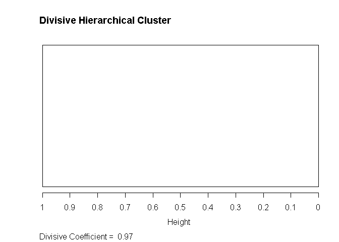
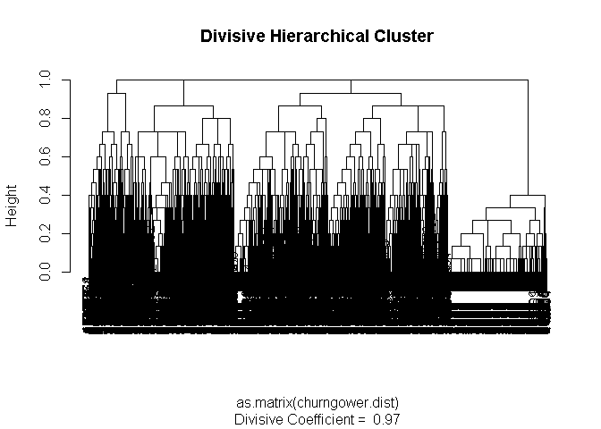

# SMU Machine Learning 1 DS7331  

## Lab 3 - Clustering Part A: All
NOTE: this does clustering on ALL customer data
  
**Telco Churn Data Set**  
https://www.kaggle.com/blastchar/telco-customer-churn  
  

* Jeremy Otsap - jotsap@mail.smu.edu  
* Shawn Jung - shawnj@mail.smu.edu  
* Lance Dacy - ldacy@mail.smu.edu  
* Amber Burnett - aburnett@mail.smu.edu  


### Business Understanding  

We are looking at customer data from a north American Telco provider. The purpose being to retain existing customers. In telecommunications, the estimated cost of new customer acquisition is approximately 5x higher than retaining an existing customer. Furthermore, only a third of customers switch carriers due to lower prices; more and more factors such as dissatisfaction with quality of service, advancing technology and media features, competitors having better cellular coverage, and poorly implemented loyalty programs are all contributing to customer attrition.  
  
### Data Understanding  
  
**Data Dictionary**  
We are provided a CSV set of 21 features and 7043 anonymyzed customers.

* **customerID**: Unique alpha-numeric string to anonymously represent an individual customer
* **gender**: Categorical String value to represent customer's gender (Male or Female)
* **SeniorCitizen**: Boolean int value to show whether the customer is a senior citizen or not (1, 0)
* **Partner**: Boolean string value showing whether the customer has a partner or not (Yes, No)
* **Dependents**: Boolean string value showing whether the customer has dependents or not (Yes, No)
* **tenure**: Numeric value showing number of months the customer has stayed with the company
* **PhoneService**: Boolean string value showing whether the customer has a phone service or not (Yes, No)
* **MultipleLines**: Categorical string value that shows if the customer has multiple lines or not (Yes, No, No phone service)
* **InternetService**: Categorical string value that shows the customer’s internet service provider (DSL, Fiber optic, No)
* **OnlineSecurity**: Categorical string value showing whether the customer has online security or not (Yes, No, No internet service)
* **OnlineBackup**: Categorical string showing whether the customer has online backup or not (Yes, No, No internet service)
* **DeviceProtection**: Categorical string showing whether the customer has device protection or not (Yes, No, No internet service)
* **TechSupport**: Categorical string showing whether the customer has tech support or not (Yes, No, No internet service)
* **StreamingTV**: Categorical string showing whether the customer has streaming TV or not (Yes, No, No internet service)
* **StreamingMovies**: Categorical string showing whether the customer has streaming movies or not (Yes, No, No internet service)
* **Contract**: Categorical string that represents the contract term (Month-to-month, One year, Two year)
* **PaperlessBilling**: Boolean string showing whether the customer has paperless billing or not (Yes, No)
* **PaymentMethod**: Categorical string that shows the customer’s payment method (Electronic check, Mailed check, Bank transfer (automatic), Credit card (automatic))
* **MonthlyCharges**: Numeric value showing the amount charged to the customer each month
* **TotalCharges**: Numeric value showing the total amount charged to the customer
* **Churn**: Boolean string showing whether or not the customer 'churned' or terminated ser
vices (Yes or No)  


### Initial Data Examination

As we can see most of the predictor variables are categorical, as is the response "Churn." However there are a few numerical variables as well specifically relating to the customer's spend, as well as the length of their contract.


```r
# dataframe
churn.df <- read.csv('https://raw.githubusercontent.com/jotsap/DS7331/master/data/churn.csv')

str(churn.df)
```

```
## 'data.frame':	7043 obs. of  21 variables:
##  $ customerID      : Factor w/ 7043 levels "0002-ORFBO","0003-MKNFE",..: 5376 3963 2565 5536 6512 6552 1003 4771 5605 4535 ...
##  $ gender          : Factor w/ 2 levels "Female","Male": 1 2 2 2 1 1 2 1 1 2 ...
##  $ SeniorCitizen   : int  0 0 0 0 0 0 0 0 0 0 ...
##  $ Partner         : Factor w/ 2 levels "No","Yes": 2 1 1 1 1 1 1 1 2 1 ...
##  $ Dependents      : Factor w/ 2 levels "No","Yes": 1 1 1 1 1 1 2 1 1 2 ...
##  $ tenure          : int  1 34 2 45 2 8 22 10 28 62 ...
##  $ PhoneService    : Factor w/ 2 levels "No","Yes": 1 2 2 1 2 2 2 1 2 2 ...
##  $ MultipleLines   : Factor w/ 3 levels "No","No phone service",..: 2 1 1 2 1 3 3 2 3 1 ...
##  $ InternetService : Factor w/ 3 levels "DSL","Fiber optic",..: 1 1 1 1 2 2 2 1 2 1 ...
##  $ OnlineSecurity  : Factor w/ 3 levels "No","No internet service",..: 1 3 3 3 1 1 1 3 1 3 ...
##  $ OnlineBackup    : Factor w/ 3 levels "No","No internet service",..: 3 1 3 1 1 1 3 1 1 3 ...
##  $ DeviceProtection: Factor w/ 3 levels "No","No internet service",..: 1 3 1 3 1 3 1 1 3 1 ...
##  $ TechSupport     : Factor w/ 3 levels "No","No internet service",..: 1 1 1 3 1 1 1 1 3 1 ...
##  $ StreamingTV     : Factor w/ 3 levels "No","No internet service",..: 1 1 1 1 1 3 3 1 3 1 ...
##  $ StreamingMovies : Factor w/ 3 levels "No","No internet service",..: 1 1 1 1 1 3 1 1 3 1 ...
##  $ Contract        : Factor w/ 3 levels "Month-to-month",..: 1 2 1 2 1 1 1 1 1 2 ...
##  $ PaperlessBilling: Factor w/ 2 levels "No","Yes": 2 1 2 1 2 2 2 1 2 1 ...
##  $ PaymentMethod   : Factor w/ 4 levels "Bank transfer (automatic)",..: 3 4 4 1 3 3 2 4 3 1 ...
##  $ MonthlyCharges  : num  29.9 57 53.9 42.3 70.7 ...
##  $ TotalCharges    : num  29.9 1889.5 108.2 1840.8 151.7 ...
##  $ Churn           : Factor w/ 2 levels "No","Yes": 1 1 2 1 2 2 1 1 2 1 ...
```

```r
head(churn.df)
```

```
##   customerID gender SeniorCitizen Partner Dependents tenure PhoneService
## 1 7590-VHVEG Female             0     Yes         No      1           No
## 2 5575-GNVDE   Male             0      No         No     34          Yes
## 3 3668-QPYBK   Male             0      No         No      2          Yes
## 4 7795-CFOCW   Male             0      No         No     45           No
## 5 9237-HQITU Female             0      No         No      2          Yes
## 6 9305-CDSKC Female             0      No         No      8          Yes
##      MultipleLines InternetService OnlineSecurity OnlineBackup
## 1 No phone service             DSL             No          Yes
## 2               No             DSL            Yes           No
## 3               No             DSL            Yes          Yes
## 4 No phone service             DSL            Yes           No
## 5               No     Fiber optic             No           No
## 6              Yes     Fiber optic             No           No
##   DeviceProtection TechSupport StreamingTV StreamingMovies       Contract
## 1               No          No          No              No Month-to-month
## 2              Yes          No          No              No       One year
## 3               No          No          No              No Month-to-month
## 4              Yes         Yes          No              No       One year
## 5               No          No          No              No Month-to-month
## 6              Yes          No         Yes             Yes Month-to-month
##   PaperlessBilling             PaymentMethod MonthlyCharges TotalCharges
## 1              Yes          Electronic check          29.85        29.85
## 2               No              Mailed check          56.95      1889.50
## 3              Yes              Mailed check          53.85       108.15
## 4               No Bank transfer (automatic)          42.30      1840.75
## 5              Yes          Electronic check          70.70       151.65
## 6              Yes          Electronic check          99.65       820.50
##   Churn
## 1    No
## 2    No
## 3   Yes
## 4    No
## 5   Yes
## 6   Yes
```


CustomerID is simply a placeholder value to represent an anonomyzed customer and is not necessary for analysis. Thus we will remove it. Additionally R can convert a data type to factor, thus we will convert the numerical SeniorCitizen variable to a factor and store it as a separate column


```r
# CustomerID not necessary for analysis
churn.df %>% dplyr::select(-customerID)  -> churn.df
# alternate code: churn.df$customerID <- NULL


# make FACTOR flavor of SeniorCitizen column
# recode 1 as "Yes" and 0 as "No"
dplyr::recode_factor(
  churn.df$SeniorCitizen, 
  `1` = "Yes", `0` = "No"
  ) -> churn.df$SeniorCitizen
# alternate code: churn.df <- churn.df %>% mutate(SeniorCitizen = factor(SeniorCitizen))

glimpse(churn.df)
```

```
## Observations: 7,043
## Variables: 20
## $ gender           <fct> Female, Male, Male, Male, Female, Female, Mal...
## $ SeniorCitizen    <fct> No, No, No, No, No, No, No, No, No, No, No, N...
## $ Partner          <fct> Yes, No, No, No, No, No, No, No, Yes, No, Yes...
## $ Dependents       <fct> No, No, No, No, No, No, Yes, No, No, Yes, Yes...
## $ tenure           <int> 1, 34, 2, 45, 2, 8, 22, 10, 28, 62, 13, 16, 5...
## $ PhoneService     <fct> No, Yes, Yes, No, Yes, Yes, Yes, No, Yes, Yes...
## $ MultipleLines    <fct> No phone service, No, No, No phone service, N...
## $ InternetService  <fct> DSL, DSL, DSL, DSL, Fiber optic, Fiber optic,...
## $ OnlineSecurity   <fct> No, Yes, Yes, Yes, No, No, No, Yes, No, Yes, ...
## $ OnlineBackup     <fct> Yes, No, Yes, No, No, No, Yes, No, No, Yes, N...
## $ DeviceProtection <fct> No, Yes, No, Yes, No, Yes, No, No, Yes, No, N...
## $ TechSupport      <fct> No, No, No, Yes, No, No, No, No, Yes, No, No,...
## $ StreamingTV      <fct> No, No, No, No, No, Yes, Yes, No, Yes, No, No...
## $ StreamingMovies  <fct> No, No, No, No, No, Yes, No, No, Yes, No, No,...
## $ Contract         <fct> Month-to-month, One year, Month-to-month, One...
## $ PaperlessBilling <fct> Yes, No, Yes, No, Yes, Yes, Yes, No, Yes, No,...
## $ PaymentMethod    <fct> Electronic check, Mailed check, Mailed check,...
## $ MonthlyCharges   <dbl> 29.85, 56.95, 53.85, 42.30, 70.70, 99.65, 89....
## $ TotalCharges     <dbl> 29.85, 1889.50, 108.15, 1840.75, 151.65, 820....
## $ Churn            <fct> No, No, Yes, No, Yes, Yes, No, No, Yes, No, N...
```


Now lets get a better look at our data using the skim() command. We can see a breakdown of variables by their types, as well as the ratio of counts for categorical variables, or range of values for numeric. 

One thing we notice immediately is there are 11 missing values in the TotalCharges parameter. *Note: we will address this shortly; however being such a small number it should not significantly impact our initial exploration*

A few things become immediately apparent as well. Firstly this sample has roughly a one third attrition rate looking at the Churn column: 1869 Yes vs 5174 No.

The output for SeniorCitizen is more useful now as a factor rather than the numeric representation, and because we did this it allows us to see that there are almost 6 times as many non-senior adults as seniors: 5901 vs 1142. However, when we look at gender we see a fairly even representation: 3555 males vs 3488 females. 

So we are starting to get a sense of the customer sample being a fairly even collection of males and females, however most of them are likely *not* retired and still working professionally. However, to get better insight we will now create some visualizations of our data


```r
skim(churn.df)
```

```
## Skim summary statistics
##  n obs: 7043 
##  n variables: 20 
## 
## -- Variable type:factor -------------------------------------------------------------------
##          variable missing complete    n n_unique
##             Churn       0     7043 7043        2
##          Contract       0     7043 7043        3
##        Dependents       0     7043 7043        2
##  DeviceProtection       0     7043 7043        3
##            gender       0     7043 7043        2
##   InternetService       0     7043 7043        3
##     MultipleLines       0     7043 7043        3
##      OnlineBackup       0     7043 7043        3
##    OnlineSecurity       0     7043 7043        3
##  PaperlessBilling       0     7043 7043        2
##           Partner       0     7043 7043        2
##     PaymentMethod       0     7043 7043        4
##      PhoneService       0     7043 7043        2
##     SeniorCitizen       0     7043 7043        2
##   StreamingMovies       0     7043 7043        3
##       StreamingTV       0     7043 7043        3
##       TechSupport       0     7043 7043        3
##                                  top_counts ordered
##                  No: 5174, Yes: 1869, NA: 0   FALSE
##      Mon: 3875, Two: 1695, One: 1473, NA: 0   FALSE
##                  No: 4933, Yes: 2110, NA: 0   FALSE
##       No: 3095, Yes: 2422, No : 1526, NA: 0   FALSE
##                 Mal: 3555, Fem: 3488, NA: 0   FALSE
##       Fib: 3096, DSL: 2421, No: 1526, NA: 0   FALSE
##        No: 3390, Yes: 2971, No : 682, NA: 0   FALSE
##       No: 3088, Yes: 2429, No : 1526, NA: 0   FALSE
##       No: 3498, Yes: 2019, No : 1526, NA: 0   FALSE
##                  Yes: 4171, No: 2872, NA: 0   FALSE
##                  No: 3641, Yes: 3402, NA: 0   FALSE
##  Ele: 2365, Mai: 1612, Ban: 1544, Cre: 1522   FALSE
##                   Yes: 6361, No: 682, NA: 0   FALSE
##                  No: 5901, Yes: 1142, NA: 0   FALSE
##       No: 2785, Yes: 2732, No : 1526, NA: 0   FALSE
##       No: 2810, Yes: 2707, No : 1526, NA: 0   FALSE
##       No: 3473, Yes: 2044, No : 1526, NA: 0   FALSE
## 
## -- Variable type:integer ------------------------------------------------------------------
##  variable missing complete    n  mean    sd p0 p25 p50 p75 p100     hist
##    tenure       0     7043 7043 32.37 24.56  0   9  29  55   72 <U+2587><U+2583><U+2583><U+2582><U+2582><U+2583><U+2583><U+2585>
## 
## -- Variable type:numeric ------------------------------------------------------------------
##        variable missing complete    n    mean      sd    p0    p25     p50
##  MonthlyCharges       0     7043 7043   64.76   30.09 18.25  35.5    70.35
##    TotalCharges      11     7032 7043 2283.3  2266.77 18.8  401.45 1397.47
##      p75    p100     hist
##    89.85  118.75 <U+2587><U+2581><U+2583><U+2582><U+2586><U+2585><U+2585><U+2582>
##  3794.74 8684.8  <U+2587><U+2583><U+2582><U+2582><U+2581><U+2581><U+2581><U+2581>
```

```r
# Churn ratio
table(churn.df$Churn) %>% pie(., main = "Churn Comparison")
```

<!-- -->

```r
# Gender ratio
table(churn.df$gender) %>% pie(., main = "Gender Comparison")
```

<!-- -->

```r
# Senior ratio
table(churn.df$SeniorCitizen) %>% pie(., , main = "SeniorCitizen")
```

<!-- -->


## Missing Values

As we investigate the data set we need to check for missing values. We validate there are 11 missing values in the TotalCharges column


```r
# from VIM package
aggr(churn.df, 
     prop = FALSE, 
     combined = TRUE, 
     numbers = TRUE, 
     sortVars = TRUE, 
     sortCombs = TRUE)
```

<!-- -->

```
## 
##  Variables sorted by number of missings: 
##          Variable Count
##      TotalCharges    11
##            gender     0
##     SeniorCitizen     0
##           Partner     0
##        Dependents     0
##            tenure     0
##      PhoneService     0
##     MultipleLines     0
##   InternetService     0
##    OnlineSecurity     0
##      OnlineBackup     0
##  DeviceProtection     0
##       TechSupport     0
##       StreamingTV     0
##   StreamingMovies     0
##          Contract     0
##  PaperlessBilling     0
##     PaymentMethod     0
##    MonthlyCharges     0
##             Churn     0
```

```r
# we can see that 'TotalCharges' has 11 missing values

# VALIDATE COUNT OF NA VALUES FOR ABOVE ROWS
print("Total number of missing values for TotalCharges: ")
```

```
## [1] "Total number of missing values for TotalCharges: "
```

```r
sum(is.na(churn.df$TotalCharges))
```

```
## [1] 11
```


Lets examine those specific rows that have missing values. We notice right away they all have a 0 for the tenure field. Lets validate we get the same 11 rows on the 2 following queries. 

NOTE: for readability we will only output the following 3 columns
* TotalCharges
* tenure
* MonthlyCharges

**All rows that have missing values in TotalCharges**


```r
# list rows with missing values
churn.df[is.na(churn.df$TotalCharges), c('TotalCharges','tenure','MonthlyCharges')]
```

```
##      TotalCharges tenure MonthlyCharges
## 489            NA      0          52.55
## 754            NA      0          20.25
## 937            NA      0          80.85
## 1083           NA      0          25.75
## 1341           NA      0          56.05
## 3332           NA      0          19.85
## 3827           NA      0          25.35
## 4381           NA      0          20.00
## 5219           NA      0          19.70
## 6671           NA      0          73.35
## 6755           NA      0          61.90
```


**All rows that have a 0 in tenure**


```r
# list rows with tenure of 0
churn.df[churn.df$tenure == 0, c('TotalCharges','tenure','MonthlyCharges')]
```

```
##      TotalCharges tenure MonthlyCharges
## 489            NA      0          52.55
## 754            NA      0          20.25
## 937            NA      0          80.85
## 1083           NA      0          25.75
## 1341           NA      0          56.05
## 3332           NA      0          19.85
## 3827           NA      0          25.35
## 4381           NA      0          20.00
## 5219           NA      0          19.70
## 6671           NA      0          73.35
## 6755           NA      0          61.90
```


We can see these are the **same** 11 rows. Thus these are likely new customers that just started their contract. Thus for this exercise it makes sense to use the value from **MonthlyCharges** as a placeholder for **TotalCharges**


```r
churn.df$TotalCharges[churn.df$tenure == 0] <- churn.df$MonthlyCharges[churn.df$tenure == 0]
```


Let's quickly verify no missing vlaues remain


```r
aggr(churn.df, 
     prop = FALSE, 
     combined = TRUE, 
     numbers = TRUE, 
     sortVars = TRUE, 
     sortCombs = TRUE)
```

<!-- -->

```
## 
##  Variables sorted by number of missings: 
##          Variable Count
##            gender     0
##     SeniorCitizen     0
##           Partner     0
##        Dependents     0
##            tenure     0
##      PhoneService     0
##     MultipleLines     0
##   InternetService     0
##    OnlineSecurity     0
##      OnlineBackup     0
##  DeviceProtection     0
##       TechSupport     0
##       StreamingTV     0
##   StreamingMovies     0
##          Contract     0
##  PaperlessBilling     0
##     PaymentMethod     0
##    MonthlyCharges     0
##      TotalCharges     0
##             Churn     0
```


## DATA SPLIT: NUMERIC AND CATEGORICAL


To do more advanced visualization we will split the data into 2 separate dataframes: numeric and categorical. However both will contain the response variable Churn. This will allow us to more easily make appropriate visualizations based on the type of variables we are considering

First lets look at boxplot of the different numerical variables for each sample of customers: those that terminated services vs those that stayed


```r
# split dataframes: numeric
churnNum.df <- churn.df %>% dplyr::select(tenure, MonthlyCharges, TotalCharges, Churn)

# create a vector of numNames
churnNumNames <- names(churnNum.df)
#remove Churn response
churnNumNames[-4] -> churnNumNames

### BOXPLOT OF NUMERICAL VALUES VS CHURN
boxplot_vs_response <- function(x) {
  ggplot(data = churnNum.df, aes_string(y=x, x="Churn", fill="Churn")) + geom_boxplot() + coord_flip() 
}

lapply(churnNumNames, boxplot_vs_response)
```

```
## [[1]]
```

<!-- -->

```
## 
## [[2]]
```

<!-- -->

```
## 
## [[3]]
```

<!-- -->


Next lets look at a barplots for the categoric variales to get a sense of the different ratio of customers who terminated service for each categorical column's level.


```r
# split dataframes: categorical
churnCat.df <- churn.df %>% dplyr::select(-tenure, -MonthlyCharges, -TotalCharges)

# create a vector of numNames and catNames
churnCatNames <- names(churnCat.df)
#remove Churn response
churnCatNames[-17] -> churnCatNames


### BARPLOT OF CATEGORICAL VALUES VS CHURN
ggplot(data = churnCat.df, aes_string(x="OnlineSecurity", y="Churn", fill="Churn")) + geom_col() 
```

<!-- -->

```r
barplot_vs_response <- function(x) {
  ggplot(data = churnCat.df, aes_string(x = x, y="Churn", fill = "Churn")) + geom_col() 
}

lapply(churnCatNames, barplot_vs_response)
```

```
## [[1]]
```

<!-- -->

```
## 
## [[2]]
```

<!-- -->

```
## 
## [[3]]
```

<!-- -->

```
## 
## [[4]]
```

<!-- -->

```
## 
## [[5]]
```

<!-- -->

```
## 
## [[6]]
```

<!-- -->

```
## 
## [[7]]
```

<!-- -->

```
## 
## [[8]]
```

<!-- -->

```
## 
## [[9]]
```

<!-- -->

```
## 
## [[10]]
```

<!-- -->

```
## 
## [[11]]
```

<!-- -->

```
## 
## [[12]]
```

<!-- -->

```
## 
## [[13]]
```

<!-- -->

```
## 
## [[14]]
```

<!-- -->

```
## 
## [[15]]
```

<!-- -->

```
## 
## [[16]]
```

<!-- -->


### Plot Tenure vs MonthlyCharges by Churn


```r
# Plot of Tenure by MonthlyCharges colored by Churn
plot(churn.df[, c("tenure", "MonthlyCharges")],
     col = churn.df$Churn,
     main = "Tenure vs MonthlyCharges by Churn",
     xlab = "Tenure", ylab = "MonthlyCharges")
```

<!-- -->


### Plot Tenure vs TotalCharges by Churn


```r
# Plot of Tenure by TotalCharges colored by Churn
plot(churn.df[, c("tenure", "TotalCharges")],
     col = churn.df$Churn,
     main = "Tenure vs TotalCharges by Churn",
     xlab = "Tenure", ylab = "TotalCharges")
```

<!-- -->


### Creating Data Categories


**Tenure by Category**

After this we'll also  a business perpsective we have divided our customers into the following categories:

* 0 to 11 months
* 12 to 23 months
* 24 to 47 months
* 48+ months


```r
# graphical look
hist(churn.df$tenure,
     main = "Customer Tenure",
     xlab = "Months",
     ylab = "Customers")
```

<!-- -->


```r
# creating bins for tenure
# under 1 year
# 1 - 2 years
# 2 - 4 years
# Over 4 years

cut(churn.df$tenure, 
    breaks = c(0,11,23,47,999), 
    labels = c("Under_1_Year","1_to_2_Years","2_to_4_Years","Over_4_Years"),
    include.lowest = T
    ) -> churn.df$tenureCat

# validate accuracy new Annual Income categorical parameter
churn.df[c(1,5,10,15,20,25,30,35,40,45),c("tenure","tenureCat")]
```

```
##    tenure    tenureCat
## 1       1 Under_1_Year
## 5       2 Under_1_Year
## 10     62 Over_4_Years
## 15     25 2_to_4_Years
## 20     21 1_to_2_Years
## 25     49 Over_4_Years
## 30     17 1_to_2_Years
## 35      1 Under_1_Year
## 40     11 Under_1_Year
## 45     13 1_to_2_Years
```


**MonthlyCharges By Category**


```r
# creating bins for MonthlyCharges
# even breaks

cut(churn.df$MonthlyCharges, 
    breaks = 3, 
    labels = c("Low","Med","High"),
    include.lowest = T
    ) -> churn.df$monthlyCat

# validate accuracy new Annual Income categorical parameter
churn.df[c(1,5,10,15,20,25,30,35,40,45),c("MonthlyCharges","monthlyCat")]
```

```
##    MonthlyCharges monthlyCat
## 1           29.85        Low
## 5           70.70        Med
## 10          56.15        Med
## 15         105.50       High
## 20          90.05       High
## 25          59.60        Med
## 30          64.70        Med
## 35          45.25        Low
## 40          97.85       High
## 45          76.20        Med
```


**Examing Churn vs Tenure Categories**

It appears most of the people are either new customers with service under 1 year, or long-term customers of 4 years or more.

Interestingly, loyal customers who do not churn appear to have a uniform distribution, while the customers who do churn are fairly right-skewed. In fact it appears most of those who churn do so within their first year. 

Possibly there are customers who aggressively change contracts to based on lowest price, new devices, etc.


```r
# plot of tenureCategory

plot(churn.df$tenureCat,
     main = "Churn by Tenure Category")
```

<!-- -->

```r
# Comparing Tenure by different Churn levels
boxplot(churn.df$tenure ~ churn.df$Churn,
        main = "Tenure by Churn",
        horizontal = T,
        xlab = "Contract Months" )
```

<!-- -->

```r
# Historgram of of Tenure for Churn = Yes Customers
hist(churn.df[churn.df$Churn == "Yes","tenure"], 
     breaks = c(0,12,24,36,48,60,72), 
     main = "Churn: Yes",
     xlab = "Months",
     ylab = "Customers")
```

<!-- -->

```r
# Historgram of of Tenure for Churn = No Customers
hist(churn.df[churn.df$Churn == "No","tenure"], 
     breaks = c(0,12,24,36,48,60,72), 
     main = "Churn: No",
     xlab = "Months",
     ylab = "Customers")
```

<!-- -->


**Churn = Yes Customers**

Of the customers who are in the "Yes" Churn category, more customers are within their first year of service, than the other 3 categories combined. We can examine this for the 4 different categories as well to verify this


```r
# Tenure Category for only Churn = Yes Customers
churn.df[churn.df$Churn == "Yes", ] %>% count(tenureCat)
```

```
## # A tibble: 4 x 2
##   tenureCat        n
##   <fct>        <int>
## 1 Under_1_Year   999
## 2 1_to_2_Years   309
## 3 2_to_4_Years   339
## 4 Over_4_Years   222
```

```r
# Plot of Tenure Categories for only Churn = Yes Customers

barplot( (churn.df[churn.df$Churn == "Yes", ] %>% count(tenureCat))$n, 
        horiz = T, 
        legend.text = (churn.df[churn.df$Churn == "Yes", ] %>% count(tenureCat))$tenureCat,
        col = rainbow(4),
        main = "Tenure Category for Churn = Yes Customers",
        xlab = "Customers")
```

<!-- -->


**Examining Monthly Charges Categories by Churn**


```r
# plot of monthlyCat

plot(churn.df$monthlyCat,
     main = "Churn by Monthly Charges Category")
```

<!-- -->

```r
# Comparing Monthly Charges by different Churn levels
boxplot(churn.df$MonthlyCharges ~ churn.df$Churn,
        main = "Monthly Charges by Churn",
        horizontal = T,
        xlab = "Dollars" )
```

<!-- -->

```r
# Historgram of of Monthly Charges for Churn = Yes Customers
hist(churn.df[churn.df$Churn == "Yes","MonthlyCharges"], 
     #breaks = c(0,12,24,36,48,60,72), 
     main = "Churn: Yes",
     xlab = "Dollars",
     ylab = "Customers")
```

<!-- -->

```r
# Historgram of of Monthly Charges for Churn = No Customers
hist(churn.df[churn.df$Churn == "No","MonthlyCharges"], 
     #breaks = c(0,12,24,36,48,60,72), 
     main = "Churn: No",
     xlab = "Dollars",
     ylab = "Customers")
```

<!-- -->


###Streaming Media


Quickly examining the customer profiles, we can see of the 5517 customers who have internet, 767 stream TV but do *NOT* stream movies. And 792 of them stream movies, but not TV. So in both cases around 14% only stream one or the other.

This may be due to different device profiles with more specific use cases. For example cable services bundled with a fiber circuit connecting to a family's home PC, vs a single / bachelor connecting to a gaming console like an Xbox or Playstation.

Unfortunately we do not have device information to further interpret these attributes


```r
# comparing StreamingMovies vs StreamingTV
table(churn.df[,c("StreamingMovies","StreamingTV")])
```

```
##                      StreamingTV
## StreamingMovies         No No internet service  Yes
##   No                  2018                   0  767
##   No internet service    0                1526    0
##   Yes                  792                   0 1940
```

```r
plot(table(churn.df[,c("StreamingMovies","StreamingTV")]),
     main = "StreamingMovies vs StreamingTV")
```

<!-- -->


###Advanced Services

Looking at some of the advanced services we can also do a similar breakdown. The numbers are output in the code below, but essentially this further infers there are different device types. Using the scenario above, device protection would not be a need for a home PC warrantied by Dell or HP. However, for a tablet or cell phone it would be more applicable.


```r
# comparing OnlineBackup vs OnlineSecurity
table(churn.df[,c("OnlineBackup","OnlineSecurity" )])
```

```
##                      OnlineSecurity
## OnlineBackup            No No internet service  Yes
##   No                  2195                   0  893
##   No internet service    0                1526    0
##   Yes                 1303                   0 1126
```

```r
table(churn.df[,c("OnlineBackup","DeviceProtection" )])
```

```
##                      DeviceProtection
## OnlineBackup            No No internet service  Yes
##   No                  1984                   0 1104
##   No internet service    0                1526    0
##   Yes                 1111                   0 1318
```

```r
table(churn.df[,c("DeviceProtection","OnlineSecurity" )])
```

```
##                      OnlineSecurity
## DeviceProtection        No No internet service  Yes
##   No                  2187                   0  908
##   No internet service    0                1526    0
##   Yes                 1311                   0 1111
```

```r
plot(table(churn.df[,c("OnlineBackup","OnlineSecurity")]),
     main = "OnlineBackup vs OnlineSecurity")
```

<!-- -->

```r
plot(table(churn.df[,c("OnlineBackup","DeviceProtection")]),
     main = "OnlineBackup vs DeviceProtection")
```

<!-- -->

```r
plot(table(churn.df[,c("DeviceProtection","OnlineSecurity")]),
     main = "DeviceProtection vs OnlineSecurity")
```

<!-- -->


###EDA CONCLUSION

Just by visually examining the features such as who uses device protection vs online backup vs online security, its difficult to build a customer profile or show assocation across these services

Thus a more advanced technique is needed


## Unsupervised Learning: Clustering

Unlike supervised machine learning, where the outcomes are already known, with unsupervised you take a data and try to discern any patterns or groups, without necessarily having a prediction to model. 


**Method Selection**

The method chosen for this exercise was hierarchical clustering. It is one of the more foundational clustering methods, lends itself well to visualization, even for categorical data.

### Challenges With Mixed and Categorical Data

While it is quite easy to imagine distances between numerical data points using Eucledian distances, categorical data does not seem so obvious. Thus we need a method to score similarity of each individual observation with respect to the categorical parameters. In order to do that, one of the first steps we need to do is create a **dissimilarity** matrix

On a final note, when doing clustering it is ideal if all the data is either categorical or numerical. Clustering on mixed data is an advanced techique beyond the scope of this class. Fortunately we have already done this step earlier for our exploratory data anlaysis


NOTE ON ALTERNATIVE METHOD

An alternative method, known as **K-Mode** which is an adaptation of the **K-Means** clustering method using the modes of categorical attributes instead the mean. Ultimately decided not to go this route, given the limited package availability and available content coverage. It is a more advanced technique, and if interested take a look at the klaR package:

https://cran.r-project.org/web/packages/klaR/
https://www.youtube.com/watch?v=b39_vipRkUo


**Prepping Data For Clustering**

Our goal is to really examine what services would benefit or entice our customers, so we want to focus on those aspects. 

As before we need to prevent data leakage for information we wouldn't necessarily have, specifically if the customer churns, as well as what their total spend would be. Their monthly spend however is something we would know for the current month, thus we will leave that factor in the analysis to help determine if they are cost conscious or not. Additionally tenure will remain, as we can know how long the customer been with us at the point in time. Contract itself may be a secondary business outcome, tied to tenure, thus we will not include it WITH tenure, as the dependency may skew our results. Lastly the payment method and the paperless billing do not have much business value. 


```r
# exclude Contract, PaperlessBilling, PaymentMethod, TotalCharges, Churn
churn.df %>% dplyr::select(-c('Contract', 'PaperlessBilling', 'PaymentMethod', 'TotalCharges', 'Churn','tenure','MonthlyCharges'))  -> churncluster.df
```


###Gower: Dissimilarity Matrix Calculation

Before we can start the actual clustering, we need to construct a **Gower Matrix.**  The handling of nominal, ordinal, and binary data is achieved by using this general dissimilarity coefficient of Gower. While numerical and rank data is conceptually easier to understand [as with most clustering methods], categorical data is till possible. 

Gower distance is calculated for each variable type and scaled between 0 and 1, and then a linear combination is calculated to create the final matrix. Additionally user-defined weights can be specified. 

Variables are essentially expanded into a binary or “dummy variable” format. I.e. 
* Internet_DSL: 0 or 1
* Internet_Fiber: 0 or 1
* Internet_NO: implied by 0’s in both the prior categories

It then computes some measure for those variables [also known as the “Dice Coefficient”] based on the differences of those individuals. Note that the theory is beyond the scope of this notebook, but essentially a series of matrix operations that examines the relative agreement, where you a put 0 when both individuals fall into the same category and a 1 if they don’t. Thus the higher the value, the more *dissimilar*

Look at the links below if interested

https://stats.stackexchange.com/questions/297121/measures-of-association-between-nominal-variables-with-the-same-categories-pair/297206#297206

https://stats.stackexchange.com/questions/55798/what-is-the-optimal-distance-function-for-individuals-when-attributes-are-nomina/55802#55802

https://stats.stackexchange.com/questions/15287/hierarchical-clustering-with-mixed-type-data-what-distance-similarity-to-use/15313#15313


###/!\ CPU WARNING
This entire process requires an n x m distance matrix to be calculated. For this particular dataset, CRAN [i.e. non-parallelized R] can take from 20-45 minutes depending on your CPU, RAM, and HD IOPS / throughput.


```r
###Gower Calculation

# available metric options are: c("euclidean", "manhattan", "gower")
churngower.dist <- daisy(churncluster.df, metric = c("gower"))

# class(churngower.dist) 

# store as matrix
as.matrix(churngower.dist) -> churngower.mtx
```


As a sanity check, we can print out the most similar and dissimilar pair in the data to see if it makes sense

**Most Similar Pair**


```r
#most similar pair

churncluster.df[which(churngower.mtx == min(churngower.mtx[churngower.mtx != min(churngower.mtx)] ), arr.ind = T )[1,],  ]
```

```
##     gender SeniorCitizen Partner Dependents PhoneService    MultipleLines
## 181 Female            No      No         No           No No phone service
## 1   Female            No     Yes         No           No No phone service
##     InternetService OnlineSecurity OnlineBackup DeviceProtection
## 181             DSL             No          Yes               No
## 1               DSL             No          Yes               No
##     TechSupport StreamingTV StreamingMovies    tenureCat monthlyCat
## 181          No          No              No Under_1_Year        Low
## 1            No          No              No Under_1_Year        Low
```


**Most Dissimilar Pair**


```r
#most DISsimilar pair

churncluster.df[which(churngower.mtx == max(churngower.mtx[churngower.mtx != max(churngower.mtx)] ), arr.ind = T )[1,],  ]
```

```
##    gender SeniorCitizen Partner Dependents PhoneService    MultipleLines
## 73   Male           Yes     Yes        Yes          Yes              Yes
## 1  Female            No     Yes         No           No No phone service
##    InternetService OnlineSecurity OnlineBackup DeviceProtection
## 73     Fiber optic            Yes           No              Yes
## 1              DSL             No          Yes               No
##    TechSupport StreamingTV StreamingMovies    tenureCat monthlyCat
## 73         Yes         Yes             Yes Over_4_Years       High
## 1           No          No              No Under_1_Year        Low
```


##Hierarchical Clustering

For this notebook we will focus on hierarchical clustering as it lends itself to visual analysis, and thus more intuitive understanding. We will be comparing the agglomerative (bottom-up) and divisive (top-down) methods of Hierarchical and noting differences in the results


**Agglomerative** clustering starts with as many clusters as there are observations, with each of those observations being its own individual cluster. Then as we model, it progressively finds more *similar* data points and groups them into clusters.

Conversely, **divisive** clustering assumes all data points are part of a single cluster, and then subdivides them by most *dissimilar* ones into separate clusters.

In general, divisive is better for a smaller number of large clusters, while agglomerative is better for finding a large number of smaller clusters


### Agglomerative Hierarchical Cluster

**DETERMINE HIERARCHICAL CLUSTER DISTANCE**

4 methods determine cluster distance

* **COMPLETE**: pairwise similarty between ALL observations in clusters 1 and 2. Uses LARGEST distance as distance between clusters. NOTE: this is the *default* method.
* **SINGLE**: as per COMPLETE but uses SMALLEST distance
* **AVERAGE**: as per COMPLETE but takes AVERAGE distance
* **CENTROID**: calculates centroid of each cluster and uses CENTROID DISTANCE

NOTE: COMPLETE & AVERAGE produce more "balanced" trees, thus for the purpose of this exercise we will be using **Complete**


```r
# Agglomerative clustering
churn.hclust.agg <- hclust(churngower.dist, method = "complete")
# hclust method = c('complete','average','single') 
plot(churn.hclust.agg, main = "Agglomerative Hierarchical Cluster With Complete Linkages")
```

<!-- -->


### Divisive Complete Hierarchical Cluster

**/!\ CPU WARNING** The Divisive is much more time intensive. Expect 20-30+ minutes


```r
# Divisive clustering
churn.hclust.div <- diana(as.matrix(churngower.dist), 
                  diss = TRUE, 
                  keep.diss = TRUE)
plot(churn.hclust.div, main = "Divisive Hierarchical Cluster")
```

<!-- --><!-- -->


While we can see the tree itself, its not very intuitive to understand how many potential clusters we should divide this into. We do note one group definitely stands out, and this is likely the 1526 users who have no interenet service. However, other than this, no clear grouping presents itself

Thus we need to decide how many clusters in which to group


##Cluster Evaluation Methods


First [and probably most difficult] is to iterate through a number of clusters, in this case a maximum of 7 clusters, and output the various stats 


**/!\ CPU WARNING** Expect 30+ minutes


```r
library(fpc)

cstats.table <- function(dist, tree, k) {
clust.assess <- c("cluster.number","n","within.cluster.ss","average.within","average.between",
                  "wb.ratio","dunn2","avg.silwidth")
clust.size <- c("cluster.size")
stats.names <- c()
row.clust <- c()
output.stats <- matrix(ncol = k, nrow = length(clust.assess))
cluster.sizes <- matrix(ncol = k, nrow = k)
for(i in c(1:k)){
  row.clust[i] <- paste("Cluster-", i, " size")
}
for(i in c(2:k)){
  stats.names[i] <- paste("Test", i-1)
  
  for(j in seq_along(clust.assess)){
    output.stats[j, i] <- unlist(cluster.stats(d = dist, clustering = cutree(tree, k = i))[clust.assess])[j]
    
  }
  
  for(d in 1:k) {
    cluster.sizes[d, i] <- unlist(cluster.stats(d = dist, clustering = cutree(tree, k = i))[clust.size])[d]
    dim(cluster.sizes[d, i]) <- c(length(cluster.sizes[i]), 1)
    cluster.sizes[d, i]
    
  }
}
output.stats.df <- data.frame(output.stats)
cluster.sizes <- data.frame(cluster.sizes)
cluster.sizes[is.na(cluster.sizes)] <- 0
rows.all <- c(clust.assess, row.clust)

# rownames(output.stats.df) <- clust.assess
output <- rbind(output.stats.df, cluster.sizes)[ ,-1]
colnames(output) <- stats.names[2:k]
rownames(output) <- rows.all
is.num <- sapply(output, is.numeric)
output[is.num] <- lapply(output[is.num], round, 2)
output
}
```


###Stats for Divisive Cluster 


```r
## DIVISIVE STATS
# capping the maximum amout of clusters at 6

stats.df.div <- cstats.table(churngower.dist, churn.hclust.div, 6)
stats.df.div
```

```
##                    Test 1  Test 2  Test 3  Test 4  Test 5
## cluster.number       2.00    3.00    4.00    5.00    6.00
## n                 7043.00 7043.00 7043.00 7043.00 7043.00
## within.cluster.ss 1106.43  995.10  544.71  527.39  417.47
## average.within       0.54    0.52    0.38    0.38    0.32
## average.between      0.63    0.60    0.64    0.64    0.62
## wb.ratio             0.85    0.87    0.60    0.59    0.51
## dunn2                1.17    0.99    1.23    1.12    1.17
## avg.silwidth         0.16    0.12    0.32    0.29    0.32
## Cluster- 1  size   685.00  685.00  685.00  473.00  473.00
## Cluster- 2  size  6358.00 1549.00 1549.00 1549.00 1549.00
## Cluster- 3  size     0.00 4809.00 3283.00 3283.00 1440.00
## Cluster- 4  size     0.00    0.00 1526.00 1526.00 1843.00
## Cluster- 5  size     0.00    0.00    0.00  212.00 1526.00
## Cluster- 6  size     0.00    0.00    0.00    0.00  212.00
```


###Stats for Agglomerative Cluster 


```r
## AGGLOMERATIVE STATS
# capping the maximum amout of clusters at 6
stats.df.aggl <-cstats.table(churngower.dist, churn.hclust.agg, 6) 
stats.df.aggl
```

```
##                    Test 1  Test 2  Test 3  Test 4  Test 5
## cluster.number       2.00    3.00    4.00    5.00    6.00
## n                 7043.00 7043.00 7043.00 7043.00 7043.00
## within.cluster.ss 1181.41  975.31  686.29  648.77  604.30
## average.within       0.55    0.51    0.40    0.39    0.37
## average.between      0.63    0.61    0.63    0.62    0.61
## wb.ratio             0.88    0.85    0.64    0.62    0.61
## dunn2                1.14    1.09    1.23    1.06    1.06
## avg.silwidth         0.11    0.14    0.25    0.21    0.19
## Cluster- 1  size  6870.00 4893.00 2033.00 2033.00 2033.00
## Cluster- 2  size   173.00 1977.00 2860.00 2592.00 1183.00
## Cluster- 3  size     0.00  173.00 1977.00 1977.00 1409.00
## Cluster- 4  size     0.00    0.00  173.00  268.00 1977.00
## Cluster- 5  size     0.00    0.00    0.00  173.00  268.00
## Cluster- 6  size     0.00    0.00    0.00    0.00  173.00
```


###Selecting Number of Clusters

**Elbow method:** start with it when the compactness of clusters, or similarities within groups are most important for your analysis.

**Silhouette method:** as a measure of data consistency, the silhouette plot displays a measure of how close each point in one cluster is to points in the neighboring clusters.


### Elbow Plot for Divisive Clustering

Given the sharp change, 4 clusters appears to be the best choice


```r
# Elbow for Divisive clustering
ggplot(data = data.frame(t(cstats.table(churngower.dist, churn.hclust.div, 9))), 
  aes(x=cluster.number, y=within.cluster.ss)) + 
  geom_point()+
  geom_line()+
  ggtitle("Divisive clustering") +
  labs(x = "Num.of clusters", y = "Within clusters sum of squares (SS)") +
  theme(plot.title = element_text(hjust = 0.5))
```

<!-- -->


### Elbow Plot for Agglomerative Clustering

Given the sharp change, 4 clusters appears to be the best choice


```r
# Elbow for Agglomerative clustering
ggplot(data = data.frame(t(cstats.table(churngower.dist, churn.hclust.agg, 9))), 
  aes(x=cluster.number, y=within.cluster.ss)) + 
  geom_point()+
  geom_line()+
  ggtitle("Agglomerative clustering") +
  labs(x = "Num.of clusters", y = "Within clusters sum of squares (SS)") +
  theme(plot.title = element_text(hjust = 0.5))
```

<!-- -->


### Silhouette for Agglomerative clustering

When it comes to silhouette assessment, the rule is you should choose the number that maximizes the silhouette coefficient because you want clusters that are distinctive (far) enough to be considered separate.

The silhouette coefficient ranges between -1 and 1, with 1 indicating good consistency within clusters, -1 — not so good. From the plot below, 7 clusters would be preferred, 4 being the second choice


```r
# Silhouette for Agglomerative clustering
ggplot(data = data.frame(t(cstats.table(churngower.dist, churn.hclust.agg, 9))), 
  aes(x=cluster.number, y=avg.silwidth)) + 
  geom_point()+
  geom_line()+
  ggtitle("Agglomerative clustering") +
  labs(x = "Num.of clusters", y = "Average silhouette width") +
  theme(plot.title = element_text(hjust = 0.5))
```

<!-- -->


### Silhouette for Divisive Clustering

From the plot below, 4 clusters would be preferred


```r
# Silhouette for Divisive Clustering
ggplot(data = data.frame(t(cstats.table(churngower.dist, churn.hclust.div, 9))), 
  aes(x=cluster.number, y=avg.silwidth)) + 
  geom_point()+
  geom_line()+
  ggtitle("Divisive clustering") +
  labs(x = "Num.of clusters", y = "Average silhouette width") +
  theme(plot.title = element_text(hjust = 0.5))
```

<!-- -->


##Conclusion

Given that most of the evaluation techniques favored 4 clusters, this is what we will go with. Again there is no "right" answer here, and it makes more business sense to have fewer clusters, at least initially, and thus we focus on experimenting with targeted marketing


###Visual for Agglomerative Clustering

Now that we have 4 clusters selected, lets look at this graph again, with each of the clusters colored separately.

**Colored Agglomerative Hierarchical**


```r
# Visual for Agglomerative Clustering


#library("ggplot2")
#library("reshape2")
#library("purrr")
#library("dplyr")

# dendrogram starting point
library("dendextend")
```

```
## 
## ---------------------
## Welcome to dendextend version 1.10.0
## Type citation('dendextend') for how to cite the package.
## 
## Type browseVignettes(package = 'dendextend') for the package vignette.
## The github page is: https://github.com/talgalili/dendextend/
## 
## Suggestions and bug-reports can be submitted at: https://github.com/talgalili/dendextend/issues
## Or contact: <tal.galili@gmail.com>
## 
## 	To suppress this message use:  suppressPackageStartupMessages(library(dendextend))
## ---------------------
```

```
## 
## Attaching package: 'dendextend'
```

```
## The following object is masked from 'package:data.table':
## 
##     set
```

```
## The following object is masked from 'package:stats':
## 
##     cutree
```

```r
dendro <- as.dendrogram(churn.hclust.agg)

#using 4 clusters as per Elbow and Silhouette
dendro.col <- dendro %>%
  set("branches_k_color", k = 4, value =   c("blue", "red", "green", "black")) %>%
  set("branches_lwd", 0.6) %>%
  set("labels_colors", 
      value = c("darkslategray")) %>% 
  set("labels_cex", 0.5)
ggd1 <- as.ggdend(dendro.col)
ggplot(ggd1, theme = theme_minimal()) +
  labs(x = "Num. observations", y = "Height", title = "Dendrogram, k = 4")
```

```
## Warning: Removed 14085 rows containing missing values (geom_point).
```

<!-- -->


**Colored Divisive Hierarchical**


```r
# dendrogram starting point
# library("dendextend")

dendro <- as.dendrogram(churn.hclust.div)

#using 4 clusters as per Elbow and Silhouette
dendro.col <- dendro %>%
  set("branches_k_color", k = 4, value =   c("blue", "red", "green", "black")) %>%
  set("branches_lwd", 0.6) %>%
  set("labels_colors", 
      value = c("darkslategray")) %>% 
  set("labels_cex", 0.5)
ggd1 <- as.ggdend(dendro.col)
ggplot(ggd1, theme = theme_minimal()) +
  labs(x = "Num. observations", y = "Height", title = "Dendrogram, k = 4")
```

```
## Warning: Removed 14085 rows containing missing values (geom_point).
```

<!-- -->


### COMPARE AGG & DIV HCLUST RESULTS IN TABLE

NOTE: Not going to actually execute this code, but will have here for reference


**Why a Table in R May Not Work**

Your first instince may be to output the cluster labels into vectors, and then put them into a table to compare as such:

*first create agg vector from cuttree*
cutree(churn.hclust.agg, k = 4) -> churn.agg.cutree

*second create div vector from cuttree*
cutree(churn.hclust.div, k = 4) -> churn.div.cutree

*then put into table*
table(churn.agg.cutree, churn.div.cutree)

The issue is that cluster 1 in Agglomerative vs cluster 1 in Divisive do not necessarily mean the same thing.


**A Better Way**

Take the cluster labels, add them as separate fields in a new dataframe, then export them as a CSV. Here you can import them into tools like Excel or PowerBI, and do more analysis on this. The reason being you very likely need an SME to help you *interpret* the meaning of these clusters, and possibly fine tune them **from a business** perspective

The code below can help you do that

churnout.df <- churncluster.df
churnout.df$agg <- churn.agg.cutree
churnout.df$div <- churn.div.cutree
write.csv(churnout.df , file = "d:/temp/data/mining/final/churnout.csv", eol = "\n", row.names = T, append = F)


