# SMU Machine Learning 1 DS7331  
## Lab 2
  
**Telco Churn Data Set**  
https://www.kaggle.com/blastchar/telco-customer-churn  
  

* Jeremy Otsap - jotsap@mail.smu.edu  
* Shawn Jung - shawnj@mail.smu.edu  
* Lance Dacy - ldacy@mail.smu.edu  
* Amber Burnett - aburnett@mail.smu.edu  


### Business Understanding  

We are looking at customer data from a north American Telco provider. The purpose being to retain existing customers. In telecommunications, the estimated cost of new customer acquisition is approximately 5x higher than retaining an existing customer. Furthermore, only a third of customers switch carriers due to lower prices; more and more factors such as dissatisfaction with quality of service, advancing technology and media features, competitors having better cellular coverage, and poorly implemented loyalty programs are all contributing to customer attrition.  
  
### Data Understanding  
  
**Data Dictionary**  
We are provided a CSV set of 21 features and 7043 anonymyzed customers.

* **customerID**: Unique alpha-numeric string to anonymously represent an individual customer
* **gender**: Categorical String value to represent customer's gender (Male or Female)
* **SeniorCitizen**: Boolean int value to show whether the customer is a senior citizen or not (1, 0)
* **Partner**: Boolean string value showing whether the customer has a partner or not (Yes, No)
* **Dependents**: Boolean string value showing whether the customer has dependents or not (Yes, No)
* **tenure**: Numeric value showing number of months the customer has stayed with the company
* **PhoneService**: Boolean string value showing whether the customer has a phone service or not (Yes, No)
* **MultipleLines**: Categorical string value that shows if the customer has multiple lines or not (Yes, No, No phone service)
* **InternetService**: Categorical string value that shows the customer’s internet service provider (DSL, Fiber optic, No)
* **OnlineSecurity**: Categorical string value showing whether the customer has online security or not (Yes, No, No internet service)
* **OnlineBackup**: Categorical string showing whether the customer has online backup or not (Yes, No, No internet service)
* **DeviceProtection**: Categorical string showing whether the customer has device protection or not (Yes, No, No internet service)
* **TechSupport**: Categorical string showing whether the customer has tech support or not (Yes, No, No internet service)
* **StreamingTV**: Categorical string showing whether the customer has streaming TV or not (Yes, No, No internet service)
* **StreamingMovies**: Categorical string showing whether the customer has streaming movies or not (Yes, No, No internet service)
* **Contract**: Categorical string that represents the contract term (Month-to-month, One year, Two year)
* **PaperlessBilling**: Boolean string showing whether the customer has paperless billing or not (Yes, No)
* **PaymentMethod**: Categorical string that shows the customer’s payment method (Electronic check, Mailed check, Bank transfer (automatic), Credit card (automatic))
* **MonthlyCharges**: Numeric value showing the amount charged to the customer each month
* **TotalCharges**: Numeric value showing the total amount charged to the customer
* **Churn**: Boolean string showing whether or not the customer 'churned' or terminated ser
vices (Yes or No)  


### Initial Data Examination

As we can see most of the predictor variables are categorical, as is the response "Churn." However there are a few numerical variables as well specifically relating to the customer's spend, as well as the length of their contract.


```r
# dataframe
churn.df <- read.csv('https://raw.githubusercontent.com/jotsap/DS7331/master/data/churn.csv')

str(churn.df)
```

```
## 'data.frame':	7043 obs. of  21 variables:
##  $ customerID      : Factor w/ 7043 levels "0002-ORFBO","0003-MKNFE",..: 5376 3963 2565 5536 6512 6552 1003 4771 5605 4535 ...
##  $ gender          : Factor w/ 2 levels "Female","Male": 1 2 2 2 1 1 2 1 1 2 ...
##  $ SeniorCitizen   : int  0 0 0 0 0 0 0 0 0 0 ...
##  $ Partner         : Factor w/ 2 levels "No","Yes": 2 1 1 1 1 1 1 1 2 1 ...
##  $ Dependents      : Factor w/ 2 levels "No","Yes": 1 1 1 1 1 1 2 1 1 2 ...
##  $ tenure          : int  1 34 2 45 2 8 22 10 28 62 ...
##  $ PhoneService    : Factor w/ 2 levels "No","Yes": 1 2 2 1 2 2 2 1 2 2 ...
##  $ MultipleLines   : Factor w/ 3 levels "No","No phone service",..: 2 1 1 2 1 3 3 2 3 1 ...
##  $ InternetService : Factor w/ 3 levels "DSL","Fiber optic",..: 1 1 1 1 2 2 2 1 2 1 ...
##  $ OnlineSecurity  : Factor w/ 3 levels "No","No internet service",..: 1 3 3 3 1 1 1 3 1 3 ...
##  $ OnlineBackup    : Factor w/ 3 levels "No","No internet service",..: 3 1 3 1 1 1 3 1 1 3 ...
##  $ DeviceProtection: Factor w/ 3 levels "No","No internet service",..: 1 3 1 3 1 3 1 1 3 1 ...
##  $ TechSupport     : Factor w/ 3 levels "No","No internet service",..: 1 1 1 3 1 1 1 1 3 1 ...
##  $ StreamingTV     : Factor w/ 3 levels "No","No internet service",..: 1 1 1 1 1 3 3 1 3 1 ...
##  $ StreamingMovies : Factor w/ 3 levels "No","No internet service",..: 1 1 1 1 1 3 1 1 3 1 ...
##  $ Contract        : Factor w/ 3 levels "Month-to-month",..: 1 2 1 2 1 1 1 1 1 2 ...
##  $ PaperlessBilling: Factor w/ 2 levels "No","Yes": 2 1 2 1 2 2 2 1 2 1 ...
##  $ PaymentMethod   : Factor w/ 4 levels "Bank transfer (automatic)",..: 3 4 4 1 3 3 2 4 3 1 ...
##  $ MonthlyCharges  : num  29.9 57 53.9 42.3 70.7 ...
##  $ TotalCharges    : num  29.9 1889.5 108.2 1840.8 151.7 ...
##  $ Churn           : Factor w/ 2 levels "No","Yes": 1 1 2 1 2 2 1 1 2 1 ...
```

```r
head(churn.df)
```

```
##   customerID gender SeniorCitizen Partner Dependents tenure PhoneService
## 1 7590-VHVEG Female             0     Yes         No      1           No
## 2 5575-GNVDE   Male             0      No         No     34          Yes
## 3 3668-QPYBK   Male             0      No         No      2          Yes
## 4 7795-CFOCW   Male             0      No         No     45           No
## 5 9237-HQITU Female             0      No         No      2          Yes
## 6 9305-CDSKC Female             0      No         No      8          Yes
##      MultipleLines InternetService OnlineSecurity OnlineBackup
## 1 No phone service             DSL             No          Yes
## 2               No             DSL            Yes           No
## 3               No             DSL            Yes          Yes
## 4 No phone service             DSL            Yes           No
## 5               No     Fiber optic             No           No
## 6              Yes     Fiber optic             No           No
##   DeviceProtection TechSupport StreamingTV StreamingMovies       Contract
## 1               No          No          No              No Month-to-month
## 2              Yes          No          No              No       One year
## 3               No          No          No              No Month-to-month
## 4              Yes         Yes          No              No       One year
## 5               No          No          No              No Month-to-month
## 6              Yes          No         Yes             Yes Month-to-month
##   PaperlessBilling             PaymentMethod MonthlyCharges TotalCharges
## 1              Yes          Electronic check          29.85        29.85
## 2               No              Mailed check          56.95      1889.50
## 3              Yes              Mailed check          53.85       108.15
## 4               No Bank transfer (automatic)          42.30      1840.75
## 5              Yes          Electronic check          70.70       151.65
## 6              Yes          Electronic check          99.65       820.50
##   Churn
## 1    No
## 2    No
## 3   Yes
## 4    No
## 5   Yes
## 6   Yes
```


CustomerID is simply a placeholder value to represent an anonomyzed customer and is not necessary for analysis. Thus we will remove it. Additionally R can convert a data type to factor, thus we will convert the numerical SeniorCitizen variable to a factor and store it as a separate column


```r
# CustomerID not necessary for analysis
churn.df %>% dplyr::select(-customerID)  -> churn.df
# alternate code: churn.df$customerID <- NULL


# make FACTOR flavor of SeniorCitizen column
# recode 1 as "Yes" and 0 as "No"
dplyr::recode_factor(
  churn.df$SeniorCitizen, 
  `1` = "Yes", `0` = "No"
  ) -> churn.df$SeniorCitizen
# alternate code: churn.df <- churn.df %>% mutate(SeniorCitizen = factor(SeniorCitizen))

glimpse(churn.df)
```

```
## Observations: 7,043
## Variables: 20
## $ gender           <fct> Female, Male, Male, Male, Female, Female, Mal...
## $ SeniorCitizen    <fct> No, No, No, No, No, No, No, No, No, No, No, N...
## $ Partner          <fct> Yes, No, No, No, No, No, No, No, Yes, No, Yes...
## $ Dependents       <fct> No, No, No, No, No, No, Yes, No, No, Yes, Yes...
## $ tenure           <int> 1, 34, 2, 45, 2, 8, 22, 10, 28, 62, 13, 16, 5...
## $ PhoneService     <fct> No, Yes, Yes, No, Yes, Yes, Yes, No, Yes, Yes...
## $ MultipleLines    <fct> No phone service, No, No, No phone service, N...
## $ InternetService  <fct> DSL, DSL, DSL, DSL, Fiber optic, Fiber optic,...
## $ OnlineSecurity   <fct> No, Yes, Yes, Yes, No, No, No, Yes, No, Yes, ...
## $ OnlineBackup     <fct> Yes, No, Yes, No, No, No, Yes, No, No, Yes, N...
## $ DeviceProtection <fct> No, Yes, No, Yes, No, Yes, No, No, Yes, No, N...
## $ TechSupport      <fct> No, No, No, Yes, No, No, No, No, Yes, No, No,...
## $ StreamingTV      <fct> No, No, No, No, No, Yes, Yes, No, Yes, No, No...
## $ StreamingMovies  <fct> No, No, No, No, No, Yes, No, No, Yes, No, No,...
## $ Contract         <fct> Month-to-month, One year, Month-to-month, One...
## $ PaperlessBilling <fct> Yes, No, Yes, No, Yes, Yes, Yes, No, Yes, No,...
## $ PaymentMethod    <fct> Electronic check, Mailed check, Mailed check,...
## $ MonthlyCharges   <dbl> 29.85, 56.95, 53.85, 42.30, 70.70, 99.65, 89....
## $ TotalCharges     <dbl> 29.85, 1889.50, 108.15, 1840.75, 151.65, 820....
## $ Churn            <fct> No, No, Yes, No, Yes, Yes, No, No, Yes, No, N...
```


Now lets get a better look at our data using the skim() command. We can see a breakdown of variables by their types, as well as the ratio of counts for categorical variables, or range of values for numeric. 

One thing we notice immediately is there are 11 missing values in the TotalCharges parameter. *Note: we will address this shortly; however being such a small number it should not significantly impact our initial exploration*

A few things become immediately apparent as well. Firstly this sample has roughly a one third attrition rate looking at the Churn column: 1869 Yes vs 5174 No.

The output for SeniorCitizen is more useful now as a factor rather than the numeric representation, and because we did this it allows us to see that there are almost 6 times as many non-senior adults as seniors: 5901 vs 1142. However, when we look at gender we see a fairly even representation: 3555 males vs 3488 females. 

So we are starting to get a sense of the customer sample being a fairly even collection of males and females, however most of them are likely *not* retired and still working professionally. However, to get better insight we will now create some visualizations of our data


```r
skim(churn.df)
```

```
## Skim summary statistics
##  n obs: 7043 
##  n variables: 20 
## 
## -- Variable type:factor ------------------------------------------------------------------------
##          variable missing complete    n n_unique
##             Churn       0     7043 7043        2
##          Contract       0     7043 7043        3
##        Dependents       0     7043 7043        2
##  DeviceProtection       0     7043 7043        3
##            gender       0     7043 7043        2
##   InternetService       0     7043 7043        3
##     MultipleLines       0     7043 7043        3
##      OnlineBackup       0     7043 7043        3
##    OnlineSecurity       0     7043 7043        3
##  PaperlessBilling       0     7043 7043        2
##           Partner       0     7043 7043        2
##     PaymentMethod       0     7043 7043        4
##      PhoneService       0     7043 7043        2
##     SeniorCitizen       0     7043 7043        2
##   StreamingMovies       0     7043 7043        3
##       StreamingTV       0     7043 7043        3
##       TechSupport       0     7043 7043        3
##                                  top_counts ordered
##                  No: 5174, Yes: 1869, NA: 0   FALSE
##      Mon: 3875, Two: 1695, One: 1473, NA: 0   FALSE
##                  No: 4933, Yes: 2110, NA: 0   FALSE
##       No: 3095, Yes: 2422, No : 1526, NA: 0   FALSE
##                 Mal: 3555, Fem: 3488, NA: 0   FALSE
##       Fib: 3096, DSL: 2421, No: 1526, NA: 0   FALSE
##        No: 3390, Yes: 2971, No : 682, NA: 0   FALSE
##       No: 3088, Yes: 2429, No : 1526, NA: 0   FALSE
##       No: 3498, Yes: 2019, No : 1526, NA: 0   FALSE
##                  Yes: 4171, No: 2872, NA: 0   FALSE
##                  No: 3641, Yes: 3402, NA: 0   FALSE
##  Ele: 2365, Mai: 1612, Ban: 1544, Cre: 1522   FALSE
##                   Yes: 6361, No: 682, NA: 0   FALSE
##                  No: 5901, Yes: 1142, NA: 0   FALSE
##       No: 2785, Yes: 2732, No : 1526, NA: 0   FALSE
##       No: 2810, Yes: 2707, No : 1526, NA: 0   FALSE
##       No: 3473, Yes: 2044, No : 1526, NA: 0   FALSE
## 
## -- Variable type:integer -----------------------------------------------------------------------
##  variable missing complete    n  mean    sd p0 p25 p50 p75 p100     hist
##    tenure       0     7043 7043 32.37 24.56  0   9  29  55   72 <U+2587><U+2583><U+2583><U+2582><U+2582><U+2583><U+2583><U+2585>
## 
## -- Variable type:numeric -----------------------------------------------------------------------
##        variable missing complete    n    mean      sd    p0    p25     p50
##  MonthlyCharges       0     7043 7043   64.76   30.09 18.25  35.5    70.35
##    TotalCharges      11     7032 7043 2283.3  2266.77 18.8  401.45 1397.47
##      p75    p100     hist
##    89.85  118.75 <U+2587><U+2581><U+2583><U+2582><U+2586><U+2585><U+2585><U+2582>
##  3794.74 8684.8  <U+2587><U+2583><U+2582><U+2582><U+2581><U+2581><U+2581><U+2581>
```

```r
# Churn ratio
table(churn.df$Churn) %>% pie(., main = "Churn Comparison")
```

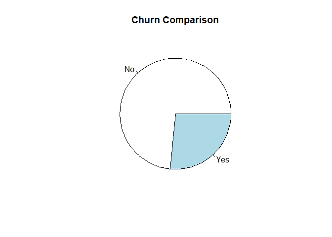<!-- -->

```r
# Gender ratio
table(churn.df$gender) %>% pie(., main = "Gender Comparison")
```

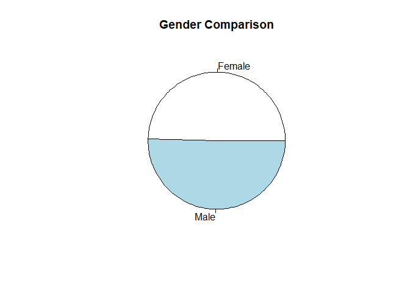<!-- -->

```r
# Senior ratio
table(churn.df$SeniorCitizen) %>% pie(., , main = "SeniorCitizen")
```

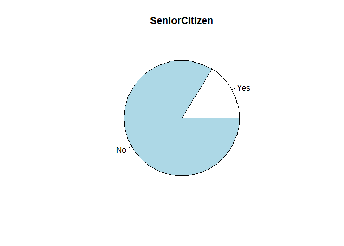<!-- -->


## Missing Values

As we investigate the data set we need to check for missing values. We validate there are 11 missing values in the TotalCharges column


```r
# from VIM package
aggr(churn.df, 
     prop = FALSE, 
     combined = TRUE, 
     numbers = TRUE, 
     sortVars = TRUE, 
     sortCombs = TRUE)
```

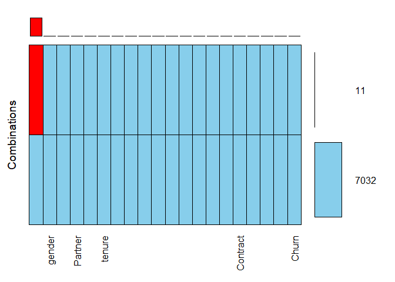<!-- -->

```
## 
##  Variables sorted by number of missings: 
##          Variable Count
##      TotalCharges    11
##            gender     0
##     SeniorCitizen     0
##           Partner     0
##        Dependents     0
##            tenure     0
##      PhoneService     0
##     MultipleLines     0
##   InternetService     0
##    OnlineSecurity     0
##      OnlineBackup     0
##  DeviceProtection     0
##       TechSupport     0
##       StreamingTV     0
##   StreamingMovies     0
##          Contract     0
##  PaperlessBilling     0
##     PaymentMethod     0
##    MonthlyCharges     0
##             Churn     0
```

```r
# we can see that 'TotalCharges' has 11 missing values

# VALIDATE COUNT OF NA VALUES FOR ABOVE ROWS
print("Total number of missing values for TotalCharges: ")
```

```
## [1] "Total number of missing values for TotalCharges: "
```

```r
sum(is.na(churn.df$TotalCharges))
```

```
## [1] 11
```


Lets examine those specific rows that have missing values. 


```r
# list rows with missing values
churn.df[is.na(churn.df$TotalCharges),]
```

```
##      gender SeniorCitizen Partner Dependents tenure PhoneService
## 489  Female            No     Yes        Yes      0           No
## 754    Male            No      No        Yes      0          Yes
## 937  Female            No     Yes        Yes      0          Yes
## 1083   Male            No     Yes        Yes      0          Yes
## 1341 Female            No     Yes        Yes      0           No
## 3332   Male            No     Yes        Yes      0          Yes
## 3827   Male            No     Yes        Yes      0          Yes
## 4381 Female            No     Yes        Yes      0          Yes
## 5219   Male            No     Yes        Yes      0          Yes
## 6671 Female            No     Yes        Yes      0          Yes
## 6755   Male            No      No        Yes      0          Yes
##         MultipleLines InternetService      OnlineSecurity
## 489  No phone service             DSL                 Yes
## 754                No              No No internet service
## 937                No             DSL                 Yes
## 1083              Yes              No No internet service
## 1341 No phone service             DSL                 Yes
## 3332               No              No No internet service
## 3827              Yes              No No internet service
## 4381               No              No No internet service
## 5219               No              No No internet service
## 6671              Yes             DSL                  No
## 6755              Yes             DSL                 Yes
##             OnlineBackup    DeviceProtection         TechSupport
## 489                   No                 Yes                 Yes
## 754  No internet service No internet service No internet service
## 937                  Yes                 Yes                  No
## 1083 No internet service No internet service No internet service
## 1341                 Yes                 Yes                 Yes
## 3332 No internet service No internet service No internet service
## 3827 No internet service No internet service No internet service
## 4381 No internet service No internet service No internet service
## 5219 No internet service No internet service No internet service
## 6671                 Yes                 Yes                 Yes
## 6755                 Yes                  No                 Yes
##              StreamingTV     StreamingMovies Contract PaperlessBilling
## 489                  Yes                  No Two year              Yes
## 754  No internet service No internet service Two year               No
## 937                  Yes                 Yes Two year               No
## 1083 No internet service No internet service Two year               No
## 1341                 Yes                  No Two year               No
## 3332 No internet service No internet service Two year               No
## 3827 No internet service No internet service Two year               No
## 4381 No internet service No internet service Two year               No
## 5219 No internet service No internet service One year              Yes
## 6671                 Yes                  No Two year               No
## 6755                  No                  No Two year              Yes
##                  PaymentMethod MonthlyCharges TotalCharges Churn
## 489  Bank transfer (automatic)          52.55           NA    No
## 754               Mailed check          20.25           NA    No
## 937               Mailed check          80.85           NA    No
## 1083              Mailed check          25.75           NA    No
## 1341   Credit card (automatic)          56.05           NA    No
## 3332              Mailed check          19.85           NA    No
## 3827              Mailed check          25.35           NA    No
## 4381              Mailed check          20.00           NA    No
## 5219              Mailed check          19.70           NA    No
## 6671              Mailed check          73.35           NA    No
## 6755 Bank transfer (automatic)          61.90           NA    No
```

We notice right away they all have a 0 for the tenure field. Lets validate we get the same 11 rows on the 2 following queries. 

NOTE: for readability we will only output the following 3 columns
* TotalCharges
* tenure
* MonthlyCharges

**All rows that have missing values in TotalCharges**


```r
churn.df[is.na(churn.df$TotalCharges), c('TotalCharges','tenure','MonthlyCharges')]
```

```
##      TotalCharges tenure MonthlyCharges
## 489            NA      0          52.55
## 754            NA      0          20.25
## 937            NA      0          80.85
## 1083           NA      0          25.75
## 1341           NA      0          56.05
## 3332           NA      0          19.85
## 3827           NA      0          25.35
## 4381           NA      0          20.00
## 5219           NA      0          19.70
## 6671           NA      0          73.35
## 6755           NA      0          61.90
```

**All rows that have a 0 in tenure**


```r
churn.df[churn.df$tenure == 0, c('TotalCharges','tenure','MonthlyCharges')]
```

```
##      TotalCharges tenure MonthlyCharges
## 489            NA      0          52.55
## 754            NA      0          20.25
## 937            NA      0          80.85
## 1083           NA      0          25.75
## 1341           NA      0          56.05
## 3332           NA      0          19.85
## 3827           NA      0          25.35
## 4381           NA      0          20.00
## 5219           NA      0          19.70
## 6671           NA      0          73.35
## 6755           NA      0          61.90
```

We can see these are the **same** 11 rows. Thus these are likely new customers that just started their contract. Thus for this exercise it makes sense to use the value from **MonthlyCharges** as a placeholder for **TotalCharges**


```r
churn.df$TotalCharges[churn.df$tenure == 0] <- churn.df$MonthlyCharges[churn.df$tenure == 0]
```


Let's quickly verify no missing vlaues remain


```r
aggr(churn.df, 
     prop = FALSE, 
     combined = TRUE, 
     numbers = TRUE, 
     sortVars = TRUE, 
     sortCombs = TRUE)
```

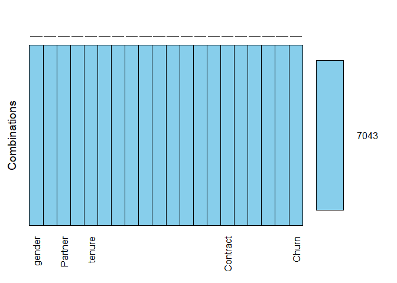<!-- -->

```
## 
##  Variables sorted by number of missings: 
##          Variable Count
##            gender     0
##     SeniorCitizen     0
##           Partner     0
##        Dependents     0
##            tenure     0
##      PhoneService     0
##     MultipleLines     0
##   InternetService     0
##    OnlineSecurity     0
##      OnlineBackup     0
##  DeviceProtection     0
##       TechSupport     0
##       StreamingTV     0
##   StreamingMovies     0
##          Contract     0
##  PaperlessBilling     0
##     PaymentMethod     0
##    MonthlyCharges     0
##      TotalCharges     0
##             Churn     0
```


## Logistic Regression: Full Model


First we need to split the data into a train and test set, with 80% of the data going into the train set. Note that createDataPartition() automatically accounts for the levels of y [in this case 'Churn'] when y is a factor in an attempt to balance the class distributions within the splits


```r
# creating the 80 data partition 
churn_split <- createDataPartition(churn.df$Churn, p = 0.8, list = F)
# including 80 for training set
churn_train.df <- churn.df[churn_split,] 
# excluding 80 for testing set
churn_test.df <- churn.df[-churn_split,]

# validating
head(churn_test.df)
```

```
##    gender SeniorCitizen Partner Dependents tenure PhoneService
## 1  Female            No     Yes         No      1           No
## 13   Male            No     Yes         No     58          Yes
## 16 Female            No     Yes        Yes     69          Yes
## 17 Female            No      No         No     52          Yes
## 22   Male            No     Yes         No     12          Yes
## 35   Male           Yes      No         No      1          Yes
##       MultipleLines InternetService      OnlineSecurity
## 1  No phone service             DSL                  No
## 13              Yes     Fiber optic                  No
## 16              Yes     Fiber optic                 Yes
## 17               No              No No internet service
## 22               No              No No internet service
## 35               No             DSL                  No
##           OnlineBackup    DeviceProtection         TechSupport
## 1                  Yes                  No                  No
## 13                  No                 Yes                  No
## 16                 Yes                 Yes                 Yes
## 17 No internet service No internet service No internet service
## 22 No internet service No internet service No internet service
## 35                  No                  No                  No
##            StreamingTV     StreamingMovies       Contract PaperlessBilling
## 1                   No                  No Month-to-month              Yes
## 13                 Yes                 Yes       One year               No
## 16                 Yes                 Yes       Two year               No
## 17 No internet service No internet service       One year               No
## 22 No internet service No internet service       One year               No
## 35                  No                  No Month-to-month               No
##                PaymentMethod MonthlyCharges TotalCharges Churn
## 1           Electronic check          29.85        29.85    No
## 13   Credit card (automatic)         100.35      5681.10    No
## 16   Credit card (automatic)         113.25      7895.15    No
## 17              Mailed check          20.65      1022.95    No
## 22 Bank transfer (automatic)          19.80       202.25    No
## 35 Bank transfer (automatic)          45.25        45.25    No
```

```r
head(churn_train.df)
```

```
##   gender SeniorCitizen Partner Dependents tenure PhoneService
## 2   Male            No      No         No     34          Yes
## 3   Male            No      No         No      2          Yes
## 4   Male            No      No         No     45           No
## 5 Female            No      No         No      2          Yes
## 6 Female            No      No         No      8          Yes
## 7   Male            No      No        Yes     22          Yes
##      MultipleLines InternetService OnlineSecurity OnlineBackup
## 2               No             DSL            Yes           No
## 3               No             DSL            Yes          Yes
## 4 No phone service             DSL            Yes           No
## 5               No     Fiber optic             No           No
## 6              Yes     Fiber optic             No           No
## 7              Yes     Fiber optic             No          Yes
##   DeviceProtection TechSupport StreamingTV StreamingMovies       Contract
## 2              Yes          No          No              No       One year
## 3               No          No          No              No Month-to-month
## 4              Yes         Yes          No              No       One year
## 5               No          No          No              No Month-to-month
## 6              Yes          No         Yes             Yes Month-to-month
## 7               No          No         Yes              No Month-to-month
##   PaperlessBilling             PaymentMethod MonthlyCharges TotalCharges
## 2               No              Mailed check          56.95      1889.50
## 3              Yes              Mailed check          53.85       108.15
## 4               No Bank transfer (automatic)          42.30      1840.75
## 5              Yes          Electronic check          70.70       151.65
## 6              Yes          Electronic check          99.65       820.50
## 7              Yes   Credit card (automatic)          89.10      1949.40
##   Churn
## 2    No
## 3   Yes
## 4    No
## 5   Yes
## 6   Yes
## 7    No
```


Lets create our initial Logistic Regression model using all the values


```r
# create logistic regression model on train data
# R will automatically create dummy variables on factors
churn_train.logit <- glm(Churn ~ ., data = churn_train.df, family = binomial("logit") )
summary(churn_train.logit)
```

```
## 
## Call:
## glm(formula = Churn ~ ., family = binomial("logit"), data = churn_train.df)
## 
## Deviance Residuals: 
##     Min       1Q   Median       3Q      Max  
## -1.9286  -0.6819  -0.2870   0.7384   3.3726  
## 
## Coefficients: (7 not defined because of singularities)
##                                        Estimate Std. Error z value
## (Intercept)                           1.559e+00  9.150e-01   1.704
## genderMale                            3.090e-03  7.244e-02   0.043
## SeniorCitizenNo                      -2.724e-01  9.451e-02  -2.882
## PartnerYes                           -5.279e-02  8.692e-02  -0.607
## DependentsYes                        -1.347e-01  9.967e-02  -1.351
## tenure                               -5.615e-02  6.876e-03  -8.166
## PhoneServiceYes                       4.157e-01  7.259e-01   0.573
## MultipleLinesNo phone service                NA         NA      NA
## MultipleLinesYes                      4.211e-01  1.981e-01   2.125
## InternetServiceFiber optic            1.950e+00  8.933e-01   2.183
## InternetServiceNo                    -1.977e+00  9.026e-01  -2.190
## OnlineSecurityNo internet service            NA         NA      NA
## OnlineSecurityYes                    -1.281e-01  2.005e-01  -0.639
## OnlineBackupNo internet service              NA         NA      NA
## OnlineBackupYes                       8.821e-02  1.961e-01   0.450
## DeviceProtectionNo internet service          NA         NA      NA
## DeviceProtectionYes                   2.022e-01  1.964e-01   1.030
## TechSupportNo internet service               NA         NA      NA
## TechSupportYes                       -1.536e-01  2.031e-01  -0.756
## StreamingTVNo internet service               NA         NA      NA
## StreamingTVYes                        6.419e-01  3.666e-01   1.751
## StreamingMoviesNo internet service           NA         NA      NA
## StreamingMoviesYes                    7.138e-01  3.657e-01   1.952
## ContractOne year                     -7.414e-01  1.212e-01  -6.116
## ContractTwo year                     -1.414e+00  1.979e-01  -7.146
## PaperlessBillingYes                   3.137e-01  8.315e-02   3.772
## PaymentMethodCredit card (automatic) -8.479e-02  1.273e-01  -0.666
## PaymentMethodElectronic check         3.035e-01  1.059e-01   2.865
## PaymentMethodMailed check            -7.079e-02  1.281e-01  -0.553
## MonthlyCharges                       -4.807e-02  3.553e-02  -1.353
## TotalCharges                          2.871e-04  7.829e-05   3.667
##                                      Pr(>|z|)    
## (Intercept)                          0.088382 .  
## genderMale                           0.965980    
## SeniorCitizenNo                      0.003948 ** 
## PartnerYes                           0.543683    
## DependentsYes                        0.176605    
## tenure                               3.18e-16 ***
## PhoneServiceYes                      0.566846    
## MultipleLinesNo phone service              NA    
## MultipleLinesYes                     0.033546 *  
## InternetServiceFiber optic           0.029053 *  
## InternetServiceNo                    0.028497 *  
## OnlineSecurityNo internet service          NA    
## OnlineSecurityYes                    0.522881    
## OnlineBackupNo internet service            NA    
## OnlineBackupYes                      0.652769    
## DeviceProtectionNo internet service        NA    
## DeviceProtectionYes                  0.303203    
## TechSupportNo internet service             NA    
## TechSupportYes                       0.449401    
## StreamingTVNo internet service             NA    
## StreamingTVYes                       0.079910 .  
## StreamingMoviesNo internet service         NA    
## StreamingMoviesYes                   0.050946 .  
## ContractOne year                     9.57e-10 ***
## ContractTwo year                     8.90e-13 ***
## PaperlessBillingYes                  0.000162 ***
## PaymentMethodCredit card (automatic) 0.505483    
## PaymentMethodElectronic check        0.004175 ** 
## PaymentMethodMailed check            0.580461    
## MonthlyCharges                       0.176088    
## TotalCharges                         0.000245 ***
## ---
## Signif. codes:  0 '***' 0.001 '**' 0.01 '*' 0.05 '.' 0.1 ' ' 1
## 
## (Dispersion parameter for binomial family taken to be 1)
## 
##     Null deviance: 6522.7  on 5635  degrees of freedom
## Residual deviance: 4665.7  on 5612  degrees of freedom
## AIC: 4713.7
## 
## Number of Fisher Scoring iterations: 6
```


### Visualize the coefficients of the Full Logistic Model

We can see the most influential factors are the type of Internet Service and the type of contract.


```r
# visualize coefficients
as.data.frame(churn_train.logit$coefficients) %>% ggplot(aes(y = .[,1], x = rownames(.)) ) + geom_col() + theme( axis.text = element_text(angle = 90, size = rel(0.7)) )
```

```
## Warning: Removed 7 rows containing missing values (position_stack).
```

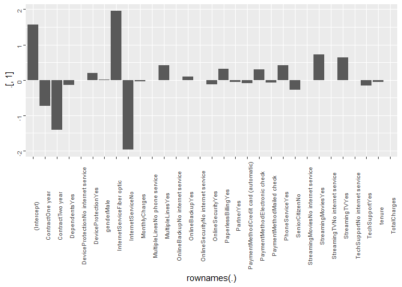<!-- -->

```r
# standard graphics alternative
# barplot( churn_train.logit$coefficients, names.arg = F, col = rainbow(31), legend.text = names(churn_train.logit$coefficient) )
```


Note that R automatically processes the 1-bit encoding on factor variables. However our model has some issues due to the fact that there is a high amount of correlation. For example if a customer has no Internet service, they will always have no for ancillary services like Online Security or Online Backup. 

Despite this we see some parameters appear to be more significant to the model:

* SeniorCitizen
* tenure
* MultipleLines
* InternetService
* Contract
* PaperlessBilling
* PaymentMethod
* TotalCharges


### ROC Curve for Full Logistic Model

So now lets validate the accuracy of our model on the test data set. First lets take a look at a ROC curve for the model 


```r
# create predictions
predict(
  churn_train.logit, 
  newdata = churn_test.df,
  type = "response"
  ) -> churn_test.pred
```

```
## Warning in predict.lm(object, newdata, se.fit, scale = 1, type =
## ifelse(type == : prediction from a rank-deficient fit may be misleading
```

```r
# validate all values are between 0 and 1
range(churn_test.pred)
```

```
## [1] 0.001508417 0.857636767
```

```r
#prediction(churn_test.pred, churn_test.df$Churn)

performance(
  prediction(churn_test.pred, churn_test.df$Churn),
  measure = "tpr",
  x.measure = "fpr"
) -> churn_logit.perf 

plot(churn_logit.perf)
```

<!-- -->

Essentially comparing the number of times the model predicts an accurate result, either "Yes" or "No" in comparison to the actual values

We can see we have an accurancy of approximately 82%


```r
# split into "Yes" and "No" based on 0.5 threadshold
as.numeric(churn_test.pred > 0.5 ) -> churn_test.pred

dplyr::recode_factor(
  churn_test.pred, 
  `1` = "Yes", `0` = "No"
  ) -> churn_test.pred


mean(churn_test.pred == churn_test.df$Churn )
```

```
## [1] 0.8059701
```


### Confusion Matrix: Full Logistic Model

Lets setup a confusion matrix to also see the sensitivity and specificity of the model. 

Our specificity, essentially predicting negative outcomes, is fairly good at 90%.

However the sensitivity, predicting positive outcomes, is actually quite low at just under 60%

What this means is our model is better at determining loyal customers, or when a customer **won't** leave.


```r
caret::confusionMatrix(
  data = relevel(churn_test.pred, ref = "Yes"),
  reference = relevel(churn_test.df$Churn, ref = "Yes")
)
```

```
## Confusion Matrix and Statistics
## 
##           Reference
## Prediction Yes  No
##        Yes 208 108
##        No  165 926
##                                           
##                Accuracy : 0.806           
##                  95% CI : (0.7843, 0.8263)
##     No Information Rate : 0.7349          
##     P-Value [Acc > NIR] : 2.745e-10       
##                                           
##                   Kappa : 0.4765          
##  Mcnemar's Test P-Value : 0.0007008       
##                                           
##             Sensitivity : 0.5576          
##             Specificity : 0.8956          
##          Pos Pred Value : 0.6582          
##          Neg Pred Value : 0.8488          
##              Prevalence : 0.2651          
##          Detection Rate : 0.1478          
##    Detection Prevalence : 0.2246          
##       Balanced Accuracy : 0.7266          
##                                           
##        'Positive' Class : Yes             
## 
```


## Model Challenges: Variable Correlation and Overfitting

As mentioned earlier we have some issues with this model. Due to the fact that we are predominantly dealing with categorical predictors, it's not as obvious to identify potential correlation between them; as compared to continuous variables that allow us to simply calculate the Variance Inflation Factor [VIF].

The message *Coefficients: (7 not defined because of singularities)* alludes to model features whose effect on the output is not discernable from other features due to inter-dependencies. As per above, any customer with "no" for the InternetService predictor is also going to have "no" for ancillary services like OnlineSecurity and OnlineBackup, as well as StreamingTV or StreamingMovies.

The **alias()** command [output omitted due to size] validates this.

Additionally with 20+ predictors we run the risk of overfitting, where our model performs well on the training data set used to construct the model, but then performs poorly on new customers we wish to accurately predict their attrition likelihood.

For this there are a variety of techniques to simplify the model, leaving only the most influential predictors. We will explore these further

* Feature Selection
* Regularized or Shrinkage
* Manually Adjusted


## Feature Selection: Stepwise Regression

Now let's employ **Feature Selection**, where R iteratively goes through the model adding / removing a predictors based on the calculated significance to the model's overall performance. There are different metrics which can be used to evaluate this performance; here we find optimal coefficients by using the respective AIC score. 

So far this is the lowest AIC score at 4737.3. However we still have some interdependencies among the predictors.

Let's investigate further


```r
stepAIC(
  churn_train.logit,
  trace = F,
  direction = "both"
) -> churn_step.logit


# view results
summary(churn_step.logit)
```

```
## 
## Call:
## glm(formula = Churn ~ SeniorCitizen + Dependents + tenure + MultipleLines + 
##     InternetService + OnlineSecurity + TechSupport + StreamingTV + 
##     StreamingMovies + Contract + PaperlessBilling + PaymentMethod + 
##     MonthlyCharges + TotalCharges, family = binomial("logit"), 
##     data = churn_train.df)
## 
## Deviance Residuals: 
##     Min       1Q   Median       3Q      Max  
## -1.9268  -0.6798  -0.2869   0.7354   3.3805  
## 
## Coefficients: (4 not defined because of singularities)
##                                        Estimate Std. Error z value
## (Intercept)                           8.014e-01  5.838e-01   1.373
## SeniorCitizenNo                      -2.664e-01  9.389e-02  -2.838
## DependentsYes                        -1.604e-01  9.065e-02  -1.769
## tenure                               -5.648e-02  6.847e-03  -8.249
## MultipleLinesNo phone service         1.048e-01  2.717e-01   0.386
## MultipleLinesYes                      2.901e-01  1.059e-01   2.740
## InternetServiceFiber optic            1.302e+00  3.081e-01   4.226
## InternetServiceNo                    -1.333e+00  3.518e-01  -3.788
## OnlineSecurityNo internet service            NA         NA      NA
## OnlineSecurityYes                    -2.609e-01  1.115e-01  -2.339
## TechSupportNo internet service               NA         NA      NA
## TechSupportYes                       -2.806e-01  1.144e-01  -2.453
## StreamingTVNo internet service               NA         NA      NA
## StreamingTVYes                        3.893e-01  1.517e-01   2.566
## StreamingMoviesNo internet service           NA         NA      NA
## StreamingMoviesYes                    4.627e-01  1.503e-01   3.079
## ContractOne year                     -7.370e-01  1.211e-01  -6.086
## ContractTwo year                     -1.400e+00  1.975e-01  -7.091
## PaperlessBillingYes                   3.140e-01  8.309e-02   3.779
## PaymentMethodCredit card (automatic) -8.149e-02  1.272e-01  -0.641
## PaymentMethodElectronic check         3.016e-01  1.059e-01   2.848
## PaymentMethodMailed check            -6.777e-02  1.279e-01  -0.530
## MonthlyCharges                       -2.216e-02  1.183e-02  -1.873
## TotalCharges                          2.876e-04  7.816e-05   3.679
##                                      Pr(>|z|)    
## (Intercept)                          0.169872    
## SeniorCitizenNo                      0.004541 ** 
## DependentsYes                        0.076897 .  
## tenure                                < 2e-16 ***
## MultipleLinesNo phone service        0.699698    
## MultipleLinesYes                     0.006153 ** 
## InternetServiceFiber optic           2.38e-05 ***
## InternetServiceNo                    0.000152 ***
## OnlineSecurityNo internet service          NA    
## OnlineSecurityYes                    0.019312 *  
## TechSupportNo internet service             NA    
## TechSupportYes                       0.014175 *  
## StreamingTVNo internet service             NA    
## StreamingTVYes                       0.010290 *  
## StreamingMoviesNo internet service         NA    
## StreamingMoviesYes                   0.002077 ** 
## ContractOne year                     1.16e-09 ***
## ContractTwo year                     1.33e-12 ***
## PaperlessBillingYes                  0.000158 ***
## PaymentMethodCredit card (automatic) 0.521812    
## PaymentMethodElectronic check        0.004400 ** 
## PaymentMethodMailed check            0.596154    
## MonthlyCharges                       0.061010 .  
## TotalCharges                         0.000234 ***
## ---
## Signif. codes:  0 '***' 0.001 '**' 0.01 '*' 0.05 '.' 0.1 ' ' 1
## 
## (Dispersion parameter for binomial family taken to be 1)
## 
##     Null deviance: 6522.7  on 5635  degrees of freedom
## Residual deviance: 4667.5  on 5616  degrees of freedom
## AIC: 4707.5
## 
## Number of Fisher Scoring iterations: 6
```


### Visualizing Coefficients on Stepwise Model


Notably OnlineSecurity, TechSupport, StreamingTV, StreamingMovies, and MonthlyCharges were found to be significant as opposed to the prior Full Logistic Model. Thus the list of significant factors that the AIC-based Stepwise Regression recommends are:

* SeniorCitizen
* tenure
* MultipleLines
* InternetService
* OnlineSecurity
* TechSupport
* StreamingTV
* StreamingMovies
* Contract
* PaperlessBilling
* PaymentMethod
* TotalCharges


```r
# visualize coefficients
as.data.frame(churn_step.logit$coefficients) %>% ggplot(aes(y = .[,1], x = rownames(.)) ) + geom_col() + theme( axis.text = element_text(angle = 90, size = rel(0.7)) )
```

```
## Warning: Removed 4 rows containing missing values (position_stack).
```

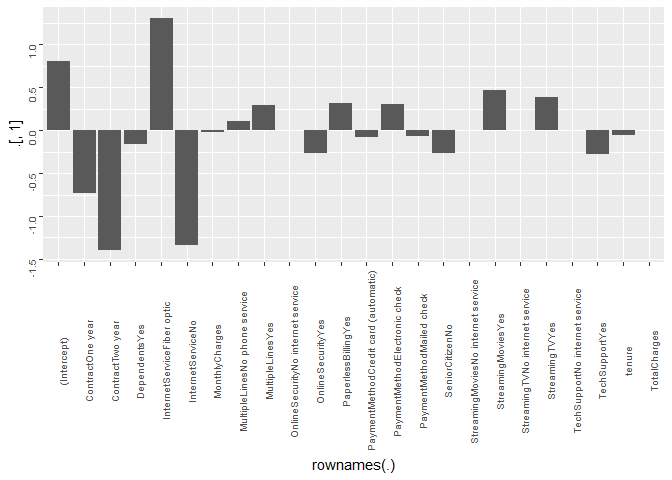<!-- -->


### ROC Curve on AIC-based Stepwise

Evaluating the accuracy of our model on the test data set by visualizing through a ROC curve of the model's performance. Looks fairly close to the ROC of the Full Logistic Model. 


```r
# create predictions
predict(
  churn_step.logit, 
  newdata = churn_test.df,
  type = "response"
  ) -> churn_step.pred
```

```
## Warning in predict.lm(object, newdata, se.fit, scale = 1, type =
## ifelse(type == : prediction from a rank-deficient fit may be misleading
```

```r
# validate all values are between 0 and 1
range(churn_step.pred)
```

```
## [1] 0.001521281 0.853028216
```

```r
#prediction(churn_step.pred, churn_test.df$Churn)

performance(
  prediction(churn_step.pred, churn_test.df$Churn),
  measure = "tpr",
  x.measure = "fpr"
) -> churn_step.perf 

plot(churn_step.perf)
```

<!-- -->


Essentially comparing the number of times the model predicts an accurate result, either "Yes" or "No" in comparison to the actual values

We have an accurancy of 81.7%


```r
# split into "Yes" and "No" based on 0.5 threadshold
as.numeric(churn_step.pred > 0.5 ) -> churn_step.pred

dplyr::recode_factor(
  churn_step.pred, 
  `1` = "Yes", `0` = "No"
  ) -> churn_step.pred


mean(churn_step.pred == churn_test.df$Churn )
```

```
## [1] 0.8059701
```


Lets setup a confusion matrix to also see the sensitivity and specificity of the model. 

Our specificity, essentially predicting negative outcomes, is still around 90%. And the sensitivity, predicting positive outcomes, is slightly lower now at 58.98%

Thus our model is *still* better at determining loyal customers, or when a customer **won't** leave.


```r
caret::confusionMatrix(
  data = relevel(churn_step.pred, ref = "Yes"),
  reference = relevel(churn_test.df$Churn, ref = "Yes")
)
```

```
## Confusion Matrix and Statistics
## 
##           Reference
## Prediction Yes  No
##        Yes 210 110
##        No  163 924
##                                           
##                Accuracy : 0.806           
##                  95% CI : (0.7843, 0.8263)
##     No Information Rate : 0.7349          
##     P-Value [Acc > NIR] : 2.745e-10       
##                                           
##                   Kappa : 0.4783          
##  Mcnemar's Test P-Value : 0.001649        
##                                           
##             Sensitivity : 0.5630          
##             Specificity : 0.8936          
##          Pos Pred Value : 0.6562          
##          Neg Pred Value : 0.8500          
##              Prevalence : 0.2651          
##          Detection Rate : 0.1493          
##    Detection Prevalence : 0.2274          
##       Balanced Accuracy : 0.7283          
##                                           
##        'Positive' Class : Yes             
## 
```


## Regularization: Lasso & Ridge Penalized Regression

Unlike Feature Selection in the prior section, which adds / removes predictors, now we are looking at **Regularization** techniques. Rather than removing predictors they instead introduce a constraint in the training process that shrinks the estimated coefficients. We will be exploring 2 such methods

**Ridge Regression** introduces bias in order to reduce the model's variance, and tries to minimize the sum of the Residual Sum-of-Squares [RSS]. It shrinks variables to be *approximately* zero.

**Lasso Regression** is similar to Ridge, however it instad involves the minimizing the sum of the absolute values of the coefficients, pushing the least significant ones closer to zero. Unlike Ridge, the Lasso Penalty will actually push them all the way to zero.

Both of these rely on a constant **lambda** which acts as a tuning parameter which effects the size of the penalty, thus shrinking the coefficients's closer to zero. For the purposes of this exercise we rely on the **cv.glmnet()** function to iteratively find the optimal value for each model


```r
# NOTE: requires data as matrix

# create dummy variables
model.matrix(Churn ~ ., data = churn_train.df) -> churn_train.mtx
# remove intercept
churn_train.mtx[, -1] -> churn_train.mtx
```


First we need to prepare the data as a separate matrix of predictors, and the response as a vector, in order to leverage the cv.glmnet() function. Note that the glmnet() function can do either Lasso *or* Ridge Regularized Regression, simply by specifying **alpha = 1** or **alpha = 0** respectively

In both cases we first run the **cv.glmnet()** function to find the optimal value of lambda, then output as an S3 object which we plug that value into the actual Regularized Regression model. 


**Lasso Regression**


```r
# Find optimal value of lambda
cv.glmnet(
  churn_train.mtx, churn_train.df$Churn,
  family = "binomial",
  alpha = 1
) -> lambda.lasso

# glm model: LASSO
glmnet(
  churn_train.mtx, churn_train.df$Churn, 
  family="binomial", 
  alpha = 1,
  lambda = lambda.lasso$lambda.min
  ) -> churn_train.lasso

# output coefficients
coef(lambda.lasso, lambda.lasso$lambda.min)
```

```
## 31 x 1 sparse Matrix of class "dgCMatrix"
##                                                  1
## (Intercept)                           2.409911e-01
## genderMale                            .           
## SeniorCitizenNo                      -2.677931e-01
## PartnerYes                           -4.604738e-02
## DependentsYes                        -1.363337e-01
## tenure                               -4.960015e-02
## PhoneServiceYes                      -4.949252e-01
## MultipleLinesNo phone service         .           
## MultipleLinesYes                      1.822980e-01
## InternetServiceFiber optic            7.835366e-01
## InternetServiceNo                    -6.211054e-01
## OnlineSecurityNo internet service    -4.295171e-14
## OnlineSecurityYes                    -3.524519e-01
## OnlineBackupNo internet service      -6.841212e-02
## OnlineBackupYes                      -1.287611e-01
## DeviceProtectionNo internet service  -2.726181e-02
## DeviceProtectionYes                  -1.509446e-02
## TechSupportNo internet service       -7.111717e-04
## TechSupportYes                       -3.798659e-01
## StreamingTVNo internet service       -5.191060e-02
## StreamingTVYes                        1.707676e-01
## StreamingMoviesNo internet service   -1.042796e-04
## StreamingMoviesYes                    2.452870e-01
## ContractOne year                     -7.334244e-01
## ContractTwo year                     -1.375338e+00
## PaperlessBillingYes                   3.101406e-01
## PaymentMethodCredit card (automatic) -6.661790e-02
## PaymentMethodElectronic check         3.170472e-01
## PaymentMethodMailed check            -4.235888e-02
## MonthlyCharges                        .           
## TotalCharges                          2.088051e-04
```

```r
# NOTE: lambda.lasso$lambda.1se outputs simplest model
```


### Plot of Lasso Model Lambda

CV Mean Squared Error [MSE] for Lasso model. The first dotted line represents lambda with the smallest MSE and the second represents with an MSE within 1 standard-error of the minimum MSE


```r
plot(lambda.lasso)
```

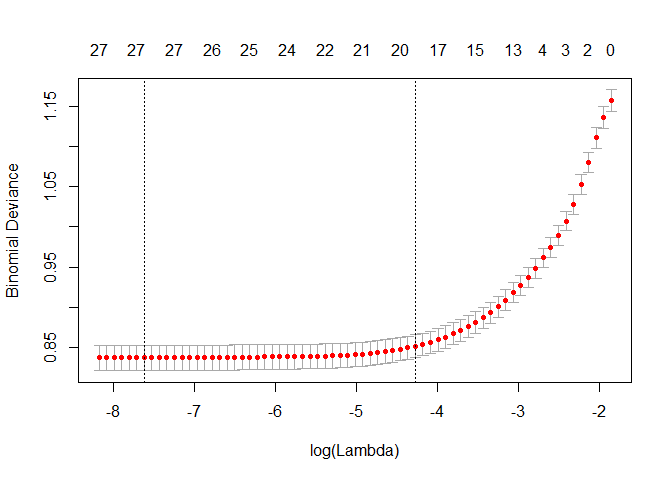<!-- -->


**Ridge Regression**


```r
# Find optimal value of lambda
cv.glmnet(
  churn_train.mtx, churn_train.df$Churn,
  family = "binomial",
  alpha = 0
) -> lambda.ridge

# glm model: RIDGE
glmnet(
  churn_train.mtx, churn_train.df$Churn, 
  family="binomial", 
  alpha = 0,
  lambda = lambda.ridge$lambda.min
  ) -> churn_train.ridge

# output coefficients of lowest lambda
coef(
  lambda.ridge,
  lambda.ridge$lambda.min
)
```

```
## 31 x 1 sparse Matrix of class "dgCMatrix"
##                                                  1
## (Intercept)                          -3.612049e-01
## genderMale                           -1.767771e-03
## SeniorCitizenNo                      -2.680487e-01
## PartnerYes                           -9.355250e-02
## DependentsYes                        -1.586081e-01
## tenure                               -2.308788e-02
## PhoneServiceYes                      -1.736048e-01
## MultipleLinesNo phone service         1.696206e-01
## MultipleLinesYes                      1.513193e-01
## InternetServiceFiber optic            6.824237e-01
## InternetServiceNo                    -1.207797e-01
## OnlineSecurityNo internet service    -1.203450e-01
## OnlineSecurityYes                    -3.699162e-01
## OnlineBackupNo internet service      -1.211059e-01
## OnlineBackupYes                      -1.483381e-01
## DeviceProtectionNo internet service  -1.221875e-01
## DeviceProtectionYes                  -4.941222e-02
## TechSupportNo internet service       -1.230534e-01
## TechSupportYes                       -3.844694e-01
## StreamingTVNo internet service       -1.239544e-01
## StreamingTVYes                        1.613211e-01
## StreamingMoviesNo internet service   -1.249750e-01
## StreamingMoviesYes                    2.157431e-01
## ContractOne year                     -6.480395e-01
## ContractTwo year                     -1.015327e+00
## PaperlessBillingYes                   2.912681e-01
## PaymentMethodCredit card (automatic) -1.122272e-01
## PaymentMethodElectronic check         3.301855e-01
## PaymentMethodMailed check            -1.911465e-02
## MonthlyCharges                        4.560302e-03
## TotalCharges                         -6.461654e-05
```

```r
# NOTE: lambda.ridge$lambda.1se outputs simplest model
```


### Plot of Ridge Model Lambda

CV Mean Squared Error [MSE] for Ridge model. The first dotted line represents lambda with the smallest MSE and the second represents with an MSE within 1 standard-error of the minimum MSE


```r
plot(lambda.ridge)
```

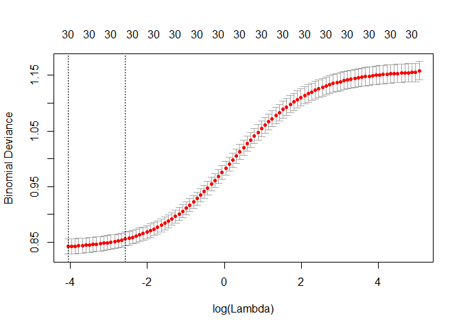<!-- -->


### Lasso model with optimized Lambda

**ROC curve**

Evaluating the accuracy of the Lasso Penalized Logistic model on the test data set by visualizing through a ROC curve of the model's performance. 

Looks fairly close to the ROC of the Full Logistic Model.


```r
# make test data into matrix
# create dummy variables
model.matrix(Churn ~ ., data = churn_test.df) -> churn_test.mtx
# remove intercept
churn_test.mtx[, -1] -> churn_test.mtx

# validate prediction accuracy on test data set

predict(
  churn_train.lasso,
  s = lambda.lasso$lambda.min,
  newx = churn_test.mtx,
  type = "response"
) -> churn_test_lasso.pred


# validate range is between 0 and 1
range(churn_test_lasso.pred)
```

```
## [1] 0.00214452 0.84878606
```

```r
performance(
  prediction(churn_test_lasso.pred, churn_test.df$Churn),
  measure = "tpr",
  x.measure = "fpr"
) -> churn_lasso.perf 

plot(churn_lasso.perf)
```

<!-- -->


### Confusion Matrix for Lasso Model

Essentially comparing the number of times the model predicts an accurate result, either "Yes" or "No" in comparison to the actual values

We can see we have a slightly lower accurancy of approximately 82%


```r
# preparing data for confusion matrix

as.numeric(churn_test_lasso.pred > 0.5) -> churn_test_lasso.pred

dplyr::recode_factor(
  churn_test_lasso.pred, 
  `1` = "Yes", `0` = "No"
) -> churn_test_lasso.pred

# Accuracy
mean(churn_test_lasso.pred == churn_test.df$Churn)
```

```
## [1] 0.8052594
```


**Confusion Matrix**

Our specificity, essentially predicting negative outcomes, is just over 90%. And the sensitivity, predicting positive outcomes, is at 59%

What this means is our model is better at determining loyal customers, or when a customer **won't** leave.


```r
# confusion matrix
caret::confusionMatrix(
  data = relevel(churn_test_lasso.pred, ref = "Yes"),
  reference = relevel(churn_test.df$Churn, ref = "Yes")
)
```

```
## Confusion Matrix and Statistics
## 
##           Reference
## Prediction Yes  No
##        Yes 207 108
##        No  166 926
##                                           
##                Accuracy : 0.8053          
##                  95% CI : (0.7836, 0.8257)
##     No Information Rate : 0.7349          
##     P-Value [Acc > NIR] : 4.134e-10       
##                                           
##                   Kappa : 0.4741          
##  Mcnemar's Test P-Value : 0.0005742       
##                                           
##             Sensitivity : 0.5550          
##             Specificity : 0.8956          
##          Pos Pred Value : 0.6571          
##          Neg Pred Value : 0.8480          
##              Prevalence : 0.2651          
##          Detection Rate : 0.1471          
##    Detection Prevalence : 0.2239          
##       Balanced Accuracy : 0.7253          
##                                           
##        'Positive' Class : Yes             
## 
```


## Logistic Regression: Manually Optimized Model

From the results of the AIC-based Stepwise, the categories it found to be significant were:

* SeniorCitizen
* tenure
* MultipleLines
* InternetService
* OnlineSecurity
* TechSupport
* StreamingTV
* StreamingMovies
* Contract
* PaperlessBilling
* PaymentMethod
* TotalCharges

We will now create a model just using these predictors in an attempt to avoid a model that overfits our data. However, as per above, the results of the **alias()** command shows us that InternetService is problematic, thus we will not include it in the model


The AIC score on the manual model is 4779.5 vs the full model 4744.1, and using the Stepwise method for feature engineering of 4737.


```r
# logistic regression model on manually specified variables
churn_manual.logit <- glm(
  Churn ~ tenure + Contract + PaperlessBilling + TotalCharges + SeniorCitizen + MultipleLines + PaymentMethod + OnlineSecurity + TechSupport + StreamingTV + StreamingMovies, 
  data = churn_train.df, 
  family = binomial("logit") 
  )

# view results
summary(churn_manual.logit)
```

```
## 
## Call:
## glm(formula = Churn ~ tenure + Contract + PaperlessBilling + 
##     TotalCharges + SeniorCitizen + MultipleLines + PaymentMethod + 
##     OnlineSecurity + TechSupport + StreamingTV + StreamingMovies, 
##     family = binomial("logit"), data = churn_train.df)
## 
## Deviance Residuals: 
##     Min       1Q   Median       3Q      Max  
## -1.8710  -0.6935  -0.2824   0.7680   3.6070  
## 
## Coefficients: (3 not defined because of singularities)
##                                        Estimate Std. Error z value
## (Intercept)                           2.552e-01  1.494e-01   1.709
## tenure                               -7.026e-02  6.678e-03 -10.521
## ContractOne year                     -8.354e-01  1.201e-01  -6.955
## ContractTwo year                     -1.557e+00  1.972e-01  -7.898
## PaperlessBillingYes                   3.721e-01  8.200e-02   4.537
## TotalCharges                          4.596e-04  7.275e-05   6.317
## SeniorCitizenNo                      -3.486e-01  9.156e-02  -3.808
## MultipleLinesNo phone service         2.056e-01  1.410e-01   1.458
## MultipleLinesYes                      2.334e-01  8.731e-02   2.673
## PaymentMethodCredit card (automatic) -9.040e-02  1.263e-01  -0.716
## PaymentMethodElectronic check         3.458e-01  1.048e-01   3.301
## PaymentMethodMailed check            -1.550e-01  1.260e-01  -1.230
## OnlineSecurityNo internet service    -1.058e+00  1.420e-01  -7.448
## OnlineSecurityYes                    -4.766e-01  9.287e-02  -5.132
## TechSupportNo internet service               NA         NA      NA
## TechSupportYes                       -5.022e-01  9.382e-02  -5.353
## StreamingTVNo internet service               NA         NA      NA
## StreamingTVYes                        1.655e-01  8.980e-02   1.843
## StreamingMoviesNo internet service           NA         NA      NA
## StreamingMoviesYes                    2.440e-01  9.043e-02   2.699
##                                      Pr(>|z|)    
## (Intercept)                          0.087480 .  
## tenure                                < 2e-16 ***
## ContractOne year                     3.52e-12 ***
## ContractTwo year                     2.83e-15 ***
## PaperlessBillingYes                  5.70e-06 ***
## TotalCharges                         2.66e-10 ***
## SeniorCitizenNo                      0.000140 ***
## MultipleLinesNo phone service        0.144774    
## MultipleLinesYes                     0.007511 ** 
## PaymentMethodCredit card (automatic) 0.474091    
## PaymentMethodElectronic check        0.000964 ***
## PaymentMethodMailed check            0.218580    
## OnlineSecurityNo internet service    9.45e-14 ***
## OnlineSecurityYes                    2.87e-07 ***
## TechSupportNo internet service             NA    
## TechSupportYes                       8.63e-08 ***
## StreamingTVNo internet service             NA    
## StreamingTVYes                       0.065370 .  
## StreamingMoviesNo internet service         NA    
## StreamingMoviesYes                   0.006958 ** 
## ---
## Signif. codes:  0 '***' 0.001 '**' 0.01 '*' 0.05 '.' 0.1 ' ' 1
## 
## (Dispersion parameter for binomial family taken to be 1)
## 
##     Null deviance: 6522.7  on 5635  degrees of freedom
## Residual deviance: 4725.0  on 5619  degrees of freedom
## AIC: 4759
## 
## Number of Fisher Scoring iterations: 6
```

**Simplest Model**

However we still have 3 parameters, again due to the "No Internet Service" category of multiple parameters. 

Let's try a much simpler model using only InternetService and removing all the ancillary services. Thus our final model will use only:

* SeniorCitizen
* tenure
* InternetService
* Contract
* TotalCharges
* MultipleLines
* PaymentMethod
* PaperlessBilling

Here we get an AIC score of 4791.7 using a reduced number of variables to describe a customer.


```r
# logistic regression model on manually specified variables
churn_manual.logit <- glm(
  Churn ~ tenure + Contract + InternetService + TotalCharges + SeniorCitizen + MultipleLines + PaymentMethod + PaperlessBilling, 
  data = churn_train.df, 
  family = binomial("logit") 
  )

# view results
summary(churn_manual.logit)
```

```
## 
## Call:
## glm(formula = Churn ~ tenure + Contract + InternetService + TotalCharges + 
##     SeniorCitizen + MultipleLines + PaymentMethod + PaperlessBilling, 
##     family = binomial("logit"), data = churn_train.df)
## 
## Deviance Residuals: 
##     Min       1Q   Median       3Q      Max  
## -1.8128  -0.6878  -0.2986   0.7590   3.4867  
## 
## Coefficients:
##                                        Estimate Std. Error z value
## (Intercept)                          -0.3899756  0.1608060  -2.425
## tenure                               -0.0586895  0.0065612  -8.945
## ContractOne year                     -0.8028185  0.1184626  -6.777
## ContractTwo year                     -1.5848638  0.1945897  -8.145
## InternetServiceFiber optic            0.9185960  0.1058973   8.674
## InternetServiceNo                    -0.5453304  0.1445655  -3.772
## TotalCharges                          0.0002863  0.0000703   4.072
## SeniorCitizenNo                      -0.3305612  0.0918197  -3.600
## MultipleLinesNo phone service         0.6358397  0.1448498   4.390
## MultipleLinesYes                      0.2134438  0.0877847   2.431
## PaymentMethodCredit card (automatic) -0.0843546  0.1263369  -0.668
## PaymentMethodElectronic check         0.3682217  0.1047903   3.514
## PaymentMethodMailed check            -0.0777444  0.1265107  -0.615
## PaperlessBillingYes                   0.3558826  0.0819265   4.344
##                                      Pr(>|z|)    
## (Intercept)                          0.015303 *  
## tenure                                < 2e-16 ***
## ContractOne year                     1.23e-11 ***
## ContractTwo year                     3.80e-16 ***
## InternetServiceFiber optic            < 2e-16 ***
## InternetServiceNo                    0.000162 ***
## TotalCharges                         4.65e-05 ***
## SeniorCitizenNo                      0.000318 ***
## MultipleLinesNo phone service        1.14e-05 ***
## MultipleLinesYes                     0.015039 *  
## PaymentMethodCredit card (automatic) 0.504328    
## PaymentMethodElectronic check        0.000442 ***
## PaymentMethodMailed check            0.538866    
## PaperlessBillingYes                  1.40e-05 ***
## ---
## Signif. codes:  0 '***' 0.001 '**' 0.01 '*' 0.05 '.' 0.1 ' ' 1
## 
## (Dispersion parameter for binomial family taken to be 1)
## 
##     Null deviance: 6522.7  on 5635  degrees of freedom
## Residual deviance: 4723.4  on 5622  degrees of freedom
## AIC: 4751.4
## 
## Number of Fisher Scoring iterations: 6
```


### Visualizing Coefficients on Manual Model

From this model it estimates the strongest feature to predicting customer churn would be those with a 2-year contract.


```r
# visualize coefficients
as.data.frame(churn_manual.logit$coefficients) %>% ggplot(aes(y = .[,1], x = rownames(.)) ) + geom_col() + theme( axis.text = element_text(angle = 90, size = rel(0.9)) )
```

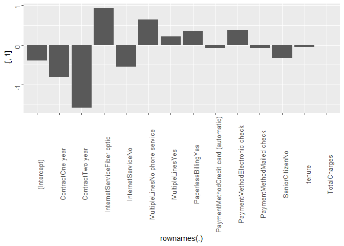<!-- -->


### ROC Curve on Manual Model

So now lets validate the accuracy of our model on the test data set. First lets take a look at a ROC curve for the model 


```r
# create predictions
predict(
  churn_manual.logit, 
  newdata = churn_test.df,
  type = "response"
  ) -> churn_manual.pred

# validate all values are between 0 and 1
range(churn_manual.pred)
```

```
## [1] 0.001214594 0.807564544
```

```r
#prediction(churn_manual.pred, churn_test.df$Churn)

performance(
  prediction(churn_manual.pred, churn_test.df$Churn),
  measure = "tpr",
  x.measure = "fpr"
) -> churn_manual.perf 

plot(churn_manual.perf)
```

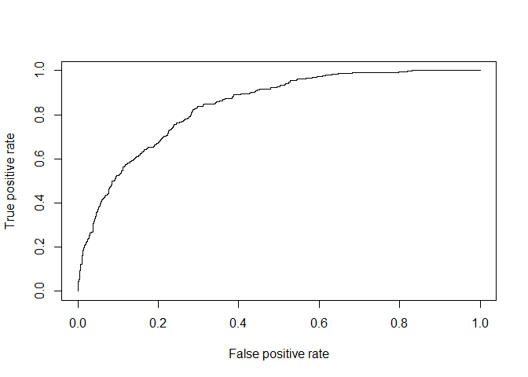<!-- -->


Essentially comparing the number of times the model predicts an accurate result, either "Yes" or "No" in comparison to the actual values

We can see we have a slightly lower accurancy of approximately 81.67%


```r
# split into "Yes" and "No" based on 0.5 threadshold
as.numeric(churn_manual.pred > 0.5 ) -> churn_manual.pred

dplyr::recode_factor(
  churn_manual.pred, 
  `1` = "Yes", `0` = "No"
  ) -> churn_manual.pred


mean(churn_manual.pred == churn_test.df$Churn )
```

```
## [1] 0.7995736
```


Lets setup a confusion matrix to also see the sensitivity and specificity of the model. 

Our specificity, essentially predicting negative outcomes, is just under 90%. And the sensitivity, predicting positive outcomes, is at 59.5%

What this means is our model is better at determining loyal customers, or when a customer **won't** leave.


```r
caret::confusionMatrix(
  data = relevel(churn_manual.pred, ref = "Yes"),
  reference = relevel(churn_test.df$Churn, ref = "Yes")
)
```

```
## Confusion Matrix and Statistics
## 
##           Reference
## Prediction Yes  No
##        Yes 197 106
##        No  176 928
##                                           
##                Accuracy : 0.7996          
##                  95% CI : (0.7777, 0.8202)
##     No Information Rate : 0.7349          
##     P-Value [Acc > NIR] : 9.339e-09       
##                                           
##                   Kappa : 0.4528          
##  Mcnemar's Test P-Value : 3.976e-05       
##                                           
##             Sensitivity : 0.5282          
##             Specificity : 0.8975          
##          Pos Pred Value : 0.6502          
##          Neg Pred Value : 0.8406          
##              Prevalence : 0.2651          
##          Detection Rate : 0.1400          
##    Detection Prevalence : 0.2154          
##       Balanced Accuracy : 0.7128          
##                                           
##        'Positive' Class : Yes             
## 
```


